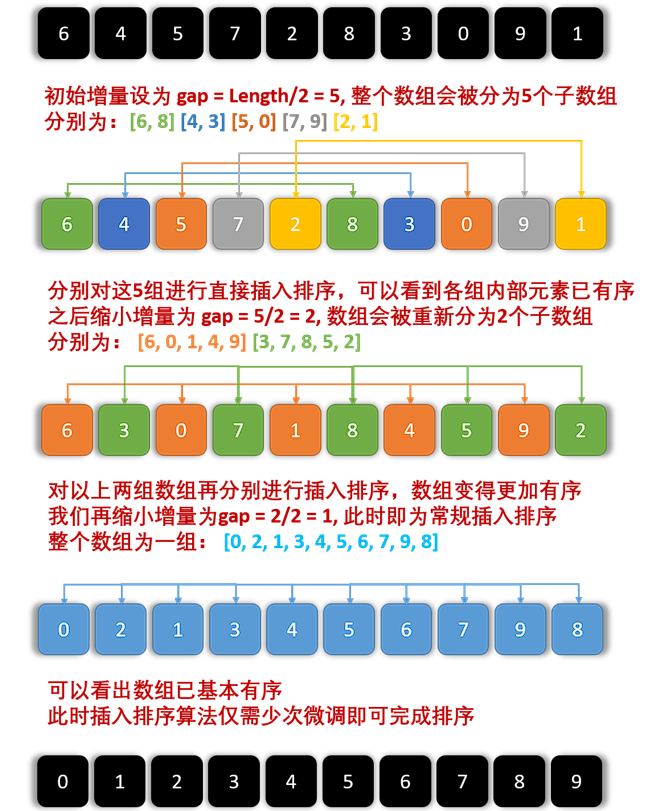

# 微服务

## SpringCloud常见组件有哪些？

**问题说明**：这个题目主要考察对SpringCloud的组件基本了解

**难易程度**：简单

**参考话术**：

SpringCloud包含的组件很多，有很多功能是重复的。其中最常用组件包括：

* 注册中心组件：Eureka、Nacos等

* 负载均衡组件：Ribbon

* 远程调用组件：OpenFeign

* 网关组件：Zuul、Gateway

* 服务保护组件：Hystrix、Sentinel

* 服务配置管理组件：SpringCloudConfig、Nacos


## Nacos的服务注册表结构是怎样的？

**问题说明**：考察对Nacos数据分级结构的了解，以及Nacos源码的掌握情况

**难易程度**：一般

**参考话术**：

Nacos采用了数据的分级存储模型，最外层是Namespace，用来隔离环境。然后是Group，用来对服务分组。接下来就是服务（Service）了，一个服务包含多个实例，但是可能处于不同机房，因此Service下有多个集群（Cluster），Cluster下是不同的实例（Instance）。

对应到Java代码中，Nacos采用了一个多层的Map来表示。结构为Map<String, Map<String, Service>>，其中最外层Map的key就是namespaceId，值是一个Map。内层Map的key是group拼接serviceName，值是Service对象。Service对象内部又是一个Map，key是集群名称，值是Cluster对象。而Cluster对象内部维护了Instance的集合。


## Nacos如何支撑阿里内部数十万服务注册压力？

**问题说明**：考察对Nacos源码的掌握情况

**难易程度**：难

**参考话术**：

Nacos内部接收到注册的请求时，不会立即写数据，而是将服务注册的任务放入一个阻塞队列就立即响应给客户端。然后利用线程池读取阻塞队列中的任务，异步来完成实例更新，从而提高并发写能力。


## Nacos如何避免并发读写冲突问题？

**问题说明**：考察对Nacos源码的掌握情况

**难易程度**：难

**参考话术**：

Nacos在更新实例列表时，会采用CopyOnWrite技术，首先将旧的实例列表拷贝一份，然后更新拷贝的实例列表，再用更新后的实例列表来覆盖旧的实例列表。

这样在更新的过程中，就不会对读实例列表的请求产生影响，也不会出现脏读问题了


## Nacos与Eureka的区别有哪些？

**问题说明**：考察对Nacos、Eureka的底层实现的掌握情况

**难易程度**：难

**参考话术**：

Nacos与Eureka有相同点，也有不同之处，可以从以下几点来描述：

- **接口方式**：Nacos与Eureka都对外暴露了Rest风格的API接口，用来实现服务注册、发现等功能
- **实例类型**：Nacos的实例有永久和临时实例之分；而Eureka只支持临时实例
- **健康检测**：Nacos对临时实例采用心跳模式检测，对永久实例采用主动请求来检测；Eureka只支持心跳模式
- **服务发现**：Nacos支持定时拉取和订阅推送两种模式；Eureka只支持定时拉取模式


## Sentinel的线程隔离与Hystix的线程隔离有什么差别?

线程隔离有两种方式实现：

* 线程池隔离（Hystix默认采用）

* 信号量隔离（Sentinel默认采用）


**问题说明**：考察对线程隔离方案的掌握情况

**难易程度**：一般

**参考话术**：

Hystix默认是基于线程池实现的线程隔离，每一个被隔离的业务都要创建一个独立的线程池，线程过多会带来额外的CPU开销，性能一般，但是隔离性更强。

Sentinel是基于信号量（计数器）实现的线程隔离，不用创建线程池，性能较好，但是隔离性一般。


## Sentinel的限流与Gateway的限流有什么差别？

**限流**：对应用服务器的请求做限制，避免因过多请求而导致服务器过载甚至宕机。

限流算法常见的包括：

* 计数器算法，又包括窗口计数器算法、滑动窗口计数器算法

* 令牌桶算法（Token Bucket）

* 漏桶算法(Leaky Bucket)


### 固定窗口计数器算法

固定窗口计数器算法概念如下：

* 将时间划分为多个窗口，窗口时间跨度称为Interval，本例中为1000ms；

* 每个窗口维护一个计数器，每有一次请求就将计数器加一，限流就是设置计数器阈值，本例为3

* 如果计数器超过了限流阈值，则超出阈值的请求都被丢弃。


### 滑动窗口计数器算法

滑动窗口计数器算法会将一个窗口划分为n个更小的区间

* 窗口时间跨度Interval为1秒；区间数量 n = 2 ，则每个小区间时间跨度为500ms

* 限流阈值依然为3，时间窗口（1秒）内请求超过阈值时，超出的请求被限流

* 窗口会根据当前请求所在时间（currentTime）移动，窗口范围是从（currentTime-Interval）之后的第一个时区开始，到currentTime所在时区结束


### 令牌桶算法

令牌桶算法说明：

* 以固定的速率生成令牌，存入令牌桶中，如果令牌桶满了以后，多余令牌丢弃

* 请求进入后，必须先尝试从桶中获取令牌，获取到令牌后才可以被处理

* 如果令牌桶中没有令牌，则请求等待或丢弃


### 漏桶算法

* 将每个请求视作"水滴"放入"漏桶"进行存储；

* "漏桶"以固定速率向外"漏"出请求来执行，如果"漏桶"空了则停止"漏水”；

* 如果"漏桶"满了则多余的"水滴"会被直接丢弃。

* 可以理解成请求在桶内排队等待


Sentinel在实现漏桶时，采用了排队等待模式：

让所有请求进入一个队列中，然后按照阈值允许的时间间隔依次执行。并发的多个请求必须等待，预期的等待时长 =最近一次请求的预期等待时间 +  允许的间隔。如果请求预期的等待时间超出最大时长，则会被拒绝。

例如：QPS = 5，意味着每200ms处理一个队列中的请求；timeout = 2000，意味着预期等待超过2000ms的请求会被拒绝并抛出异常


### 限流算法对比


|        **对比项**        |               **滑动时间窗口**               |                          **令牌桶**                          |                    **漏桶**                    |
| :----------------------: | :------------------------------------------: | :----------------------------------------------------------: | :--------------------------------------------: |
| **能否保证流量曲线平滑** |    不能，但窗口内区间越小，流量控制越平滑    | 基本能，在请求量持续高于令牌生成速度时，流量平滑。     但请求量在令牌生成速率上下波动时，无法保证曲线平滑 | 能，所有请求进入桶内，以恒定速率放行，绝对平滑 |
|   **能否应对突增流量**   | 不能，徒增流量，只要高出限流阈值都会被拒绝。 |              能，桶内积累的令牌可以应对突增流量              |             能，请求可以暂存在桶内             |
|    **流量控制精确度**    |          低，窗口区间越小，精度越高          |                              高                              |                       高                       |


**问题说明**：考察对限流算法的掌握情况

**难易程度**：难

**参考话术**：

限流算法常见的有三种实现：滑动时间窗口、令牌桶算法、漏桶算法。Gateway则采用了基于Redis实现的令牌桶算法。

而Sentinel内部却比较复杂：

- 默认限流模式是基于滑动时间窗口算法
- 排队等待的限流模式则基于漏桶算法
- 而热点参数限流则是基于令牌桶算法


# 消息队列

## 你们为什么选择了RabbitMQ而不是其它的MQ？


kafka是以吞吐量高而闻名，不过其数据稳定性一般，而且无法保证消息有序性。我们公司的日志收集也有使用，业务模块中则使用的RabbitMQ。

阿里巴巴的RocketMQ基于Kafka的原理，弥补了Kafka的缺点，继承了其高吞吐的优势，其客户端目前以Java为主。但是我们担心阿里巴巴开源产品的稳定性，所以就没有使用。

RabbitMQ基于面向并发的语言Erlang开发，吞吐量不如Kafka，但是对我们公司来讲够用了。而且消息可靠性较好，并且消息延迟极低，集群搭建比较方便。支持多种协议，并且有各种语言的客户端，比较灵活。Spring对RabbitMQ的支持也比较好，使用起来比较方便，比较符合我们公司的需求。

综合考虑我们公司的并发需求以及稳定性需求，我们选择了RabbitMQ


## RabbitMQ如何确保消息的不丢失？


**话术：**

RabbitMQ针对消息传递过程中可能发生问题的各个地方，给出了针对性的解决方案：

- 生产者发送消息时可能因为网络问题导致消息没有到达交换机：
  - RabbitMQ提供了publisher confirm机制
    - 生产者发送消息后，可以编写ConfirmCallback函数
    - 消息成功到达交换机后，RabbitMQ会调用ConfirmCallback通知消息的发送者，返回ACK
    - 消息如果未到达交换机，RabbitMQ也会调用ConfirmCallback通知消息的发送者，返回NACK
    - 消息超时未发送成功也会抛出异常
- 消息到达交换机后，如果未能到达队列，也会导致消息丢失：
  - RabbitMQ提供了publisher return机制
    - 生产者可以定义ReturnCallback函数
    - 消息到达交换机，未到达队列，RabbitMQ会调用ReturnCallback通知发送者，告知失败原因
- 消息到达队列后，MQ宕机也可能导致丢失消息：
  - RabbitMQ提供了持久化功能，集群的主从备份功能
    - 消息持久化，RabbitMQ会将交换机、队列、消息持久化到磁盘，宕机重启可以恢复消息
    - 镜像集群，仲裁队列，都可以提供主从备份功能，主节点宕机，从节点会自动切换为主，数据依然在
- 消息投递给消费者后，如果消费者处理不当，也可能导致消息丢失
  - SpringAMQP基于RabbitMQ提供了消费者确认机制、消费者重试机制，消费者失败处理策略：
    - 消费者的确认机制：
      - 消费者处理消息成功，未出现异常时，Spring返回ACK给RabbitMQ，消息才被移除
      - 消费者处理消息失败，抛出异常，宕机，Spring返回NACK或者不返回结果，消息不被异常
    - 消费者重试机制：
      - 默认情况下，消费者处理失败时，消息会再次回到MQ队列，然后投递给其它消费者。Spring提供的消费者重试机制，则是在处理失败后不返回NACK，而是直接在消费者本地重试。多次重试都失败后，则按照消费者失败处理策略来处理消息。避免了消息频繁入队带来的额外压力。
    - 消费者失败策略：
      - 当消费者多次本地重试失败时，消息默认会丢弃。
      - Spring提供了Republish策略，在多次重试都失败，耗尽重试次数后，将消息重新投递给指定的异常交换机，并且会携带上异常栈信息，帮助定位问题。


## RabbitMQ如何避免消息堆积？

消息堆积问题产生的原因往往是因为消息发送的速度超过了消费者消息处理的速度。因此解决方案无外乎以下三点：

- 提高消费者处理速度
- 增加更多消费者
- 增加队列消息存储上限


### 提高消费者处理速度

消费者处理速度是由业务代码决定的，所以我们能做的事情包括：

- 尽可能优化业务代码，提高业务性能
- 接收到消息后，开启线程池，并发处理多个消息

优点：成本低，改改代码即可

缺点：开启线程池会带来额外的性能开销，对于高频、低时延的任务不合适。推荐任务执行周期较长的业务。


### 增加更多消费者

一个队列绑定多个消费者，共同争抢任务，自然可以提供消息处理的速度。

优点：能用钱解决的问题都不是问题。实现简单粗暴

缺点：问题是没有钱。成本太高


### 增加队列消息存储上限

在RabbitMQ的1.8版本后，加入了新的队列模式：Lazy Queue

这种队列不会将消息保存在内存中，而是在收到消息后直接写入磁盘中，理论上没有存储上限。可以解决消息堆积问题。

优点：磁盘存储更安全；存储无上限；避免内存存储带来的Page Out问题，性能更稳定；

缺点：磁盘存储受到IO性能的限制，消息时效性不如内存模式，但影响不大。


## RabbitMQ如何保证消息的有序性？

其实RabbitMQ是队列存储，天然具备先进先出的特点，只要消息的发送是有序的，那么理论上接收也是有序的。不过当一个队列绑定了多个消费者时，可能出现消息轮询投递给消费者的情况，而消费者的处理顺序就无法保证了。

因此，要保证消息的有序性，需要做的下面几点：

- 保证消息发送的有序性
- 保证一组有序的消息都发送到同一个队列
- 保证一个队列只包含一个消费者


## 如何防止MQ消息被重复消费？

消息重复消费的原因多种多样，不可避免。所以只能从消费者端入手，只要能保证消息处理的幂等性就可以确保消息不被重复消费。

而幂等性的保证又有很多方案：

- 给每一条消息都添加一个唯一id，在本地记录消息表及消息状态，处理消息时基于数据库表的id唯一性做判断
- 同样是记录消息表，利用消息状态字段实现基于乐观锁的判断，保证幂等
- 基于业务本身的幂等性。比如根据id的删除、查询业务天生幂等；新增、修改等业务可以考虑基于数据库id唯一性、或者乐观锁机制确保幂等。本质与消息表方案类似。


## 如何保证RabbitMQ的高可用？

要实现RabbitMQ的高可用无外乎下面两点：

- 做好交换机、队列、消息的持久化
- 搭建RabbitMQ的镜像集群，做好主从备份。当然也可以使用仲裁队列代替镜像集群。


## 使用MQ可以解决那些问题？

RabbitMQ能解决的问题很多，例如：

- 解耦合：将几个业务关联的微服务调用修改为基于MQ的异步通知，可以解除微服务之间的业务耦合。同时还提高了业务性能。
- 流量削峰：将突发的业务请求放入MQ中，作为缓冲区。后端的业务根据自己的处理能力从MQ中获取消息，逐个处理任务。流量曲线变的平滑很多
- 延迟队列：基于RabbitMQ的死信队列或者DelayExchange插件，可以实现消息发送后，延迟接收的效果。


# Redis

## Redis的单线程问题

### Redis采用单线程，如何保证高并发？

Redis快的主要原因是：

1. 完全基于内存
2. 数据结构简单，对数据操作也简单
3. 使用多路 I/O 复用模型，充分利用CPU资源


### 这样做的好处是什么？

单线程优势有下面几点：

- 代码更清晰，处理逻辑更简单
- 不用去考虑各种锁的问题，不存在加锁释放锁操作，没有因为锁而导致的性能消耗
- 不存在多进程或者多线程导致的CPU切换，充分利用CPU资源


## Redis的持久化方案有哪些？

### RDB 持久化

RDB持久化可以使用save或bgsave，为了不阻塞主进程业务，一般都使用bgsave，流程：

- Redis 进程会 fork 出一个子进程（与父进程内存数据一致）。
- 父进程继续处理客户端请求命令
- 由子进程将内存中的所有数据写入到一个临时的 RDB 文件中。
- 完成写入操作之后，旧的 RDB 文件会被新的 RDB 文件替换掉。

下面是一些和 RDB 持久化相关的配置：

- `save 60 10000`：如果在 60 秒内有 10000 个 key 发生改变，那就执行 RDB 持久化。
- `stop-writes-on-bgsave-error yes`：如果 Redis 执行 RDB 持久化失败（常见于操作系统内存不足），那么 Redis 将不再接受 client 写入数据的请求。
- `rdbcompression yes`：当生成 RDB 文件时，同时进行压缩。
- `dbfilename dump.rdb`：将 RDB 文件命名为 dump.rdb。
- `dir /var/lib/redis`：将 RDB 文件保存在`/var/lib/redis`目录下。

　　当然在实践中，我们通常会将`stop-writes-on-bgsave-error`设置为`false`，同时让监控系统在 Redis 执行 RDB 持久化失败时发送告警，以便人工介入解决，而不是粗暴地拒绝 client 的写入请求。

RDB持久化的优点：

- RDB持久化文件小，Redis数据恢复时速度快
- 子进程不影响父进程，父进程可以持续处理客户端命令
- 子进程fork时采用copy-on-write方式，大多数情况下，没有太多的内存消耗，效率比较好。

 RDB 持久化的缺点：

- 子进程fork时采用copy-on-write方式，如果Redis此时写操作较多，可能导致额外的内存占用，甚至内存溢出
- RDB文件压缩会减小文件体积，但通过时会对CPU有额外的消耗
- 如果业务场景很看重数据的持久性 (durability)，那么不应该采用 RDB 持久化。譬如说，如果 Redis 每 5 分钟执行一次 RDB 持久化，要是 Redis 意外奔溃了，那么最多会丢失 5 分钟的数据。


### AOF 持久化

可以使用`appendonly yes`配置项来开启 AOF 持久化。Redis 执行 AOF 持久化时，会将接收到的写命令追加到 AOF 文件的末尾，因此 Redis 只要对 AOF 文件中的命令进行回放，就可以将数据库还原到原先的状态。
　　与 RDB 持久化相比，AOF 持久化的一个明显优势就是，它可以提高数据的持久性 (durability)。因为在 AOF 模式下，Redis 每次接收到 client 的写命令，就会将命令`write()`到 AOF 文件末尾。
　　然而，在 Linux 中，将数据`write()`到文件后，数据并不会立即刷新到磁盘，而会先暂存在 OS 的文件系统缓冲区。在合适的时机，OS 才会将缓冲区的数据刷新到磁盘（如果需要将文件内容刷新到磁盘，可以调用`fsync()`或`fdatasync()`）。
　　通过`appendfsync`配置项，可以控制 Redis 将命令同步到磁盘的频率：

- `always`：每次 Redis 将命令`write()`到 AOF 文件时，都会调用`fsync()`，将命令刷新到磁盘。这可以保证最好的数据持久性，但却会给系统带来极大的开销。
- `no`：Redis 只将命令`write()`到 AOF 文件。这会让 OS 决定何时将命令刷新到磁盘。
- `everysec`：除了将命令`write()`到 AOF 文件，Redis 还会每秒执行一次`fsync()`。在实践中，推荐使用这种设置，一定程度上可以保证数据持久性，又不会明显降低 Redis 性能。

　　然而，AOF 持久化并不是没有缺点的：Redis 会不断将接收到的写命令追加到 AOF 文件中，导致 AOF 文件越来越大。过大的 AOF 文件会消耗磁盘空间，并且导致 Redis 重启时更加缓慢。为了解决这个问题，在适当情况下，Redis 会对 AOF 文件进行重写，去除文件中冗余的命令，以减小 AOF 文件的体积。在重写 AOF 文件期间， Redis 会启动一个子进程，由子进程负责对 AOF 文件进行重写。
　　可以通过下面两个配置项，控制 Redis 重写 AOF 文件的频率：

- `auto-aof-rewrite-min-size 64mb`
- `auto-aof-rewrite-percentage 100`

　　上面两个配置的作用：当 AOF 文件的体积大于 64MB，并且 AOF 文件的体积比上一次重写之后的体积大了至少一倍，那么 Redis 就会执行 AOF 重写。

优点：

- 持久化频率高，数据可靠性高
- 没有额外的内存或CPU消耗

缺点：

- 文件体积大
- 文件大导致服务数据恢复时效率较低


**面试话术：**

Redis 提供了两种数据持久化的方式，一种是 RDB，另一种是 AOF。默认情况下，Redis 使用的是 RDB 持久化。

RDB持久化文件体积较小，但是保存数据的频率一般较低，可靠性差，容易丢失数据。另外RDB写数据时会采用Fork函数拷贝主进程，可能有额外的内存消耗，文件压缩也会有额外的CPU消耗。

ROF持久化可以做到每秒钟持久化一次，可靠性高。但是持久化文件体积较大，导致数据恢复时读取文件时间较长，效率略低


## Redis的集群方式有哪些？

**面试话术：**

Redis集群可以分为**主从集群**和**分片集群**两类。

**主从集群**一般一主多从，主库用来写数据，从库用来读数据。结合哨兵，可以再主库宕机时从新选主，**目的是保证Redis的高可用**。

**分片集群**是数据分片，我们会让多个Redis节点组成集群，并将16383个插槽分到不同的节点上。存储数据时利用对key做hash运算，得到插槽值后存储到对应的节点即可。因为存储数据面向的是插槽而非节点本身，因此可以做到集群动态伸缩。**目的是让Redis能存储更多数据。**


### 主从集群

主从集群，也是读写分离集群。一般都是一主多从方式。

Redis 的复制（replication）功能允许用户根据一个 Redis 服务器来创建任意多个该服务器的复制品，其中被复制的服务器为主服务器（master），而通过复制创建出来的服务器复制品则为从服务器（slave）。

只要主从服务器之间的网络连接正常，主从服务器两者会具有相同的数据，主服务器就会一直将发生在自己身上的数据更新同步给从服务器，从而一直保证主从服务器的数据相同。

- 写数据时只能通过主节点完成
- 读数据可以从任何节点完成
- 如果配置了`哨兵节点`，当master宕机时，哨兵会从salve节点选出一个新的主


### 分片集群

主从集群中，每个节点都要保存所有信息，容易形成木桶效应。并且当数据量较大时，单个机器无法满足需求。此时我们就要使用分片集群了


集群特征：

- 每个节点都保存不同数据
- 所有的redis节点彼此互联(PING-PONG机制),内部使用二进制协议优化传输速度和带宽.

- 节点的fail是通过集群中超过半数的节点检测失效时才生效.

- 客户端与redis节点直连,不需要中间proxy层连接集群中任何一个可用节点都可以访问到数据

- redis-cluster把所有的物理节点映射到[0-16383]slot（插槽）上，实现动态伸缩


为了保证Redis中每个节点的高可用，我们还可以给每个节点创建replication（slave节点），出现故障时，主从可以及时切换


## Redis的常用数据类型有哪些？

支持多种类型的数据结构，主要区别是value存储的数据格式不同：

- string：最基本的数据类型，二进制安全的字符串，最大512M。
- list：按照添加顺序保持顺序的字符串列表。
- set：无序的字符串集合，不存在重复的元素。
- sorted set：已排序的字符串集合。
- hash：key-value对格式


## 聊一下Redis事务机制

Redis事务功能是通过MULTI、EXEC、DISCARD和WATCH 四个原语实现的。Redis会将一个事务中的所有命令序列化，然后按顺序执行。但是Redis事务不支持回滚操作，命令运行出错后，正确的命令会继续执行。

- `MULTI`: 用于开启一个事务，它总是返回OK。 MULTI执行之后，客户端可以继续向服务器发送任意多条命令，这些命令不会立即被执行，而是被放到一个**待执行命令队列**中
- `EXEC`：按顺序执行命令队列内的所有命令。返回所有命令的返回值。事务执行过程中，Redis不会执行其它事务的命令。
- `DISCARD`：清空命令队列，并放弃执行事务， 并且客户端会从事务状态中退出
- `WATCH`：Redis的乐观锁机制，利用compare-and-set（CAS）原理，可以监控一个或多个键，一旦其中有一个键被修改，之后的事务就不会执行


使用事务时可能会遇上以下两种错误：

- 执行 EXEC 之前，入队的命令可能会出错。比如说，命令可能会产生语法错误（参数数量错误，参数名错误，等等），或者其他更严重的错误，比如内存不足（如果服务器使用 `maxmemory` 设置了最大内存限制的话）。
  - Redis 2.6.5 开始，服务器会对命令入队失败的情况进行记录，并在客户端调用 EXEC 命令时，拒绝执行并自动放弃这个事务。
- 命令可能在 EXEC 调用之后失败。举个例子，事务中的命令可能处理了错误类型的键，比如将列表命令用在了字符串键上面，诸如此类。
  - 即使事务中有某个/某些命令在执行时产生了错误， 事务中的其他命令仍然会继续执行，不会回滚。

为什么 Redis 不支持回滚（roll back）？

以下是这种做法的优点：

- Redis 命令只会因为错误的语法而失败（并且这些问题不能在入队时发现），或是命令用在了错误类型的键上面：这也就是说，从实用性的角度来说，失败的命令是由**编程错误**造成的，而这些错误应该在开发的过程中被发现，而不应该出现在生产环境中。
- 因为不需要对回滚进行支持，所以 Redis 的内部可以保持简单且快速。


鉴于没有任何机制能避免程序员自己造成的错误， 并且这类错误通常不会在生产环境中出现， 所以 Redis 选择了更简单、更快速的无回滚方式来处理事务


**面试话术：**

Redis事务其实是把一系列Redis命令放入队列，然后批量执行，执行过程中不会有其它事务来打断。不过与关系型数据库的事务不同，Redis事务不支持回滚操作，事务中某个命令执行失败，其它命令依然会执行。

为了弥补不能回滚的问题，Redis会在事务入队时就检查命令，如果命令异常则会放弃整个事务。

因此，只要程序员编程是正确的，理论上说Redis会正确执行所有事务，无需回滚。


面试官：如果事务执行一半的时候Redis宕机怎么办？

Redis有持久化机制，因为可靠性问题，我们一般使用AOF持久化。事务的所有命令也会写入AOF文件，但是如果在执行EXEC命令之前，Redis已经宕机，则AOF文件中事务不完整。使用 `redis-check-aof` 程序可以移除 AOF 文件中不完整事务的信息，确保服务器可以顺利启动


## Redis的Key过期策略

### 为什么需要内存回收？

- 在Redis中，set指令可以指定key的过期时间，当过期时间到达以后，key就失效了；
- Redis是基于内存操作的，所有的数据都是保存在内存中，一台机器的内存是有限且很宝贵的。

基于以上两点，为了保证Redis能继续提供可靠的服务，Redis需要一种机制清理掉不常用的、无效的、多余的数据，失效后的数据需要及时清理，这就需要内存回收了。


Redis的内存回收主要分为过期删除策略和内存淘汰策略两部分。


### 过期删除策略

删除达到过期时间的key。

- 定时删除

对于每一个设置了过期时间的key都会创建一个定时器，一旦到达过期时间就立即删除。该策略可以立即清除过期的数据，对内存较友好，但是缺点是占用了大量的CPU资源去处理过期的数据，会影响Redis的吞吐量和响应时间。

- 惰性删除

当访问一个key时，才判断该key是否过期，过期则删除。该策略能最大限度地节省CPU资源，但是对内存却十分不友好。有一种极端的情况是可能出现大量的过期key没有被再次访问，因此不会被清除，导致占用了大量的内存。

> 在计算机科学中，懒惰删除（英文：lazy deletion）指的是从一个散列表（也称哈希表）中删除元素的一种方法。在这个方法中，删除仅仅是指标记一个元素被删除，而不是整个清除它。被删除的位点在插入时被当作空元素，在搜索之时被当作已占据。

- 定期删除

每隔一段时间，扫描Redis中过期key字典，并清除部分过期的key。该策略是前两者的一个折中方案，还可以通过调整定时扫描的时间间隔和每次扫描的限定耗时，在不同情况下使得CPU和内存资源达到最优的平衡效果。

在Redis中，`同时使用了定期删除和惰性删除`。不过Redis定期删除采用的是随机抽取的方式删除部分Key，因此不能保证过期key 100%的删除。


Redis结合了定期删除和惰性删除，基本上能很好的处理过期数据的清理，但是实际上还是有点问题的，如果过期key较多，定期删除漏掉了一部分，而且也没有及时去查，即没有走惰性删除，那么就会有大量的过期key堆积在内存中，导致redis内存耗尽，当内存耗尽之后，有新的key到来会发生什么事呢？是直接抛弃还是其他措施呢？有什么办法可以接受更多的key？


### 内存淘汰策略

Redis的内存淘汰策略，是指内存达到maxmemory极限时，使用某种算法来决定清理掉哪些数据，以保证新数据的存入。

Redis的内存淘汰机制包括：

- noeviction: 当内存不足以容纳新写入数据时，新写入操作会报错。
- allkeys-lru：当内存不足以容纳新写入数据时，在键空间（`server.db[i].dict`）中，移除最近最少使用的 key（这个是最常用的）。
- allkeys-random：当内存不足以容纳新写入数据时，在键空间（`server.db[i].dict`）中，随机移除某个 key。
- volatile-lru：当内存不足以容纳新写入数据时，在设置了过期时间的键空间（`server.db[i].expires`）中，移除最近最少使用的 key。
- volatile-random：当内存不足以容纳新写入数据时，在设置了过期时间的键空间（`server.db[i].expires`）中，随机移除某个 key。
- volatile-ttl：当内存不足以容纳新写入数据时，在设置了过期时间的键空间（`server.db[i].expires`）中，有更早过期时间的 key 优先移除。

> 在配置文件中，通过maxmemory-policy可以配置要使用哪一个淘汰机制。

什么时候会进行淘汰？

Redis会在每一次处理命令的时候（processCommand函数调用freeMemoryIfNeeded）判断当前redis是否达到了内存的最大限制，如果达到限制，则使用对应的算法去处理需要删除的key。

在淘汰key时，Redis默认最常用的是LRU算法（Latest Recently Used）。Redis通过在每一个redisObject保存lru属性来保存key最近的访问时间，在实现LRU算法时直接读取key的lru属性。

具体实现时，Redis遍历每一个db，从每一个db中随机抽取一批样本key，默认是3个key，再从这3个key中，删除最近最少使用的key。


### 面试话术

Redis过期策略包含定期删除和惰性删除两部分。定期删除是在Redis内部有一个定时任务，会定期删除一些过期的key。惰性删除是当用户查询某个Key时，会检查这个Key是否已经过期，如果没过期则返回用户，如果过期则删除。

但是这两个策略都无法保证过期key一定删除，漏网之鱼越来越多，还可能导致内存溢出。当发生内存不足问题时，Redis还会做内存回收。内存回收采用LRU策略，就是最近最少使用。其原理就是记录每个Key的最近使用时间，内存回收时，随机抽取一些Key，比较其使用时间，把最老的几个删除。

Redis的逻辑是：最近使用过的，很可能再次被使用


## Redis在项目中的哪些地方有用到?

* 共享session

在分布式系统下，服务会部署在不同的tomcat，因此多个tomcat的session无法共享，以前存储在session中的数据无法实现共享，可以用redis代替session，解决分布式系统间数据共享问题。

* 数据缓存

Redis采用内存存储，读写效率较高。我们可以把数据库的访问频率高的热点数据存储到redis中，这样用户请求时优先从redis中读取，减少数据库压力，提高并发能力。

* 异步队列

Reids在内存存储引擎领域的一大优点是提供 list 和 set 操作，这使得Redis能作为一个很好的消息队列平台来使用。而且Redis中还有pub/sub这样的专用结构，用于1对N的消息通信模式。

* 分布式锁

Redis中的乐观锁机制，可以帮助我们实现分布式锁的效果，用于解决分布式系统下的多线程安全问题

* 全局ID

int类型，incrby，利用原子性

* 计数器

文章的阅读量、微博点赞数、允许一定的延迟，先写入Redis再定时同步到数据库

* 位统计

String类型的bitcount，字符是以8位二进制存储的

* 点赞、签到、打卡

* 商品标签

用 tags:i5001 来维护商品所有的标签

* 好友关系、用户关注、推荐模型

* 排行榜

使用`sorted set`(有序set)和一个计算热度的算法便可以轻松打造一个热度排行榜


## Redis的缓存击穿、缓存雪崩、缓存穿透

### 缓存穿透

- 什么是缓存穿透
  - 正常情况下，我们去查询数据都是存在。那么请求去查询一条压根儿数据库中根本就不存在的数据，也就是缓存和数据库都查询不到这条数据，但是请求每次都会打到数据库上面去。这种查询不存在数据的现象我们称为**缓存穿透**。
- 穿透带来的问题
  - 试想一下，如果有黑客会对你的系统进行攻击，拿一个不存在的id 去查询数据，会产生大量的请求到数据库去查询。可能会导致你的数据库由于压力过大而宕掉。
- 解决办法
  - 缓存空值：之所以会发生穿透，就是因为缓存中没有存储这些空数据的key。从而导致每次查询都到数据库去了。那么我们就可以为这些key对应的值设置为null 丢到缓存里面去。后面再出现查询这个key 的请求的时候，直接返回null 。这样，就不用在到数据库中去走一圈了，但是别忘了设置过期时间。
  - BloomFilter（布隆过滤）：将所有可能存在的数据哈希到一个足够大的bitmap中，一个一定不存在的数据会被 这个bitmap拦截掉，从而避免了对底层存储系统的查询压力。在缓存之前在加一层 BloomFilter ，在查询的时候先去 BloomFilter 去查询 key 是否存在，如果不存在就直接返回，存在再走查缓存 -> 查 DB。


**话术：**

缓存穿透有两种解决方案：**其一**是把不存在的key设置null值到缓存中。**其二**是使用布隆过滤器，在查询缓存前先通过布隆过滤器判断key是否存在，存在再去查询缓存。

设置null值可能被恶意针对，攻击者使用大量不存在的不重复key ，那么方案一就会缓存大量不存在key数据。此时我们还可以对Key规定格式模板，然后对不存在的key做**正则规范**匹配，如果完全不符合就不用存null值到redis，而是直接返回错误。


### 缓存击穿

- 什么是缓存击穿？

key可能会在某些时间点被超高并发地访问，是一种非常“热点”的数据。这个时候，需要考虑一个问题：缓存被“击穿”的问题。

当这个key在失效的瞬间，redis查询失败，持续的大并发就穿破缓存，直接请求数据库，就像在一个屏障上凿开了一个洞。

- 解决方案：
  - 使用互斥锁(mutex key)：mutex，就是互斥。简单地来说，就是在缓存失效的时候（判断拿出来的值为空），不是立即去load db，而是先使用Redis的SETNX去set一个互斥key，当操作返回成功时，再进行load db的操作并回设缓存；否则，就重试整个get缓存的方法。SETNX，是「SET if Not eXists」的缩写，也就是只有不存在的时候才设置，可以利用它来实现互斥的效果。
  - 软过期：也就是逻辑过期，不使用redis提供的过期时间，而是业务层在数据中存储过期时间信息。查询时由业务程序判断是否过期，如果数据即将过期时，将缓存的时效延长，程序可以派遣一个线程去数据库中获取最新的数据，其他线程这时看到延长了的过期时间，就会继续使用旧数据，等派遣的线程获取最新数据后再更新缓存。

推荐使用互斥锁，因为软过期会有业务逻辑侵入和额外的判断。


**面试话术**：

缓存击穿主要担心的是某个Key过期，更新缓存时引起对数据库的突发高并发访问。因此我们可以在更新缓存时采用互斥锁控制，只允许一个线程去更新缓存，其它线程等待并重新读取缓存。例如Redis的setnx命令就能实现互斥效果。


### 缓存雪崩

缓存雪崩，是指在某一个时间段，缓存集中过期失效。对这批数据的访问查询，都落到了数据库上，对于数据库而言，就会产生周期性的压力波峰。

解决方案：

- 数据分类分批处理：采取不同分类数据，缓存不同周期
- 相同分类数据：采用固定时长加随机数方式设置缓存
- 热点数据缓存时间长一些，冷门数据缓存时间短一些
- 避免redis节点宕机引起雪崩，搭建主从集群，保证高可用


**面试话术：**

解决缓存雪崩问题的关键是让缓存Key的过期时间分散。因此我们可以把数据按照业务分类，然后设置不同过期时间。相同业务类型的key，设置固定时长加随机数。尽可能保证每个Key的过期时间都不相同。

另外，Redis宕机也可能导致缓存雪崩，因此我们还要搭建Redis主从集群及哨兵监控，保证Redis的高可用。


## 缓存冷热数据分离

Redis使用的是内存存储，当需要海量数据存储时，成本非常高。

经过调研发现，当前主流DDR3内存和主流SATA SSD的单位成本价格差距大概在20倍左右，为了优化redis机器综合成本，我们考虑实现基于**热度统计 的数据分级存储**及数据在RAM/FLASH之间的动态交换，从而大幅度降低成本，达到性能与成本的高平衡。

基本思路：基于key访问次数(LFU)的热度统计算法识别出热点数据，并将热点数据保留在redis中，对于无访问/访问次数少的数据则转存到SSD上，如果SSD上的key再次变热，则重新将其加载到redis内存中。

目前流行的高性能磁盘存储，并且遵循Redis协议的方案包括：

- SSDB：http://ssdb.io/zh_cn/
- RocksDB：https://rocksdb.org.cn/


因此，我们就需要在应用程序与缓存服务之间引入代理，实现Redis和SSD之间的切换


## Redis实现分布式锁

分布式锁要满足的条件：

- 多进程互斥：同一时刻，只有一个进程可以获取锁
- 保证锁可以释放：任务结束或出现异常，锁一定要释放，避免死锁
- 阻塞锁（可选）：获取锁失败时可否重试
- 重入锁（可选）：获取锁的代码递归调用时，依然可以获取锁


### 最基本的分布式锁

利用Redis的setnx命令，这个命令的特征时如果多次执行，只有第一次执行会成功，可以实现`互斥`的效果。但是为了保证服务宕机时也可以释放锁，需要利用expire命令给锁设置一个有效期

```
setnx lock thread-01 # 尝试获取锁
expire lock 10 # 设置有效期
```

**面试官问题1**：如果expire之前服务宕机怎么办？

要保证setnx和expire命令的原子性。redis的set命令可以满足：

```
set key value [NX] [EX time] 
```

需要添加nx和ex的选项：

- NX：与setnx一致，第一次执行成功
- EX：设置过期时间

**面试官问题2**：释放锁的时候，如果自己的锁已经过期了，此时会出现安全漏洞，如何解决？

在锁中存储当前进程和线程标识，释放锁时对锁的标识判断，如果是自己的则删除，不是则放弃操作。

但是这两步操作要保证原子性，需要通过Lua脚本来实现。

```
if redis.call("get",KEYS[1]) == ARGV[1] then
    redis.call("del",KEYS[1])
end
```


### 可重入分布式锁

下面我们假设锁的key为“`lock`”，hashKey是当前线程的id：“`threadId`”，锁自动释放时间假设为20

获取锁的步骤：

- 1、判断lock是否存在 `EXISTS lock`
  - 存在，说明有人获取锁了，下面判断是不是自己的锁
    - 判断当前线程id作为hashKey是否存在：`HEXISTS lock threadId`
      - 不存在，说明锁已经有了，且不是自己获取的，锁获取失败，end
      - 存在，说明是自己获取的锁，重入次数+1：`HINCRBY lock threadId 1`，去到步骤3
  - 2、不存在，说明可以获取锁，`HSET key threadId 1`
  - 3、设置锁自动释放时间，`EXPIRE lock 20`

释放锁的步骤：

- 1、判断当前线程id作为hashKey是否存在：`HEXISTS lock threadId`
  - 不存在，说明锁已经失效，不用管了
  - 存在，说明锁还在，重入次数减1：`HINCRBY lock threadId -1`，获取新的重入次数
- 2、判断重入次数是否为0：
  - 为0，说明锁全部释放，删除key：`DEL lock`
  - 大于0，说明锁还在使用，重置有效时间：`EXPIRE lock 20`


### 高可用的锁

redis分布式锁依赖于redis，如果redis宕机则锁失效。如何解决？

如果搭建主从集群做数据备份时，进程A获取锁，master还没有把数据备份到slave，master宕机，slave升级为master，此时原来锁失效，其它进程也可以获取锁，出现安全问题。如何解决？


关于这个问题，Redis官网给出了解决方案，使用RedLock思路可以解决：

> 在Redis的分布式环境中，我们假设有N个Redis master。这些节点完全互相独立，不存在主从复制或者其他集群协调机制。之前我们已经描述了在Redis单实例下怎么安全地获取和释放锁。我们确保将在每（N)个实例上使用此方法获取和释放锁。在这个样例中，我们假设有5个Redis master节点，这是一个比较合理的设置，所以我们需要在5台机器上面或者5台虚拟机上面运行这些实例，这样保证他们不会同时都宕掉。
>
> 为了取到锁，客户端应该执行以下操作:
>
> 1. 获取当前Unix时间，以毫秒为单位。
> 2. 依次尝试从N个实例，使用相同的key和随机值获取锁。在步骤2，当向Redis设置锁时,客户端应该设置一个网络连接和响应超时时间，这个超时时间应该小于锁的失效时间。例如你的锁自动失效时间为10秒，则超时时间应该在5-50毫秒之间。这样可以避免服务器端Redis已经挂掉的情况下，客户端还在死死地等待响应结果。如果服务器端没有在规定时间内响应，客户端应该尽快尝试另外一个Redis实例。
> 3. 客户端使用当前时间减去开始获取锁时间（步骤1记录的时间）就得到获取锁使用的时间。当且仅当从大多数（这里是3个节点）的Redis节点都取到锁，并且使用的时间小于锁失效时间时，锁才算获取成功。
> 4. 如果取到了锁，key的真正有效时间等于有效时间减去获取锁所使用的时间（步骤3计算的结果）。
> 5. 如果因为某些原因，获取锁失败（*没有*在至少N/2+1个Redis实例取到锁或者取锁时间已经超过了有效时间），客户端应该在所有的Redis实例上进行解锁（即便某些Redis实例根本就没有加锁成功）。


## 如何实现数据库与缓存数据一致？

实现方案有下面几种：

- 本地缓存同步：当前微服务的数据库数据与缓存数据同步，可以直接在数据库修改时加入对Redis的修改逻辑，保证一致。
- 跨服务缓存同步：服务A调用了服务B，并对查询结果缓存。服务B数据库修改，可以通过MQ通知服务A，服务A修改Redis缓存数据
- 通用方案：使用Canal框架，伪装成MySQL的salve节点，监听MySQL的binLog变化，然后修改Redis缓存数据


# 基础-排序算法

## 冒泡排序

**算法描述**

1. 依次比较数组中相邻两个元素大小，若 a[j] > a[j+1]，则交换两个元素，两两都比较一遍称为一轮冒泡，结果是让最大的元素排至最后
2. 重复以上步骤，直到整个数组有序


## 选择排序

**算法描述**

1. 将数组分为两个子集，排序的和未排序的，每一轮从未排序的子集中选出最小的元素，放入排序子集
2. 重复以上步骤，直到整个数组有序


## 插入排序

**算法描述**

1. 将数组分为两个区域，排序区域和未排序区域，每一轮从未排序区域中取出第一个元素，插入到排序区域（需保证顺序）
2. 重复以上步骤，直到整个数组有序


## 希尔排序

**算法描述**

1. 首先选取一个间隙序列，如 (n/2，n/4 … 1)，n 为数组长度

2. 每一轮将间隙相等的元素视为一组，对组内元素进行插入排序，目的有二

   ① 少量元素插入排序速度很快

   ② 让组内值较大的元素更快地移动到后方

3. 当间隙逐渐减少，直至为 1 时，即可完成排序





## 归并排序

归并排序是建立在归并操作上的一种有效的排序算法。该算法是采用分治法 (Divide and Conquer) 的一个非常典型的应用。归并排序是一种稳定的排序方法。将已有序的子序列合并，得到完全有序的序列；即先使每个子序列有序，再使子序列段间有序。若将两个有序表合并成一个有序表，称为 2 - 路归并。

和选择排序一样，归并排序的性能不受输入数据的影响，但表现比选择排序好的多，因为始终都是 `O(nlogn)` 的时间复杂度。代价是需要额外的内存空间。


归并排序算法是一个递归过程，边界条件为当输入序列仅有一个元素时，直接返回，具体过程如下：

1. 如果输入内只有一个元素，则直接返回，否则将长度为 `n` 的输入序列分成两个长度为 `n/2` 的子序列；
2. 分别对这两个子序列进行归并排序，使子序列变为有序状态；
3. 设定两个指针，分别指向两个已经排序子序列的起始位置；
4. 比较两个指针所指向的元素，选择相对小的元素放入到合并空间（用于存放排序结果），并移动指针到下一位置；
5. 重复步骤 3 ~4 直到某一指针达到序列尾；
6. 将另一序列剩下的所有元素直接复制到合并序列尾。


## 快速排序

快速排序用到了分治思想，同样的还有归并排序。乍看起来快速排序和归并排序非常相似，都是将问题变小，先排序子串，最后合并。不同的是快速排序在划分子问题的时候经过多一步处理，将划分的两组数据划分为一大一小，这样在最后合并的时候就不必像归并排序那样再进行比较。但也正因为如此，划分的不定性使得快速排序的时间复杂度并不稳定。

快速排序的基本思想：通过一趟排序将待排序列分隔成独立的两部分，其中一部分记录的元素均比另一部分的元素小，则可分别对这两部分子序列继续进行排序，以达到整个序列有序。


**算法描述**

1. 每一轮排序选择一个基准点（pivot）进行分区
   1. 让小于基准点的元素的进入一个分区，大于基准点的元素的进入另一个分区
   2. 当分区完成时，基准点元素的位置就是其最终位置
2. 在子分区内重复以上过程，直至子分区元素个数少于等于 1，这体现的是分而治之的思想 （[divide-and-conquer](https://en.wikipedia.org/wiki/Divide-and-conquer_algorithm)）
3. 从以上描述可以看出，一个关键在于分区算法，常见的有洛穆托分区方案、双边循环分区方案、霍尔分区方案


# 基础-javaSE

## ArrayList

**要求**

* 掌握 ArrayList 扩容规则

**扩容规则**

1. ArrayList() 会使用长度为零的数组
2. ArrayList(int initialCapacity) 会使用指定容量的数组
3. public ArrayList(Collection<? extends E> c) 会使用 c 的大小作为数组容量
4. add(Object o) 首次扩容为 10，再次扩容为上次容量的 1.5 倍
5. addAll(Collection c) 没有元素时，扩容为 Math.max(10, 实际元素个数)，有元素时为 Math.max(原容量 1.5 倍, 实际元素个数)


## LinkedList

**要求**

* 能够说清楚 LinkedList 对比 ArrayList 的区别，并重视纠正部分错误的认知

**LinkedList**

1. 基于双向链表，无需连续内存
2. 随机访问慢（要沿着链表遍历）
3. 头尾插入删除性能高
4. 占用内存多

**ArrayList**

1. 基于数组，需要连续内存
2. 随机访问快（指根据下标访问）
3. 尾部插入、删除性能可以，其它部分插入、删除都会移动数据，因此性能会低
4. 可以利用 cpu 缓存，局部性原理


## Iterator

**要求**

* 掌握什么是 Fail-Fast、什么是 Fail-Safe

Fail-Fast 与 Fail-Safe

* ArrayList 是 fail-fast 的典型代表，遍历的同时不能修改，尽快失败
* CopyOnWriteArrayList 是 fail-safe 的典型代表，遍历的同时可以修改，原理是读写分离


## HashMap

**要求**

* 掌握 HashMap 的基本数据结构
* 掌握树化
* 理解索引计算方法、二次 hash 的意义、容量对索引计算的影响
* 掌握 put 流程、扩容、扩容因子
* 理解并发使用 HashMap 可能导致的问题
* 理解 key 的设计


### 基本数据结构

* 1.7 数组 + 链表
* 1.8 数组 + （链表 | 红黑树）


### 树化与退化

**树化意义**

* 红黑树用来避免 DoS 攻击，防止链表超长时性能下降，树化应当是偶然情况，是保底策略
* hash 表的查找，更新的时间复杂度是 $O(1)$，而红黑树的查找，更新的时间复杂度是 $O(log_2⁡n )$，TreeNode 占用空间也比普通 Node 的大，如非必要，尽量还是使用链表
* hash 值如果足够随机，则在 hash 表内按泊松分布，在负载因子 0.75 的情况下，长度超过 8 的链表出现概率是 0.00000006，树化阈值选择 8 就是为了让树化几率足够小

**树化规则**

* 当链表长度超过树化阈值 8 时，先尝试扩容来减少链表长度，如果数组容量已经 >=64，才会进行树化

**退化规则**

* 情况1：在扩容时如果拆分树时，树元素个数 <= 6 则会退化链表
* 情况2：remove 树节点时，若 root、root.left、root.right、root.left.left 有一个为 null ，也会退化为链表


### 索引计算

**索引计算方法**

* 首先，计算对象的 hashCode()
* 再进行调用 HashMap 的 hash() 方法进行二次哈希
  * 二次 hash() 是为了综合高位数据，让哈希分布更为均匀
* 最后 & (capacity – 1) 得到索引


**数组容量为何是 2 的 n 次幂**

1. 计算索引时效率更高：如果是 2 的 n 次幂可以使用位与运算代替取模
2. 扩容时重新计算索引效率更高： hash & oldCap == 0 的元素留在原来位置 ，否则新位置 = 旧位置 + oldCap

**注意**

* 二次 hash 是为了配合 **容量是 2 的 n 次幂** 这一设计前提，如果 hash 表的容量不是 2 的 n 次幂，则不必二次 hash
* **容量是 2 的 n 次幂** 这一设计计算索引效率更好，但 hash 的分散性就不好，需要二次 hash 来作为补偿，没有采用这一设计的典型例子是 Hashtable


### put 与扩容

**put 流程**

1. HashMap 是懒惰创建数组的，首次使用才创建数组
2. 计算索引（桶下标）
3. 如果桶下标还没人占用，创建 Node 占位返回
4. 如果桶下标已经有人占用
   1. 已经是 TreeNode 走红黑树的添加或更新逻辑
   2. 是普通 Node，走链表的添加或更新逻辑，如果链表长度超过树化阈值，走树化逻辑
5. 返回前检查容量是否超过阈值，一旦超过进行扩容


**1.7 与 1.8 的区别**

1. 链表插入节点时，1.7 是头插法，1.8 是尾插法

2. 1.7 是大于等于阈值且没有空位时才扩容，而 1.8 是大于阈值就扩容

3. 1.8 在扩容计算 Node 索引时，会优化

**扩容（加载）因子为何默认是 0.75f**

1. 在空间占用与查询时间之间取得较好的权衡
2. 大于这个值，空间节省了，但链表就会比较长影响性能
3. 小于这个值，冲突减少了，但扩容就会更频繁，空间占用也更多


### 并发问题

**扩容死链（1.7 会存在）**

1.7 源码如下：

```java
void transfer(Entry[] newTable, boolean rehash) {
    int newCapacity = newTable.length;
    for (Entry<K,V> e : table) {
        while(null != e) {
            Entry<K,V> next = e.next;
            if (rehash) {
                e.hash = null == e.key ? 0 : hash(e.key);
            }
            int i = indexFor(e.hash, newCapacity);
            e.next = newTable[i];
            newTable[i] = e;
            e = next;
        }
    }
}
```

* e 和 next 都是局部变量，用来指向当前节点和下一个节点
* 线程1（绿色）的临时变量 e 和 next 刚引用了这俩节点，还未来得及移动节点，发生了线程切换，由线程2（蓝色）完成扩容和迁移


* 线程2 扩容完成，由于头插法，链表顺序颠倒。但线程1 的临时变量 e 和 next 还引用了这俩节点，还要再来一遍迁移


* 第一次循环
  * 循环接着线程切换前运行，注意此时 e 指向的是节点 a，next 指向的是节点 b
  * e 头插 a 节点，注意图中画了两份 a 节点，但事实上只有一个（为了不让箭头特别乱画了两份）
  * 当循环结束是 e 会指向 next 也就是 b 节点


* 第二次循环
  * next 指向了节点 a
  * e 头插节点 b
  * 当循环结束时，e 指向 next 也就是节点 a


* 第三次循环
  * next 指向了 null
  * e 头插节点 a，**a 的 next 指向了 b**（之前 a.next 一直是 null），b 的 next 指向 a，死链已成
  * 当循环结束时，e 指向 next 也就是 null，因此第四次循环时会正常退出


### key 的设计

**key 的设计要求**

1. HashMap 的 key 可以为 null，但 Map 的其他实现则不然
2. 作为 key 的对象，必须实现 hashCode 和 equals，并且 key 的内容不能修改（不可变）
3. key 的 hashCode 应该有良好的散列性


**String 对象的 hashCode() 设计**

* 目标是达到较为均匀的散列效果，每个字符串的 hashCode 足够独特
* 字符串中的每个字符都可以表现为一个数字，称为 $S_i$，其中 i 的范围是 0 ~ n - 1 
* 散列公式为： $S_0∗31^{(n-1)}+ S_1∗31^{(n-2)}+ … S_i ∗ 31^{(n-1-i)}+ …S_{(n-1)}∗31^0$
* 31 代入公式有较好的散列特性，并且 31 * h 可以被优化为 
  * 即 $32 ∗h -h $
  * 即 $2^5  ∗h -h$
  * 即 $h≪5  -h$


## 什么是序列化?什么是反序列化?

如果我们需要持久化 Java 对象比如将 Java 对象保存在文件中，或者在网络传输 Java 对象，这些场景都需要用到序列化。

简单来说：

- **序列化**： 将数据结构或对象转换成二进制字节流的过程
- **反序列化**：将在序列化过程中所生成的二进制字节流的过程转换成数据结构或者对象的过程

对于 Java 这种面向对象编程语言来说，我们序列化的都是对象（Object）也就是实例化后的类(Class)，但是在 C++这种半面向对象的语言中，struct(结构体)定义的是数据结构类型，而 class 对应的是对象类型


序列化的主要目的是通过网络传输对象或者说是将对象存储到文件系统、数据库、内存中


## 实际开发中有哪些用到序列化和反序列化的场景？

1. 对象在进行网络传输（比如远程方法调用 RPC 的时候）之前需要先被序列化，接收到序列化的对象之后需要再进行反序列化；
2. 将对象存储到文件中的时候需要进行序列化，将对象从文件中读取出来需要进行反序列化。
3. 将对象存储到缓存数据库（如 Redis）时需要用到序列化，将对象从缓存数据库中读取出来需要反序列化。


## 序列化协议对应于 TCP/IP 4 层模型的哪一层？

我们知道网络通信的双方必须要采用和遵守相同的协议。TCP/IP 四层模型是下面这样的，序列化协议属于哪一层呢？

1. 网络接口层
2. 网络层
3. 传输层
4. 应用层


OSI 七层协议模型中，表示层做的事情主要就是对应用层的用户数据进行处理转换为二进制流。反过来的话，就是将二进制流转换成应用层的用户数据。这不就对应的是序列化和反序列化么？

因为，OSI 七层协议模型中的应用层、表示层和会话层对应的都是 TCP/IP 四层模型中的应用层，所以序列化协议属于 TCP/IP 协议应用层的一部分


## 何为反射？

Java 反射机制是在运行状态中，对于任意一个类，都能够知道这个类的所有属性和方法；对于任意一个对象，都能够调用它的任意方法和属性；这种动态获取信息以及动态调用对象方法的功能称为 Java 语言的反射机制。简单来说，反射机制指的是程序在运行时能够获取自身的信息。在 Java 中，只要给定类的名字，就可以通过反射机制来获得类的所有信息


## 反射的应用场景了解么？

像咱们平时大部分时候都是在写业务代码，很少会接触到直接使用反射机制的场景。

但是，这并不代表反射没有用。相反，正是因为反射，你才能这么轻松地使用各种框架。像 Spring/Spring Boot、MyBatis 等等框架中都大量使用了反射机制。

这些框架中也大量使用了动态代理，而动态代理的实现也依赖反射


另外，像 Java 中的一大利器 **注解** 的实现也用到了反射


## 谈谈反射机制的优缺点

**优点** ： 可以让咱们的代码更加灵活、为各种框架提供开箱即用的功能提供了便利

**缺点** ：让我们在运行时有了分析操作类的能力，这同样也增加了安全问题。比如可以无视泛型参数的安全检查（泛型参数的安全检查发生在编译时）。另外，反射的性能也要稍差点，不过，对于框架来说实际是影响不大的


## 获取 Class 对象的四种方式

**1. 知道具体类的情况下可以使用：**

```java
Class alunbarClass = TargetObject.class;
```

但是我们一般是不知道具体类的，基本都是通过遍历包下面的类来获取 Class 对象，通过此方式获取 Class 对象不会进行初始化

**2. 通过 `Class.forName()`传入类的全路径获取：**

```java
Class alunbarClass1 = Class.forName("包名.类名");
```

**3. 通过对象实例`instance.getClass()`获取：**

```java
TargetObject o = new TargetObject();
Class alunbarClass2 = o.getClass();
```

**4. 通过类加载器`xxxClassLoader.loadClass()`传入类路径获取:**

```java
ClassLoader.getSystemClassLoader().loadClass("包名.类名");
```

通过类加载器获取 Class 对象不会进行初始化，意味着不进行包括初始化等一系列步骤，静态代码块和静态对象不会得到执行


## 动态代理

动态代理的实现方式有很多种，比如 **JDK 动态代理**、**CGLIB 动态代理**等等


1. **JDK 动态代理只能代理实现了接口的类或者直接代理接口，而 CGLIB 可以代理未实现任何接口的类。** 另外， CGLIB 动态代理是通过生成一个被代理类的子类来拦截被代理类的方法调用，因此不能代理声明为 final 类型的类和方法。
2. 就二者的效率来说，大部分情况都是 JDK 动态代理更优秀，随着 JDK 版本的升级，这个优势更加明显。


## SPI

SPI 即 Service Provider Interface ，字面意思就是：“服务提供者的接口”，SPI 将服务接口和具体的服务实现分离开来，将服务调用方和服务实现者解耦，能够提升程序的扩展性、可维护性。修改或者替换服务实现并不需要修改调用方。很多框架都使用了 Java 的 SPI 机制，比如：Spring 框架、数据库加载驱动、日志接口、以及 Dubbo 的扩展实现等等


SPI 和 API 有啥区别？


一般模块之间都是通过通过接口进行通讯，那我们在服务调用方和服务实现方（也称服务提供者）之间引入一个“接口”。

当实现方提供了接口和实现，我们可以通过调用实现方的接口从而拥有实现方给我们提供的能力，这就是 API ，这种接口和实现都是放在实现方的。

当接口存在于调用方这边时，就是 SPI ，由接口调用方确定接口规则，然后由不同的厂商去根据这个规则对这个接口进行实现，从而提供服务。

举个通俗易懂的例子：公司 H 是一家科技公司，新设计了一款芯片，然后现在需要量产了，而市面上有好几家芯片制造业公司，这个时候，只要 H 公司指定好了这芯片生产的标准（定义好了接口标准），那么这些合作的芯片公司（服务提供者）就按照标准交付自家特色的芯片（提供不同方案的实现，但是给出来的结果是一样的）


## JVM vs JDK vs JRE

### JVM

Java 虚拟机（JVM）是运行 Java 字节码的虚拟机。JVM 有针对不同系统的特定实现（Windows，Linux，macOS），目的是使用相同的字节码，它们都会给出相同的结果。字节码和不同系统的 JVM 实现是 Java 语言“一次编译，随处可以运行”的关键所在。

**JVM 并不是只有一种！只要满足 JVM 规范，每个公司、组织或者个人都可以开发自己的专属 JVM。** 也就是说我们平时接触到的 HotSpot VM 仅仅是是 JVM 规范的一种实现而已。

除了我们平时最常用的 HotSpot VM 外，还有 J9 VM、Zing VM、JRockit VM 等 JVM 


### JDK 和 JRE

JDK 是 Java Development Kit 缩写，它是功能齐全的 Java SDK。它拥有 JRE 所拥有的一切，还有编译器（javac）和工具（如 javadoc 和 jdb）。它能够创建和编译程序。

JRE 是 Java 运行时环境。它是运行已编译 Java 程序所需的所有内容的集合，包括 Java 虚拟机（JVM），Java 类库，java 命令和其他的一些基础构件。但是，它不能用于创建新程序。

如果你只是为了运行一下 Java 程序的话，那么你只需要安装 JRE 就可以了。如果你需要进行一些 Java 编程方面的工作，那么你就需要安装 JDK 了。但是，这不是绝对的。有时，即使您不打算在计算机上进行任何 Java 开发，仍然需要安装 JDK。例如，如果要使用 JSP 部署 Web 应用程序，那么从技术上讲，您只是在应用程序服务器中运行 Java 程序。那你为什么需要 JDK 呢？因为应用程序服务器会将 JSP 转换为 Java servlet，并且需要使用 JDK 来编译 servlet。


## 什么是字节码?采用字节码的好处是什么?

在 Java 中，JVM 可以理解的代码就叫做字节码（即扩展名为 `.class` 的文件），它不面向任何特定的处理器，只面向虚拟机。Java 语言通过字节码的方式，在一定程度上解决了传统解释型语言执行效率低的问题，同时又保留了解释型语言可移植的特点。所以， Java 程序运行时相对来说还是高效的（不过，和 C++，Rust，Go 等语言还是有一定差距的），而且，由于字节码并不针对一种特定的机器，因此，Java 程序无须重新编译便可在多种不同操作系统的计算机上运行


我们需要格外注意的是 `.class->机器码` 这一步。在这一步 JVM 类加载器首先加载字节码文件，然后通过解释器逐行解释执行，这种方式的执行速度会相对比较慢。而且，有些方法和代码块是经常需要被调用的(也就是所谓的热点代码)，所以后面引进了 JIT（just-in-time compilation） 编译器，而 JIT 属于运行时编译。当 JIT 编译器完成第一次编译后，其会将字节码对应的机器码保存下来，下次可以直接使用。而我们知道，机器码的运行效率肯定是高于 Java 解释器的。这也解释了我们为什么经常会说 **Java 是编译与解释共存的语言** 


## 为什么不全部使用 AOT 呢？

AOT 可以提前编译节省启动时间，那为什么不全部使用这种编译方式呢？

长话短说，这和 Java 语言的动态特性有千丝万缕的联系了。举个例子，CGLIB 动态代理使用的是 ASM 技术，而这种技术大致原理是运行时直接在内存中生成并加载修改后的字节码文件也就是 `.class` 文件，如果全部使用 AOT 提前编译，也就不能使用 ASM 技术了。为了支持类似的动态特性，所以选择使用 JIT 即时编译器


## 为什么说 Java 语言“编译与解释并存”？

我们可以将高级编程语言按照程序的执行方式分为两种：

- **编译型** ：[编译型语言](https://zh.wikipedia.org/wiki/%E7%B7%A8%E8%AD%AF%E8%AA%9E%E8%A8%80) 会通过[编译器](https://zh.wikipedia.org/wiki/%E7%B7%A8%E8%AD%AF%E5%99%A8)将源代码一次性翻译成可被该平台执行的机器码。一般情况下，编译语言的执行速度比较快，开发效率比较低。常见的编译性语言有 C、C++、Go、Rust 等等。
- **解释型** ：[解释型语言](https://zh.wikipedia.org/wiki/%E7%9B%B4%E8%AD%AF%E8%AA%9E%E8%A8%80)会通过[解释器](https://zh.wikipedia.org/wiki/直譯器)一句一句的将代码解释（interpret）为机器代码后再执行。解释型语言开发效率比较快，执行速度比较慢。常见的解释性语言有 Python、JavaScript、PHP 等等


这是因为 Java 语言既具有编译型语言的特征，也具有解释型语言的特征。因为 Java 程序要经过先编译，后解释两个步骤，由 Java 编写的程序需要先经过编译步骤，生成字节码（`.class` 文件），这种字节码必须由 Java 解释器来解释执行


## Java 和 C++ 的区别?

- Java 不提供指针来直接访问内存，程序内存更加安全
- Java 的类是单继承的，C++ 支持多重继承；虽然 Java 的类不可以多继承，但是接口可以多继承。
- Java 有自动内存管理垃圾回收机制(GC)，不需要程序员手动释放无用内存。
- C ++同时支持方法重载和操作符重载，但是 Java 只支持方法重载


## 基本类型和包装类型的区别？

- 成员变量包装类型不赋值就是 `null` ，而基本类型有默认值且不是 `null`。
- 包装类型可用于泛型，而基本类型不可以。
- 基本数据类型的局部变量存放在 Java 虚拟机栈中的局部变量表中，基本数据类型的成员变量（未被 `static` 修饰 ）存放在 Java 虚拟机的堆中。包装类型属于对象类型，我们知道几乎所有对象实例都存在于堆中。
- 相比于对象类型， 基本数据类型占用的空间非常小


**为什么说是几乎所有对象实例呢？** 这是因为 HotSpot 虚拟机引入了 JIT 优化之后，会对对象进行逃逸分析，如果发现某一个对象并没有逃逸到方法外部，那么就可能通过标量替换来实现栈上分配，而避免堆上分配内存


## 基本数据类型存放在栈中吗？

**基本数据类型存放在栈中是一个常见的误区！** 基本数据类型的成员变量如果没有被 `static` 修饰的话（不建议这么使用，应该要使用基本数据类型对应的包装类型），就存放在堆中


## 包装类型的缓存机制了解么？

Java 基本数据类型的包装类型的大部分都用到了缓存机制来提升性能。

`Byte`,`Short`,`Integer`,`Long` 这 4 种包装类默认创建了数值 **[-128，127]** 的相应类型的缓存数据，`Character` 创建了数值在 **[0,127]** 范围的缓存数据，`Boolean` 直接返回 `True` or `False`


## 自动装箱与拆箱了解吗？原理是什么？

**什么是自动拆装箱？**

- **装箱**：将基本类型用它们对应的引用类型包装起来；
- **拆箱**：将包装类型转换为基本数据类型；


装箱其实就是调用了 包装类的`valueOf()`方法，拆箱其实就是调用了 `xxxValue()`方法


如果频繁拆装箱的话，也会严重影响系统的性能。我们应该尽量避免不必要的拆装箱操作


## 为什么浮点数运算的时候会有精度丢失的风险

这个和计算机保存浮点数的机制有很大关系。我们知道计算机是二进制的，而且计算机在表示一个数字时，宽度是有限的，无限循环的小数存储在计算机时，只能被截断，所以就会导致小数精度发生损失的情况。这也就是解释了为什么浮点数没有办法用二进制精确表示


## 如何解决浮点数运算的精度丢失问题？

`BigDecimal` 可以实现对浮点数的运算，不会造成精度丢失。通常情况下，大部分需要浮点数精确运算结果的业务场景（比如涉及到钱的场景）都是通过 `BigDecimal` 来做的


## 超过 long 整型的数据应该如何表示？

基本数值类型都有一个表达范围，如果超过这个范围就会有数值溢出的风险。

在 Java 中，64 位 long 整型是最大的整数类型


`BigInteger` 内部使用 `int[]` 数组来存储任意大小的整形数据

相对于常规整数类型的运算来说，`BigInteger` 运算的效率会相对较低


## 面向对象和面向过程的区别

两者的主要区别在于解决问题的方式不同：

- 面向过程把解决问题的过程拆成一个个方法，通过一个个方法的执行解决问题。
- 面向对象会先抽象出对象，然后用对象执行方法的方式解决问题。

另外，面向对象开发的程序一般更易维护、易复用、易扩展


## 接口和抽象类有什么共同点和区别？

**共同点** ：

- 都不能被实例化。
- 都可以包含抽象方法。
- 都可以有默认实现的方法（Java 8 可以用 `default` 关键字在接口中定义默认方法）。

**区别** ：

- 接口主要用于对类的行为进行约束，你实现了某个接口就具有了对应的行为。抽象类主要用于代码复用，强调的是所属关系。
- 一个类只能继承一个类，但是可以实现多个接口。
- 接口中的成员变量只能是 `public static final` 类型的，不能被修改且必须有初始值，而抽象类的成员变量默认 default，可在子类中被重新定义，也可被重新赋值。


## 深拷贝和浅拷贝区别了解吗？什么是引用拷贝？

- **浅拷贝**：浅拷贝会在堆上创建一个新的对象（区别于引用拷贝的一点），不过，如果原对象内部的属性是引用类型的话，浅拷贝会直接复制内部对象的引用地址，也就是说拷贝对象和原对象共用同一个内部对象。
- **深拷贝** ：深拷贝会完全复制整个对象，包括这个对象所包含的内部对象


**那什么是引用拷贝呢？** 简单来说，引用拷贝就是两个不同的引用指向同一个对象


## hashCode() 有什么用？

`hashCode()` 的作用是获取哈希码（`int` 整数），也称为散列码。这个哈希码的作用是确定该对象在哈希表中的索引位置。

`hashCode()`定义在 JDK 的 `Object` 类中，这就意味着 Java 中的任何类都包含有 `hashCode()` 函数。另外需要注意的是： `Object` 的 `hashCode()` 方法是本地方法，也就是用 C 语言或 C++ 实现的，该方法通常用来将对象的内存地址转换为整数之后返回


**那为什么 JDK 还要同时提供这两个方法呢？**

这是因为在一些容器（比如 `HashMap`、`HashSet`）中，有了 `hashCode()` 之后，判断元素是否在对应容器中的效率会更高

我们在前面也提到了添加元素进`HashSet`的过程，如果 `HashSet` 在对比的时候，同样的 `hashCode` 有多个对象，它会继续使用 `equals()` 来判断是否真的相同。也就是说 `hashCode` 帮助我们大大缩小了查找成本


**那为什么不只提供 `hashCode()` 方法呢？**

这是因为两个对象的`hashCode` 值相等并不代表两个对象就相等。


**那为什么两个对象有相同的 `hashCode` 值，它们也不一定是相等的？**

因为 `hashCode()` 所使用的哈希算法也许刚好会让多个对象传回相同的哈希值。越糟糕的哈希算法越容易碰撞，但这也与数据值域分布的特性有关（所谓哈希碰撞也就是指的是不同的对象得到相同的 `hashCode` )。

总结下来就是 ：

- 如果两个对象的`hashCode` 值相等，那这两个对象不一定相等（哈希碰撞）。
- 如果两个对象的`hashCode` 值相等并且`equals()`方法也返回 `true`，我们才认为这两个对象相等。
- 如果两个对象的`hashCode` 值不相等，我们就可以直接认为这两个对象不相等


## 为什么重写 equals() 时必须重写 hashCode() 方法？

因为两个相等的对象的 `hashCode` 值必须是相等。也就是说如果 `equals` 方法判断两个对象是相等的，那这两个对象的 `hashCode` 值也要相等。

如果重写 `equals()` 时没有重写 `hashCode()` 方法的话就可能会导致 `equals` 方法判断是相等的两个对象，`hashCode` 值却不相等


## String#equals() 和 Object#equals() 有何区别？

`String` 中的 `equals` 方法是被重写过的，比较的是 String 字符串的值是否相等。 `Object` 的 `equals` 方法是比较的对象的内存地址


## 字符串常量池的作用了解吗？

**字符串常量池** 是 JVM 为了提升性能和减少内存消耗针对字符串（String 类）专门开辟的一块区域，主要目的是为了避免字符串的重复创建


```java
// 在堆中创建字符串对象”ab“
// 将字符串对象”ab“的引用保存在字符串常量池中
String aa = "ab";
// 直接返回字符串常量池中字符串对象”ab“的引用
String bb = "ab";
System.out.println(aa==bb);// true
```


## String s1 = new String("abc");这句话创建了几个字符串对象？

会创建 1 或 2 个字符串对象。

如果字符串常量池中不存在字符串对象“abc”的引用，那么会在堆中创建 2 个字符串对象“abc”


`ldc` 命令用于判断字符串常量池中是否保存了对应的字符串对象的引用，如果保存了的话直接返回，如果没有保存的话，会在堆中创建对应的字符串对象并将该字符串对象的引用保存到字符串常量池中。

如果字符串常量池中已存在字符串对象“abc”的引用，则只会在堆中创建 1 个字符串对象“abc”


## intern 方法有什么作用?

`String.intern()` 是一个 native（本地）方法，其作用是将指定的字符串对象的引用保存在字符串常量池中，可以简单分为两种情况：

- 如果字符串常量池中保存了对应的字符串对象的引用，就直接返回该引用。
- 如果字符串常量池中没有保存了对应的字符串对象的引用，那就在常量池中创建一个指向该字符串对象的引用并返回


## String 类型的变量和常量做“+”运算时发生了什么？

```java
String str1 = "str";
String str2 = "ing";
String str3 = "str" + "ing";
String str4 = str1 + str2;
String str5 = "string";
System.out.println(str3 == str4);//false
System.out.println(str3 == str5);//true
System.out.println(str4 == str5);//false
```


**对于编译期可以确定值的字符串，也就是常量字符串 ，jvm 会将其存入字符串常量池。并且，字符串常量拼接得到的字符串常量在编译阶段就已经被存放字符串常量池，这个得益于编译器的优化。**


在编译过程中，Javac 编译器（下文中统称为编译器）会进行一个叫做 **常量折叠(Constant Folding)** 的代码优化


常量折叠会把常量表达式的值求出来作为常量嵌在最终生成的代码中，这是 Javac 编译器会对源代码做的极少量优化措施之一(代码优化几乎都在即时编译器中进行)。

对于 `String str3 = "str" + "ing";` 编译器会给你优化成 `String str3 = "string";` 。

并不是所有的常量都会进行折叠，只有编译器在程序编译期就可以确定值的常量才可以：

- 基本数据类型( `byte`、`boolean`、`short`、`char`、`int`、`float`、`long`、`double`)以及字符串常量。
- `final` 修饰的基本数据类型和字符串变量
- 字符串通过 “+”拼接得到的字符串、基本数据类型之间算数运算（加减乘除）、基本数据类型的位运算（<<、\>>、\>>> )


**引用的值在程序编译期是无法确定的，编译器无法对其进行优化。**


对象引用和“+”的字符串拼接方式，实际上是通过 `StringBuilder` 调用 `append()` 方法实现的，拼接完成之后调用 `toString()` 得到一个 `String` 对象 。

```java
String str4 = new StringBuilder().append(str1).append(str2).toString();
```

我们在平时写代码的时候，尽量避免多个字符串对象拼接，因为这样会重新创建对象。如果需要改变字符串的话，可以使用 `StringBuilder` 或者 `StringBuffer`。

不过，字符串使用 `final` 关键字声明之后，可以让编译器当做常量来处理


被 `final` 关键字修改之后的 `String` 会被编译器当做常量来处理，编译器在程序编译期就可以确定它的值，其效果就相当于访问常量。

如果 ，编译器在运行时才能知道其确切值的话，就无法对其优化。


