# 微服务

## SpringCloud常见组件有哪些？

**问题说明**：这个题目主要考察对SpringCloud的组件基本了解

**难易程度**：简单

**参考话术**：

SpringCloud包含的组件很多，有很多功能是重复的。其中最常用组件包括：

* 注册中心组件：Eureka、Nacos等

* 负载均衡组件：Ribbon

* 远程调用组件：OpenFeign

* 网关组件：Zuul、Gateway

* 服务保护组件：Hystrix、Sentinel

* 服务配置管理组件：SpringCloudConfig、Nacos


## Nacos的服务注册表结构是怎样的？

**问题说明**：考察对Nacos数据分级结构的了解，以及Nacos源码的掌握情况

**难易程度**：一般

**参考话术**：

Nacos采用了数据的分级存储模型，最外层是Namespace，用来隔离环境。然后是Group，用来对服务分组。接下来就是服务（Service）了，一个服务包含多个实例，但是可能处于不同机房，因此Service下有多个集群（Cluster），Cluster下是不同的实例（Instance）。

对应到Java代码中，Nacos采用了一个多层的Map来表示。结构为Map<String, Map<String, Service>>，其中最外层Map的key就是namespaceId，值是一个Map。内层Map的key是group拼接serviceName，值是Service对象。Service对象内部又是一个Map，key是集群名称，值是Cluster对象。而Cluster对象内部维护了Instance的集合。


## Nacos如何支撑阿里内部数十万服务注册压力？

**问题说明**：考察对Nacos源码的掌握情况

**难易程度**：难

**参考话术**：

Nacos内部接收到注册的请求时，不会立即写数据，而是将服务注册的任务放入一个阻塞队列就立即响应给客户端。然后利用线程池读取阻塞队列中的任务，异步来完成实例更新，从而提高并发写能力。


## Nacos如何避免并发读写冲突问题？

**问题说明**：考察对Nacos源码的掌握情况

**难易程度**：难

**参考话术**：

Nacos在更新实例列表时，会采用CopyOnWrite技术，首先将旧的实例列表拷贝一份，然后更新拷贝的实例列表，再用更新后的实例列表来覆盖旧的实例列表。

这样在更新的过程中，就不会对读实例列表的请求产生影响，也不会出现脏读问题了


## Nacos与Eureka的区别有哪些？

**问题说明**：考察对Nacos、Eureka的底层实现的掌握情况

**难易程度**：难

**参考话术**：

Nacos与Eureka有相同点，也有不同之处，可以从以下几点来描述：

- **接口方式**：Nacos与Eureka都对外暴露了Rest风格的API接口，用来实现服务注册、发现等功能
- **实例类型**：Nacos的实例有永久和临时实例之分；而Eureka只支持临时实例
- **健康检测**：Nacos对临时实例采用心跳模式检测，对永久实例采用主动请求来检测；Eureka只支持心跳模式
- **服务发现**：Nacos支持定时拉取和订阅推送两种模式；Eureka只支持定时拉取模式


## Sentinel的线程隔离与Hystix的线程隔离有什么差别?

线程隔离有两种方式实现：

* 线程池隔离（Hystix默认采用）

* 信号量隔离（Sentinel默认采用）


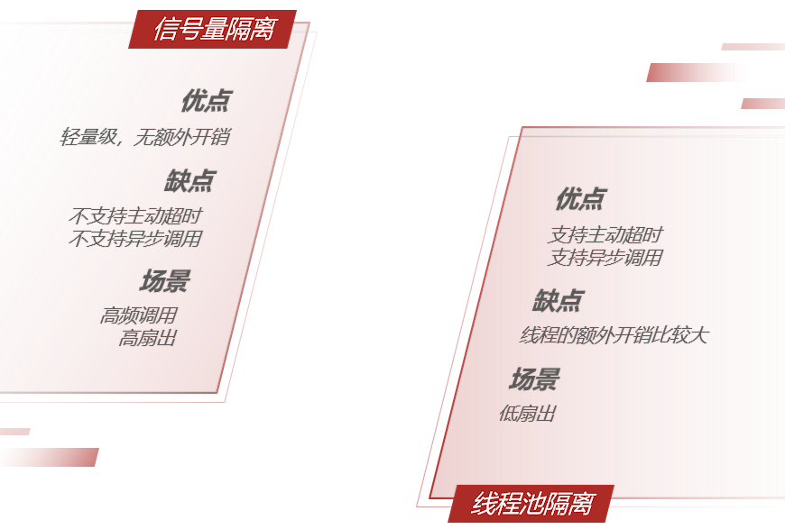


**问题说明**：考察对线程隔离方案的掌握情况

**难易程度**：一般

**参考话术**：

Hystix默认是基于线程池实现的线程隔离，每一个被隔离的业务都要创建一个独立的线程池，线程过多会带来额外的CPU开销，性能一般，但是隔离性更强。

Sentinel是基于信号量（计数器）实现的线程隔离，不用创建线程池，性能较好，但是隔离性一般。


## Sentinel的限流与Gateway的限流有什么差别？

**限流**：对应用服务器的请求做限制，避免因过多请求而导致服务器过载甚至宕机。

限流算法常见的包括：

* 计数器算法，又包括窗口计数器算法、滑动窗口计数器算法

* 令牌桶算法（Token Bucket）

* 漏桶算法(Leaky Bucket)


### 固定窗口计数器算法

固定窗口计数器算法概念如下：

* 将时间划分为多个窗口，窗口时间跨度称为Interval，本例中为1000ms；

* 每个窗口维护一个计数器，每有一次请求就将计数器加一，限流就是设置计数器阈值，本例为3

* 如果计数器超过了限流阈值，则超出阈值的请求都被丢弃。


### 滑动窗口计数器算法

滑动窗口计数器算法会将一个窗口划分为n个更小的区间

* 窗口时间跨度Interval为1秒；区间数量 n = 2 ，则每个小区间时间跨度为500ms

* 限流阈值依然为3，时间窗口（1秒）内请求超过阈值时，超出的请求被限流

* 窗口会根据当前请求所在时间（currentTime）移动，窗口范围是从（currentTime-Interval）之后的第一个时区开始，到currentTime所在时区结束


### 令牌桶算法

令牌桶算法说明：

* 以固定的速率生成令牌，存入令牌桶中，如果令牌桶满了以后，多余令牌丢弃

* 请求进入后，必须先尝试从桶中获取令牌，获取到令牌后才可以被处理

* 如果令牌桶中没有令牌，则请求等待或丢弃


### 漏桶算法

* 将每个请求视作"水滴"放入"漏桶"进行存储；

* "漏桶"以固定速率向外"漏"出请求来执行，如果"漏桶"空了则停止"漏水”；

* 如果"漏桶"满了则多余的"水滴"会被直接丢弃。

* 可以理解成请求在桶内排队等待


Sentinel在实现漏桶时，采用了排队等待模式：

让所有请求进入一个队列中，然后按照阈值允许的时间间隔依次执行。并发的多个请求必须等待，预期的等待时长 =最近一次请求的预期等待时间 +  允许的间隔。如果请求预期的等待时间超出最大时长，则会被拒绝。

例如：QPS = 5，意味着每200ms处理一个队列中的请求；timeout = 2000，意味着预期等待超过2000ms的请求会被拒绝并抛出异常


### 限流算法对比


|        **对比项**        |               **滑动时间窗口**               |                          **令牌桶**                          |                    **漏桶**                    |
| :----------------------: | :------------------------------------------: | :----------------------------------------------------------: | :--------------------------------------------: |
| **能否保证流量曲线平滑** |    不能，但窗口内区间越小，流量控制越平滑    | 基本能，在请求量持续高于令牌生成速度时，流量平滑。     但请求量在令牌生成速率上下波动时，无法保证曲线平滑 | 能，所有请求进入桶内，以恒定速率放行，绝对平滑 |
|   **能否应对突增流量**   | 不能，徒增流量，只要高出限流阈值都会被拒绝。 |              能，桶内积累的令牌可以应对突增流量              |             能，请求可以暂存在桶内             |
|    **流量控制精确度**    |          低，窗口区间越小，精度越高          |                              高                              |                       高                       |


**问题说明**：考察对限流算法的掌握情况

**难易程度**：难

**参考话术**：

限流算法常见的有三种实现：滑动时间窗口、令牌桶算法、漏桶算法。Gateway则采用了基于Redis实现的令牌桶算法。

而Sentinel内部却比较复杂：

- 默认限流模式是基于滑动时间窗口算法
- 排队等待的限流模式则基于漏桶算法
- 而热点参数限流则是基于令牌桶算法


# 消息队列

## 你们为什么选择了RabbitMQ而不是其它的MQ？


kafka是以吞吐量高而闻名，不过其数据稳定性一般，而且无法保证消息有序性。我们公司的日志收集也有使用，业务模块中则使用的RabbitMQ。

阿里巴巴的RocketMQ基于Kafka的原理，弥补了Kafka的缺点，继承了其高吞吐的优势，其客户端目前以Java为主。但是我们担心阿里巴巴开源产品的稳定性，所以就没有使用。

RabbitMQ基于面向并发的语言Erlang开发，吞吐量不如Kafka，但是对我们公司来讲够用了。而且消息可靠性较好，并且消息延迟极低，集群搭建比较方便。支持多种协议，并且有各种语言的客户端，比较灵活。Spring对RabbitMQ的支持也比较好，使用起来比较方便，比较符合我们公司的需求。

综合考虑我们公司的并发需求以及稳定性需求，我们选择了RabbitMQ


## RabbitMQ如何确保消息的不丢失？


**话术：**

RabbitMQ针对消息传递过程中可能发生问题的各个地方，给出了针对性的解决方案：

- 生产者发送消息时可能因为网络问题导致消息没有到达交换机：
  - RabbitMQ提供了publisher confirm机制
    - 生产者发送消息后，可以编写ConfirmCallback函数
    - 消息成功到达交换机后，RabbitMQ会调用ConfirmCallback通知消息的发送者，返回ACK
    - 消息如果未到达交换机，RabbitMQ也会调用ConfirmCallback通知消息的发送者，返回NACK
    - 消息超时未发送成功也会抛出异常
- 消息到达交换机后，如果未能到达队列，也会导致消息丢失：
  - RabbitMQ提供了publisher return机制
    - 生产者可以定义ReturnCallback函数
    - 消息到达交换机，未到达队列，RabbitMQ会调用ReturnCallback通知发送者，告知失败原因
- 消息到达队列后，MQ宕机也可能导致丢失消息：
  - RabbitMQ提供了持久化功能，集群的主从备份功能
    - 消息持久化，RabbitMQ会将交换机、队列、消息持久化到磁盘，宕机重启可以恢复消息
    - 镜像集群，仲裁队列，都可以提供主从备份功能，主节点宕机，从节点会自动切换为主，数据依然在
- 消息投递给消费者后，如果消费者处理不当，也可能导致消息丢失
  - SpringAMQP基于RabbitMQ提供了消费者确认机制、消费者重试机制，消费者失败处理策略：
    - 消费者的确认机制：
      - 消费者处理消息成功，未出现异常时，Spring返回ACK给RabbitMQ，消息才被移除
      - 消费者处理消息失败，抛出异常，宕机，Spring返回NACK或者不返回结果，消息不被异常
    - 消费者重试机制：
      - 默认情况下，消费者处理失败时，消息会再次回到MQ队列，然后投递给其它消费者。Spring提供的消费者重试机制，则是在处理失败后不返回NACK，而是直接在消费者本地重试。多次重试都失败后，则按照消费者失败处理策略来处理消息。避免了消息频繁入队带来的额外压力。
    - 消费者失败策略：
      - 当消费者多次本地重试失败时，消息默认会丢弃。
      - Spring提供了Republish策略，在多次重试都失败，耗尽重试次数后，将消息重新投递给指定的异常交换机，并且会携带上异常栈信息，帮助定位问题。


## RabbitMQ如何避免消息堆积？

消息堆积问题产生的原因往往是因为消息发送的速度超过了消费者消息处理的速度。因此解决方案无外乎以下三点：

- 提高消费者处理速度
- 增加更多消费者
- 增加队列消息存储上限


### 提高消费者处理速度

消费者处理速度是由业务代码决定的，所以我们能做的事情包括：

- 尽可能优化业务代码，提高业务性能
- 接收到消息后，开启线程池，并发处理多个消息

优点：成本低，改改代码即可

缺点：开启线程池会带来额外的性能开销，对于高频、低时延的任务不合适。推荐任务执行周期较长的业务。


### 增加更多消费者

一个队列绑定多个消费者，共同争抢任务，自然可以提供消息处理的速度。

优点：能用钱解决的问题都不是问题。实现简单粗暴

缺点：问题是没有钱。成本太高


### 增加队列消息存储上限

在RabbitMQ的1.8版本后，加入了新的队列模式：Lazy Queue

这种队列不会将消息保存在内存中，而是在收到消息后直接写入磁盘中，理论上没有存储上限。可以解决消息堆积问题。

优点：磁盘存储更安全；存储无上限；避免内存存储带来的Page Out问题，性能更稳定；

缺点：磁盘存储受到IO性能的限制，消息时效性不如内存模式，但影响不大。


## RabbitMQ如何保证消息的有序性？

其实RabbitMQ是队列存储，天然具备先进先出的特点，只要消息的发送是有序的，那么理论上接收也是有序的。不过当一个队列绑定了多个消费者时，可能出现消息轮询投递给消费者的情况，而消费者的处理顺序就无法保证了。

因此，要保证消息的有序性，需要做的下面几点：

- 保证消息发送的有序性
- 保证一组有序的消息都发送到同一个队列
- 保证一个队列只包含一个消费者


## 如何防止MQ消息被重复消费？

消息重复消费的原因多种多样，不可避免。所以只能从消费者端入手，只要能保证消息处理的幂等性就可以确保消息不被重复消费。

而幂等性的保证又有很多方案：

- 给每一条消息都添加一个唯一id，在本地记录消息表及消息状态，处理消息时基于数据库表的id唯一性做判断
- 同样是记录消息表，利用消息状态字段实现基于乐观锁的判断，保证幂等
- 基于业务本身的幂等性。比如根据id的删除、查询业务天生幂等；新增、修改等业务可以考虑基于数据库id唯一性、或者乐观锁机制确保幂等。本质与消息表方案类似。


## 如何保证RabbitMQ的高可用？

要实现RabbitMQ的高可用无外乎下面两点：

- 做好交换机、队列、消息的持久化
- 搭建RabbitMQ的镜像集群，做好主从备份。当然也可以使用仲裁队列代替镜像集群。


## 使用MQ可以解决那些问题？

RabbitMQ能解决的问题很多，例如：

- 解耦合：将几个业务关联的微服务调用修改为基于MQ的异步通知，可以解除微服务之间的业务耦合。同时还提高了业务性能。
- 流量削峰：将突发的业务请求放入MQ中，作为缓冲区。后端的业务根据自己的处理能力从MQ中获取消息，逐个处理任务。流量曲线变的平滑很多
- 延迟队列：基于RabbitMQ的死信队列或者DelayExchange插件，可以实现消息发送后，延迟接收的效果。


# Redis

## Redis的单线程问题

### Redis采用单线程，如何保证高并发？

Redis快的主要原因是：

1. 完全基于内存
2. 数据结构简单，对数据操作也简单
3. 使用多路 I/O 复用模型，充分利用CPU资源


### 这样做的好处是什么？

单线程优势有下面几点：

- 代码更清晰，处理逻辑更简单
- 不用去考虑各种锁的问题，不存在加锁释放锁操作，没有因为锁而导致的性能消耗
- 不存在多进程或者多线程导致的CPU切换，充分利用CPU资源


## Redis的持久化方案有哪些？

### RDB 持久化

RDB持久化可以使用save或bgsave，为了不阻塞主进程业务，一般都使用bgsave，流程：

- Redis 进程会 fork 出一个子进程（与父进程内存数据一致）。
- 父进程继续处理客户端请求命令
- 由子进程将内存中的所有数据写入到一个临时的 RDB 文件中。
- 完成写入操作之后，旧的 RDB 文件会被新的 RDB 文件替换掉。

下面是一些和 RDB 持久化相关的配置：

- `save 60 10000`：如果在 60 秒内有 10000 个 key 发生改变，那就执行 RDB 持久化。
- `stop-writes-on-bgsave-error yes`：如果 Redis 执行 RDB 持久化失败（常见于操作系统内存不足），那么 Redis 将不再接受 client 写入数据的请求。
- `rdbcompression yes`：当生成 RDB 文件时，同时进行压缩。
- `dbfilename dump.rdb`：将 RDB 文件命名为 dump.rdb。
- `dir /var/lib/redis`：将 RDB 文件保存在`/var/lib/redis`目录下。

　　当然在实践中，我们通常会将`stop-writes-on-bgsave-error`设置为`false`，同时让监控系统在 Redis 执行 RDB 持久化失败时发送告警，以便人工介入解决，而不是粗暴地拒绝 client 的写入请求。

RDB持久化的优点：

- RDB持久化文件小，Redis数据恢复时速度快
- 子进程不影响父进程，父进程可以持续处理客户端命令
- 子进程fork时采用copy-on-write方式，大多数情况下，没有太多的内存消耗，效率比较好。

 RDB 持久化的缺点：

- 子进程fork时采用copy-on-write方式，如果Redis此时写操作较多，可能导致额外的内存占用，甚至内存溢出
- RDB文件压缩会减小文件体积，但通过时会对CPU有额外的消耗
- 如果业务场景很看重数据的持久性 (durability)，那么不应该采用 RDB 持久化。譬如说，如果 Redis 每 5 分钟执行一次 RDB 持久化，要是 Redis 意外奔溃了，那么最多会丢失 5 分钟的数据。


### AOF 持久化

可以使用`appendonly yes`配置项来开启 AOF 持久化。Redis 执行 AOF 持久化时，会将接收到的写命令追加到 AOF 文件的末尾，因此 Redis 只要对 AOF 文件中的命令进行回放，就可以将数据库还原到原先的状态。
　　与 RDB 持久化相比，AOF 持久化的一个明显优势就是，它可以提高数据的持久性 (durability)。因为在 AOF 模式下，Redis 每次接收到 client 的写命令，就会将命令`write()`到 AOF 文件末尾。
　　然而，在 Linux 中，将数据`write()`到文件后，数据并不会立即刷新到磁盘，而会先暂存在 OS 的文件系统缓冲区。在合适的时机，OS 才会将缓冲区的数据刷新到磁盘（如果需要将文件内容刷新到磁盘，可以调用`fsync()`或`fdatasync()`）。
　　通过`appendfsync`配置项，可以控制 Redis 将命令同步到磁盘的频率：

- `always`：每次 Redis 将命令`write()`到 AOF 文件时，都会调用`fsync()`，将命令刷新到磁盘。这可以保证最好的数据持久性，但却会给系统带来极大的开销。
- `no`：Redis 只将命令`write()`到 AOF 文件。这会让 OS 决定何时将命令刷新到磁盘。
- `everysec`：除了将命令`write()`到 AOF 文件，Redis 还会每秒执行一次`fsync()`。在实践中，推荐使用这种设置，一定程度上可以保证数据持久性，又不会明显降低 Redis 性能。

　　然而，AOF 持久化并不是没有缺点的：Redis 会不断将接收到的写命令追加到 AOF 文件中，导致 AOF 文件越来越大。过大的 AOF 文件会消耗磁盘空间，并且导致 Redis 重启时更加缓慢。为了解决这个问题，在适当情况下，Redis 会对 AOF 文件进行重写，去除文件中冗余的命令，以减小 AOF 文件的体积。在重写 AOF 文件期间， Redis 会启动一个子进程，由子进程负责对 AOF 文件进行重写。
　　可以通过下面两个配置项，控制 Redis 重写 AOF 文件的频率：

- `auto-aof-rewrite-min-size 64mb`
- `auto-aof-rewrite-percentage 100`

　　上面两个配置的作用：当 AOF 文件的体积大于 64MB，并且 AOF 文件的体积比上一次重写之后的体积大了至少一倍，那么 Redis 就会执行 AOF 重写。

优点：

- 持久化频率高，数据可靠性高
- 没有额外的内存或CPU消耗

缺点：

- 文件体积大
- 文件大导致服务数据恢复时效率较低


**面试话术：**

Redis 提供了两种数据持久化的方式，一种是 RDB，另一种是 AOF。默认情况下，Redis 使用的是 RDB 持久化。

RDB持久化文件体积较小，但是保存数据的频率一般较低，可靠性差，容易丢失数据。另外RDB写数据时会采用Fork函数拷贝主进程，可能有额外的内存消耗，文件压缩也会有额外的CPU消耗。

ROF持久化可以做到每秒钟持久化一次，可靠性高。但是持久化文件体积较大，导致数据恢复时读取文件时间较长，效率略低


## Redis的集群方式有哪些？

**面试话术：**

Redis集群可以分为**主从集群**和**分片集群**两类。

**主从集群**一般一主多从，主库用来写数据，从库用来读数据。结合哨兵，可以再主库宕机时从新选主，**目的是保证Redis的高可用**。

**分片集群**是数据分片，我们会让多个Redis节点组成集群，并将16383个插槽分到不同的节点上。存储数据时利用对key做hash运算，得到插槽值后存储到对应的节点即可。因为存储数据面向的是插槽而非节点本身，因此可以做到集群动态伸缩。**目的是让Redis能存储更多数据。**


### 主从集群

主从集群，也是读写分离集群。一般都是一主多从方式。

Redis 的复制（replication）功能允许用户根据一个 Redis 服务器来创建任意多个该服务器的复制品，其中被复制的服务器为主服务器（master），而通过复制创建出来的服务器复制品则为从服务器（slave）。

只要主从服务器之间的网络连接正常，主从服务器两者会具有相同的数据，主服务器就会一直将发生在自己身上的数据更新同步给从服务器，从而一直保证主从服务器的数据相同。

- 写数据时只能通过主节点完成
- 读数据可以从任何节点完成
- 如果配置了`哨兵节点`，当master宕机时，哨兵会从salve节点选出一个新的主


### 分片集群

主从集群中，每个节点都要保存所有信息，容易形成木桶效应。并且当数据量较大时，单个机器无法满足需求。此时我们就要使用分片集群了


集群特征：

- 每个节点都保存不同数据
- 所有的redis节点彼此互联(PING-PONG机制),内部使用二进制协议优化传输速度和带宽.

- 节点的fail是通过集群中超过半数的节点检测失效时才生效.

- 客户端与redis节点直连,不需要中间proxy层连接集群中任何一个可用节点都可以访问到数据

- redis-cluster把所有的物理节点映射到[0-16383]slot（插槽）上，实现动态伸缩


为了保证Redis中每个节点的高可用，我们还可以给每个节点创建replication（slave节点），出现故障时，主从可以及时切换


## Redis的常用数据类型有哪些？

支持多种类型的数据结构，主要区别是value存储的数据格式不同：

- string：最基本的数据类型，二进制安全的字符串，最大512M。
- list：按照添加顺序保持顺序的字符串列表。
- set：无序的字符串集合，不存在重复的元素。
- sorted set：已排序的字符串集合。
- hash：key-value对格式


## 聊一下Redis事务机制

Redis事务功能是通过MULTI、EXEC、DISCARD和WATCH 四个原语实现的。Redis会将一个事务中的所有命令序列化，然后按顺序执行。但是Redis事务不支持回滚操作，命令运行出错后，正确的命令会继续执行。

- `MULTI`: 用于开启一个事务，它总是返回OK。 MULTI执行之后，客户端可以继续向服务器发送任意多条命令，这些命令不会立即被执行，而是被放到一个**待执行命令队列**中
- `EXEC`：按顺序执行命令队列内的所有命令。返回所有命令的返回值。事务执行过程中，Redis不会执行其它事务的命令。
- `DISCARD`：清空命令队列，并放弃执行事务， 并且客户端会从事务状态中退出
- `WATCH`：Redis的乐观锁机制，利用compare-and-set（CAS）原理，可以监控一个或多个键，一旦其中有一个键被修改，之后的事务就不会执行


使用事务时可能会遇上以下两种错误：

- 执行 EXEC 之前，入队的命令可能会出错。比如说，命令可能会产生语法错误（参数数量错误，参数名错误，等等），或者其他更严重的错误，比如内存不足（如果服务器使用 `maxmemory` 设置了最大内存限制的话）。
  - Redis 2.6.5 开始，服务器会对命令入队失败的情况进行记录，并在客户端调用 EXEC 命令时，拒绝执行并自动放弃这个事务。
- 命令可能在 EXEC 调用之后失败。举个例子，事务中的命令可能处理了错误类型的键，比如将列表命令用在了字符串键上面，诸如此类。
  - 即使事务中有某个/某些命令在执行时产生了错误， 事务中的其他命令仍然会继续执行，不会回滚。

为什么 Redis 不支持回滚（roll back）？

以下是这种做法的优点：

- Redis 命令只会因为错误的语法而失败（并且这些问题不能在入队时发现），或是命令用在了错误类型的键上面：这也就是说，从实用性的角度来说，失败的命令是由**编程错误**造成的，而这些错误应该在开发的过程中被发现，而不应该出现在生产环境中。
- 因为不需要对回滚进行支持，所以 Redis 的内部可以保持简单且快速。


鉴于没有任何机制能避免程序员自己造成的错误， 并且这类错误通常不会在生产环境中出现， 所以 Redis 选择了更简单、更快速的无回滚方式来处理事务


**面试话术：**

Redis事务其实是把一系列Redis命令放入队列，然后批量执行，执行过程中不会有其它事务来打断。不过与关系型数据库的事务不同，Redis事务不支持回滚操作，事务中某个命令执行失败，其它命令依然会执行。

为了弥补不能回滚的问题，Redis会在事务入队时就检查命令，如果命令异常则会放弃整个事务。

因此，只要程序员编程是正确的，理论上说Redis会正确执行所有事务，无需回滚。


面试官：如果事务执行一半的时候Redis宕机怎么办？

Redis有持久化机制，因为可靠性问题，我们一般使用AOF持久化。事务的所有命令也会写入AOF文件，但是如果在执行EXEC命令之前，Redis已经宕机，则AOF文件中事务不完整。使用 `redis-check-aof` 程序可以移除 AOF 文件中不完整事务的信息，确保服务器可以顺利启动


## Redis的Key过期策略

### 为什么需要内存回收？

- 在Redis中，set指令可以指定key的过期时间，当过期时间到达以后，key就失效了；
- Redis是基于内存操作的，所有的数据都是保存在内存中，一台机器的内存是有限且很宝贵的。

基于以上两点，为了保证Redis能继续提供可靠的服务，Redis需要一种机制清理掉不常用的、无效的、多余的数据，失效后的数据需要及时清理，这就需要内存回收了。


Redis的内存回收主要分为过期删除策略和内存淘汰策略两部分。


### 过期删除策略

删除达到过期时间的key。

- 定时删除

对于每一个设置了过期时间的key都会创建一个定时器，一旦到达过期时间就立即删除。该策略可以立即清除过期的数据，对内存较友好，但是缺点是占用了大量的CPU资源去处理过期的数据，会影响Redis的吞吐量和响应时间。

- 惰性删除

当访问一个key时，才判断该key是否过期，过期则删除。该策略能最大限度地节省CPU资源，但是对内存却十分不友好。有一种极端的情况是可能出现大量的过期key没有被再次访问，因此不会被清除，导致占用了大量的内存。

> 在计算机科学中，懒惰删除（英文：lazy deletion）指的是从一个散列表（也称哈希表）中删除元素的一种方法。在这个方法中，删除仅仅是指标记一个元素被删除，而不是整个清除它。被删除的位点在插入时被当作空元素，在搜索之时被当作已占据。

- 定期删除

每隔一段时间，扫描Redis中过期key字典，并清除部分过期的key。该策略是前两者的一个折中方案，还可以通过调整定时扫描的时间间隔和每次扫描的限定耗时，在不同情况下使得CPU和内存资源达到最优的平衡效果。

在Redis中，`同时使用了定期删除和惰性删除`。不过Redis定期删除采用的是随机抽取的方式删除部分Key，因此不能保证过期key 100%的删除。


Redis结合了定期删除和惰性删除，基本上能很好的处理过期数据的清理，但是实际上还是有点问题的，如果过期key较多，定期删除漏掉了一部分，而且也没有及时去查，即没有走惰性删除，那么就会有大量的过期key堆积在内存中，导致redis内存耗尽，当内存耗尽之后，有新的key到来会发生什么事呢？是直接抛弃还是其他措施呢？有什么办法可以接受更多的key？


### 内存淘汰策略

Redis的内存淘汰策略，是指内存达到maxmemory极限时，使用某种算法来决定清理掉哪些数据，以保证新数据的存入。

Redis的内存淘汰机制包括：

- noeviction: 当内存不足以容纳新写入数据时，新写入操作会报错。
- allkeys-lru：当内存不足以容纳新写入数据时，在键空间（`server.db[i].dict`）中，移除最近最少使用的 key（这个是最常用的）。
- allkeys-random：当内存不足以容纳新写入数据时，在键空间（`server.db[i].dict`）中，随机移除某个 key。
- volatile-lru：当内存不足以容纳新写入数据时，在设置了过期时间的键空间（`server.db[i].expires`）中，移除最近最少使用的 key。
- volatile-random：当内存不足以容纳新写入数据时，在设置了过期时间的键空间（`server.db[i].expires`）中，随机移除某个 key。
- volatile-ttl：当内存不足以容纳新写入数据时，在设置了过期时间的键空间（`server.db[i].expires`）中，有更早过期时间的 key 优先移除。

> 在配置文件中，通过maxmemory-policy可以配置要使用哪一个淘汰机制。

什么时候会进行淘汰？

Redis会在每一次处理命令的时候（processCommand函数调用freeMemoryIfNeeded）判断当前redis是否达到了内存的最大限制，如果达到限制，则使用对应的算法去处理需要删除的key。

在淘汰key时，Redis默认最常用的是LRU算法（Latest Recently Used）。Redis通过在每一个redisObject保存lru属性来保存key最近的访问时间，在实现LRU算法时直接读取key的lru属性。

具体实现时，Redis遍历每一个db，从每一个db中随机抽取一批样本key，默认是3个key，再从这3个key中，删除最近最少使用的key。


### 面试话术

Redis过期策略包含定期删除和惰性删除两部分。定期删除是在Redis内部有一个定时任务，会定期删除一些过期的key。惰性删除是当用户查询某个Key时，会检查这个Key是否已经过期，如果没过期则返回用户，如果过期则删除。

但是这两个策略都无法保证过期key一定删除，漏网之鱼越来越多，还可能导致内存溢出。当发生内存不足问题时，Redis还会做内存回收。内存回收采用LRU策略，就是最近最少使用。其原理就是记录每个Key的最近使用时间，内存回收时，随机抽取一些Key，比较其使用时间，把最老的几个删除。

Redis的逻辑是：最近使用过的，很可能再次被使用


## Redis在项目中的哪些地方有用到?

* 共享session

在分布式系统下，服务会部署在不同的tomcat，因此多个tomcat的session无法共享，以前存储在session中的数据无法实现共享，可以用redis代替session，解决分布式系统间数据共享问题。

* 数据缓存

Redis采用内存存储，读写效率较高。我们可以把数据库的访问频率高的热点数据存储到redis中，这样用户请求时优先从redis中读取，减少数据库压力，提高并发能力。

* 异步队列

Reids在内存存储引擎领域的一大优点是提供 list 和 set 操作，这使得Redis能作为一个很好的消息队列平台来使用。而且Redis中还有pub/sub这样的专用结构，用于1对N的消息通信模式。

* 分布式锁

Redis中的乐观锁机制，可以帮助我们实现分布式锁的效果，用于解决分布式系统下的多线程安全问题

* 全局ID

int类型，incrby，利用原子性

* 计数器

文章的阅读量、微博点赞数、允许一定的延迟，先写入Redis再定时同步到数据库

* 位统计

String类型的bitcount，字符是以8位二进制存储的

* 点赞、签到、打卡

* 商品标签

用 tags:i5001 来维护商品所有的标签

* 好友关系、用户关注、推荐模型

* 排行榜

使用`sorted set`(有序set)和一个计算热度的算法便可以轻松打造一个热度排行榜


## Redis的缓存击穿、缓存雪崩、缓存穿透

### 缓存穿透

- 什么是缓存穿透
  - 正常情况下，我们去查询数据都是存在。那么请求去查询一条压根儿数据库中根本就不存在的数据，也就是缓存和数据库都查询不到这条数据，但是请求每次都会打到数据库上面去。这种查询不存在数据的现象我们称为**缓存穿透**。
- 穿透带来的问题
  - 试想一下，如果有黑客会对你的系统进行攻击，拿一个不存在的id 去查询数据，会产生大量的请求到数据库去查询。可能会导致你的数据库由于压力过大而宕掉。
- 解决办法
  - 缓存空值：之所以会发生穿透，就是因为缓存中没有存储这些空数据的key。从而导致每次查询都到数据库去了。那么我们就可以为这些key对应的值设置为null 丢到缓存里面去。后面再出现查询这个key 的请求的时候，直接返回null 。这样，就不用在到数据库中去走一圈了，但是别忘了设置过期时间。
  - BloomFilter（布隆过滤）：将所有可能存在的数据哈希到一个足够大的bitmap中，一个一定不存在的数据会被 这个bitmap拦截掉，从而避免了对底层存储系统的查询压力。在缓存之前在加一层 BloomFilter ，在查询的时候先去 BloomFilter 去查询 key 是否存在，如果不存在就直接返回，存在再走查缓存 -> 查 DB。


**话术：**

缓存穿透有两种解决方案：**其一**是把不存在的key设置null值到缓存中。**其二**是使用布隆过滤器，在查询缓存前先通过布隆过滤器判断key是否存在，存在再去查询缓存。

设置null值可能被恶意针对，攻击者使用大量不存在的不重复key ，那么方案一就会缓存大量不存在key数据。此时我们还可以对Key规定格式模板，然后对不存在的key做**正则规范**匹配，如果完全不符合就不用存null值到redis，而是直接返回错误。


### 缓存击穿

- 什么是缓存击穿？

key可能会在某些时间点被超高并发地访问，是一种非常“热点”的数据。这个时候，需要考虑一个问题：缓存被“击穿”的问题。

当这个key在失效的瞬间，redis查询失败，持续的大并发就穿破缓存，直接请求数据库，就像在一个屏障上凿开了一个洞。

- 解决方案：
  - 使用互斥锁(mutex key)：mutex，就是互斥。简单地来说，就是在缓存失效的时候（判断拿出来的值为空），不是立即去load db，而是先使用Redis的SETNX去set一个互斥key，当操作返回成功时，再进行load db的操作并回设缓存；否则，就重试整个get缓存的方法。SETNX，是「SET if Not eXists」的缩写，也就是只有不存在的时候才设置，可以利用它来实现互斥的效果。
  - 软过期：也就是逻辑过期，不使用redis提供的过期时间，而是业务层在数据中存储过期时间信息。查询时由业务程序判断是否过期，如果数据即将过期时，将缓存的时效延长，程序可以派遣一个线程去数据库中获取最新的数据，其他线程这时看到延长了的过期时间，就会继续使用旧数据，等派遣的线程获取最新数据后再更新缓存。

推荐使用互斥锁，因为软过期会有业务逻辑侵入和额外的判断。


**面试话术**：

缓存击穿主要担心的是某个Key过期，更新缓存时引起对数据库的突发高并发访问。因此我们可以在更新缓存时采用互斥锁控制，只允许一个线程去更新缓存，其它线程等待并重新读取缓存。例如Redis的setnx命令就能实现互斥效果。


### 缓存雪崩

缓存雪崩，是指在某一个时间段，缓存集中过期失效。对这批数据的访问查询，都落到了数据库上，对于数据库而言，就会产生周期性的压力波峰。

解决方案：

- 数据分类分批处理：采取不同分类数据，缓存不同周期
- 相同分类数据：采用固定时长加随机数方式设置缓存
- 热点数据缓存时间长一些，冷门数据缓存时间短一些
- 避免redis节点宕机引起雪崩，搭建主从集群，保证高可用


**面试话术：**

解决缓存雪崩问题的关键是让缓存Key的过期时间分散。因此我们可以把数据按照业务分类，然后设置不同过期时间。相同业务类型的key，设置固定时长加随机数。尽可能保证每个Key的过期时间都不相同。

另外，Redis宕机也可能导致缓存雪崩，因此我们还要搭建Redis主从集群及哨兵监控，保证Redis的高可用。


## 缓存冷热数据分离

Redis使用的是内存存储，当需要海量数据存储时，成本非常高。

经过调研发现，当前主流DDR3内存和主流SATA SSD的单位成本价格差距大概在20倍左右，为了优化redis机器综合成本，我们考虑实现基于**热度统计 的数据分级存储**及数据在RAM/FLASH之间的动态交换，从而大幅度降低成本，达到性能与成本的高平衡。

基本思路：基于key访问次数(LFU)的热度统计算法识别出热点数据，并将热点数据保留在redis中，对于无访问/访问次数少的数据则转存到SSD上，如果SSD上的key再次变热，则重新将其加载到redis内存中。

目前流行的高性能磁盘存储，并且遵循Redis协议的方案包括：

- SSDB：http://ssdb.io/zh_cn/
- RocksDB：https://rocksdb.org.cn/


因此，我们就需要在应用程序与缓存服务之间引入代理，实现Redis和SSD之间的切换


## Redis实现分布式锁

分布式锁要满足的条件：

- 多进程互斥：同一时刻，只有一个进程可以获取锁
- 保证锁可以释放：任务结束或出现异常，锁一定要释放，避免死锁
- 阻塞锁（可选）：获取锁失败时可否重试
- 重入锁（可选）：获取锁的代码递归调用时，依然可以获取锁


### 最基本的分布式锁

利用Redis的setnx命令，这个命令的特征时如果多次执行，只有第一次执行会成功，可以实现`互斥`的效果。但是为了保证服务宕机时也可以释放锁，需要利用expire命令给锁设置一个有效期

```
setnx lock thread-01 # 尝试获取锁
expire lock 10 # 设置有效期
```

**面试官问题1**：如果expire之前服务宕机怎么办？

要保证setnx和expire命令的原子性。redis的set命令可以满足：

```
set key value [NX] [EX time] 
```

需要添加nx和ex的选项：

- NX：与setnx一致，第一次执行成功
- EX：设置过期时间

**面试官问题2**：释放锁的时候，如果自己的锁已经过期了，此时会出现安全漏洞，如何解决？

在锁中存储当前进程和线程标识，释放锁时对锁的标识判断，如果是自己的则删除，不是则放弃操作。

但是这两步操作要保证原子性，需要通过Lua脚本来实现。

```
if redis.call("get",KEYS[1]) == ARGV[1] then
    redis.call("del",KEYS[1])
end
```


### 可重入分布式锁

下面我们假设锁的key为“`lock`”，hashKey是当前线程的id：“`threadId`”，锁自动释放时间假设为20

获取锁的步骤：

- 1、判断lock是否存在 `EXISTS lock`
  - 存在，说明有人获取锁了，下面判断是不是自己的锁
    - 判断当前线程id作为hashKey是否存在：`HEXISTS lock threadId`
      - 不存在，说明锁已经有了，且不是自己获取的，锁获取失败，end
      - 存在，说明是自己获取的锁，重入次数+1：`HINCRBY lock threadId 1`，去到步骤3
  - 2、不存在，说明可以获取锁，`HSET key threadId 1`
  - 3、设置锁自动释放时间，`EXPIRE lock 20`

释放锁的步骤：

- 1、判断当前线程id作为hashKey是否存在：`HEXISTS lock threadId`
  - 不存在，说明锁已经失效，不用管了
  - 存在，说明锁还在，重入次数减1：`HINCRBY lock threadId -1`，获取新的重入次数
- 2、判断重入次数是否为0：
  - 为0，说明锁全部释放，删除key：`DEL lock`
  - 大于0，说明锁还在使用，重置有效时间：`EXPIRE lock 20`


### 高可用的锁

redis分布式锁依赖于redis，如果redis宕机则锁失效。如何解决？

如果搭建主从集群做数据备份时，进程A获取锁，master还没有把数据备份到slave，master宕机，slave升级为master，此时原来锁失效，其它进程也可以获取锁，出现安全问题。如何解决？


关于这个问题，Redis官网给出了解决方案，使用RedLock思路可以解决：

> 在Redis的分布式环境中，我们假设有N个Redis master。这些节点完全互相独立，不存在主从复制或者其他集群协调机制。之前我们已经描述了在Redis单实例下怎么安全地获取和释放锁。我们确保将在每（N)个实例上使用此方法获取和释放锁。在这个样例中，我们假设有5个Redis master节点，这是一个比较合理的设置，所以我们需要在5台机器上面或者5台虚拟机上面运行这些实例，这样保证他们不会同时都宕掉。
>
> 为了取到锁，客户端应该执行以下操作:
>
> 1. 获取当前Unix时间，以毫秒为单位。
> 2. 依次尝试从N个实例，使用相同的key和随机值获取锁。在步骤2，当向Redis设置锁时,客户端应该设置一个网络连接和响应超时时间，这个超时时间应该小于锁的失效时间。例如你的锁自动失效时间为10秒，则超时时间应该在5-50毫秒之间。这样可以避免服务器端Redis已经挂掉的情况下，客户端还在死死地等待响应结果。如果服务器端没有在规定时间内响应，客户端应该尽快尝试另外一个Redis实例。
> 3. 客户端使用当前时间减去开始获取锁时间（步骤1记录的时间）就得到获取锁使用的时间。当且仅当从大多数（这里是3个节点）的Redis节点都取到锁，并且使用的时间小于锁失效时间时，锁才算获取成功。
> 4. 如果取到了锁，key的真正有效时间等于有效时间减去获取锁所使用的时间（步骤3计算的结果）。
> 5. 如果因为某些原因，获取锁失败（*没有*在至少N/2+1个Redis实例取到锁或者取锁时间已经超过了有效时间），客户端应该在所有的Redis实例上进行解锁（即便某些Redis实例根本就没有加锁成功）。


## 如何实现数据库与缓存数据一致？

实现方案有下面几种：

- 本地缓存同步：当前微服务的数据库数据与缓存数据同步，可以直接在数据库修改时加入对Redis的修改逻辑，保证一致。
- 跨服务缓存同步：服务A调用了服务B，并对查询结果缓存。服务B数据库修改，可以通过MQ通知服务A，服务A修改Redis缓存数据
- 通用方案：使用Canal框架，伪装成MySQL的salve节点，监听MySQL的binLog变化，然后修改Redis缓存数据


## 说一下 Redis 和 Memcached 的区别和共同点

**共同点** ：

1. 都是基于内存的数据库，一般都用来当做缓存使用。
2. 都有过期策略。
3. 两者的性能都非常高。


**区别** ：

1. **Redis 支持更丰富的数据类型（支持更复杂的应用场景）**。Redis 不仅仅支持简单的 k/v 类型的数据，同时还提供 list，set，zset，hash 等数据结构的存储。Memcached 只支持最简单的 k/v 数据类型。
2. **Redis 支持数据的持久化，可以将内存中的数据保持在磁盘中，重启的时候可以再次加载进行使用,而 Memcached 把数据全部存在内存之中。**
3. **Redis 有灾难恢复机制。** 因为可以把缓存中的数据持久化到磁盘上。
4. **Redis 在服务器内存使用完之后，可以将不用的数据放到磁盘上。但是，Memcached 在服务器内存使用完之后，就会直接报异常。**
5. **Memcached 没有原生的集群模式，需要依靠客户端来实现往集群中分片写入数据；但是 Redis 目前是原生支持 cluster 模式的。**
6. **Memcached 是多线程，非阻塞 IO 复用的网络模型；Redis 使用单线程的多路 IO 复用模型。** （Redis 6.0 引入了多线程 IO ）
7. **Redis 支持发布订阅模型、Lua 脚本、事务等功能，而 Memcached 不支持。并且，Redis 支持更多的编程语言。**
8. **Memcached 过期数据的删除策略只用了惰性删除，而 Redis 同时使用了惰性删除与定期删除。**


## 缓存数据的处理流程是怎样的？

简单来说就是:

1. 如果用户请求的数据在缓存中就直接返回。
2. 缓存中不存在的话就看数据库中是否存在。
3. 数据库中存在的话就更新缓存中的数据。
4. 数据库中不存在的话就返回空数据。


## Redis 可以做消息队列么？

Redis 5.0 新增加的一个数据结构 `Stream` 可以用来做消息队列，`Stream` 支持：

- 发布 / 订阅模式
- 按照消费者组进行消费
- 消息持久化（ RDB 和 AOF）

不过，和专业的消息队列相比，还是有很多欠缺的地方比如消息丢失和堆积问题不好解决。因此，我们通常建议是不使用 Redis 来做消息队列的，你完全可以选择市面上比较成熟的一些消息队列比如 RocketMQ、Kafka。


## Redis 常用的数据结构有哪些？

- **5 种基础数据结构** ：String（字符串）、List（列表）、Set（集合）、Hash（散列）、Zset（有序集合）。
- **3 种特殊数据结构** ：HyperLogLogs（基数统计）、Bitmap （位存储）、Geospatial (地理位置)。


## String 还是 Hash 存储对象数据更好呢？

- String 存储的是序列化后的对象数据，存放的是整个对象。Hash 是对对象的每个字段单独存储，可以获取部分字段的信息，也可以修改或者添加部分字段，节省网络流量。如果对象中某些字段需要经常变动或者经常需要单独查询对象中的个别字段信息，Hash 就非常适合。
- String 存储相对来说更加节省内存，缓存相同数量的对象数据，String 消耗的内存约是 Hash 的一半。并且，存储具有多层嵌套的对象时也方便很多。如果系统对性能和资源消耗非常敏感的话，String 就非常适合。


## 购物车信息用 String 还是 Hash 存储更好呢?

由于购物车中的商品频繁修改和变动，购物车信息建议使用 Hash 存储：

- 用户 id 为 key
- 商品 id 为 field，商品数量为 value


那用户购物车信息的维护具体应该怎么操作呢？

- 用户添加商品就是往 Hash 里面增加新的 field 与 value；
- 查询购物车信息就是遍历对应的 Hash；
- 更改商品数量直接修改对应的 value 值（直接 set 或者做运算皆可）；
- 删除商品就是删除 Hash 中对应的 field；
- 清空购物车直接删除对应的 key 即可。


## 使用 Redis 实现一个排行榜怎么做？

Redis 中有一个叫做 `sorted set` 的数据结构经常被用在各种排行榜的场景

相关的一些 Redis 命令: `ZRANGE` (从小到大排序) 、 `ZREVRANGE` （从大到小排序）、`ZREVRANK` (指定元素排名)。


## Redis6.0 之前为什么不使用多线程？

- 单线程编程容易并且更容易维护；
- Redis 的性能瓶颈不在 CPU ，主要在内存和网络；
- 多线程就会存在死锁、线程上下文切换等问题，甚至会影响性能。


## Redis6.0 之后为何引入了多线程？

**Redis6.0 引入多线程主要是为了提高网络 IO 读写性能**，因为这个算是 Redis 中的一个性能瓶颈（Redis 的瓶颈主要受限于内存和网络）。

虽然，Redis6.0 引入了多线程，但是 Redis 的多线程只是在网络数据的读写这类耗时操作上使用了，执行命令仍然是单线程顺序执行。


## Redis 是如何判断数据是否过期的呢？

Redis 通过一个叫做过期字典（可以看作是 hash 表）来保存数据过期的时间。过期字典的键指向 Redis 数据库中的某个 key(键)，过期字典的值是一个 long long 类型的整数，这个整数保存了 key 所指向的数据库键的过期时间（毫秒精度的 UNIX 时间戳）。


## 什么是 bigkey？

简单来说，如果一个 key 对应的 value 所占用的内存比较大，那这个 key 就可以看作是 bigkey。具体多大才算大呢？有一个不是特别精确的参考标准：string 类型的 value 超过 10 kb，复合类型的 value 包含的元素超过 5000 个（对于复合类型的 value 来说，不一定包含的元素越多，占用的内存就越多）。


## bigkey 有什么危害？

除了会消耗更多的内存空间，bigkey 对性能也会有比较大的影响。

因此，我们应该尽量避免写入 bigkey！


## 如何发现 bigkey？

* 使用 Redis 自带的 `--bigkeys` 参数来查找
* 分析 RDB 文件


## Cache Aside Pattern（旁路缓存模式）

Cache Aside Pattern 是我们平时使用比较多的一个缓存读写模式，**比较适合读请求比较多的场景**。

Cache Aside Pattern 中服务端需要同时维系 db 和 cache，并且是以 db 的结果为准。

下面我们来看一下这个策略模式下的缓存读写步骤。

**写** ：

- 先更新 db
- 然后直接删除 cache 。


**读** :

- 从 cache 中读取数据，读取到就直接返回
- cache 中读取不到的话，就从 db 中读取数据返回
- 再把数据放到 cache 中。


**在写数据的过程中，可以先删除 cache ，后更新 db 么？**

那肯定是不行的！因为这样可能会造成 **数据库（db）和缓存（Cache）数据不一致**的问题。

请求 1 先写数据 A，请求 2 随后读数据 A 的话，就很有可能产生数据不一致性的问题。

请求 1 先把 cache 中的 A 数据删除 -> 请求 2 从 db 中读取数据->请求 1 再把 db 中的 A 数据更新


**在写数据的过程中，先更新 db，后删除 cache 就没有问题了么？**

理论上来说还是可能会出现数据不一致性的问题，不过概率非常小，因为缓存的写入速度是比数据库的写入速度快很多。

请求 1 先读数据 A，请求 2 随后写数据 A，并且数据 A 在请求 1 请求之前不在缓存中的话，也有可能产生数据不一致性的问题。

请求 1 从 db 读数据 A-> 请求 2 更新 db 中的数据 A（此时缓存中无数据 A ，故不用执行删除缓存操作 ） -> 请求 1 将数据 A 写入 cache


## Cache Aside Pattern 的缺陷

缺陷 1：首次请求数据一定不在 cache 的问题

缺陷 2：写操作比较频繁的话导致 cache 中的数据会被频繁被删除，这样会影响缓存命中率 。


解决办法：

- 数据库和缓存数据强一致场景 ：更新 db 的时候同样更新 cache，不过我们需要加一个锁/分布式锁来保证更新 cache 的时候不存在线程安全问题。
- 可以短暂地允许数据库和缓存数据不一致的场景 ：更新 db 的时候同样更新 cache，但是给缓存加一个比较短的过期时间，这样的话就可以保证即使数据不一致的话影响也比较小。


## Read/Write Through Pattern（读写穿透）

Read/Write Through Pattern 中服务端把 cache 视为主要数据存储，从中读取数据并将数据写入其中。cache 服务负责将此数据读取和写入 db，从而减轻了应用程序的职责。


**写（Write Through）：**

- 先查 cache，cache 中不存在，直接更新 db。
- cache 中存在，则先更新 cache，然后 cache 服务自己更新 db（**同步更新 cache 和 db**）。


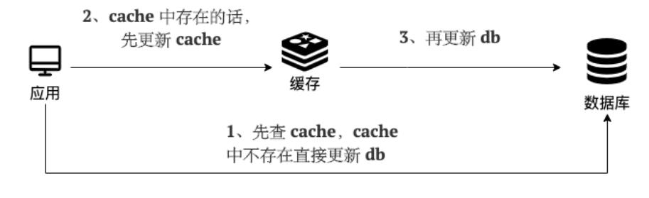


**读(Read Through)：**

- 从 cache 中读取数据，读取到就直接返回 。
- 读取不到的话，先从 db 加载，写入到 cache 后返回响应。


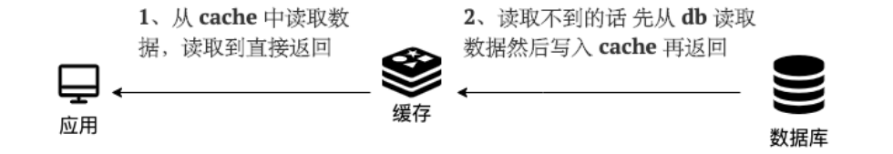


Read-Through Pattern 实际只是在 Cache-Aside Pattern 之上进行了封装。在 Cache-Aside Pattern 下，发生读请求的时候，如果 cache 中不存在对应的数据，是由客户端自己负责把数据写入 cache，而 Read Through Pattern 则是 cache 服务自己来写入缓存的，这对客户端是透明的。

和 Cache Aside Pattern 一样， Read-Through Pattern 也有首次请求数据一定不再 cache 的问题，对于热点数据可以提前放入缓存中。


## Write Behind Pattern（异步缓存写入）

Write Behind Pattern 和 Read/Write Through Pattern 很相似，两者都是由 cache 服务来负责 cache 和 db 的读写。

但是，两个又有很大的不同：**Read/Write Through 是同步更新 cache 和 db，而 Write Behind 则是只更新缓存，不直接更新 db，而是改为异步批量的方式来更新 db。**


很明显，这种方式对数据一致性带来了更大的挑战，比如 cache 数据可能还没异步更新 db 的话，cache 服务可能就就挂掉了。

这种策略在我们平时开发过程中也非常非常少见，但是不代表它的应用场景少，比如消息队列中消息的异步写入磁盘、MySQL 的 Innodb Buffer Pool 机制都用到了这种策略。

Write Behind Pattern 下 db 的写性能非常高，非常适合一些数据经常变化又对数据一致性要求没那么高的场景，比如浏览量、点赞量。


# 基础-排序算法

## 冒泡排序

**算法描述**

1. 依次比较数组中相邻两个元素大小，若 a[j] > a[j+1]，则交换两个元素，两两都比较一遍称为一轮冒泡，结果是让最大的元素排至最后
2. 重复以上步骤，直到整个数组有序


## 选择排序

**算法描述**

1. 将数组分为两个子集，排序的和未排序的，每一轮从未排序的子集中选出最小的元素，放入排序子集
2. 重复以上步骤，直到整个数组有序


## 插入排序

**算法描述**

1. 将数组分为两个区域，排序区域和未排序区域，每一轮从未排序区域中取出第一个元素，插入到排序区域（需保证顺序）
2. 重复以上步骤，直到整个数组有序


## 希尔排序

**算法描述**

1. 首先选取一个间隙序列，如 (n/2，n/4 … 1)，n 为数组长度

2. 每一轮将间隙相等的元素视为一组，对组内元素进行插入排序，目的有二

   ① 少量元素插入排序速度很快

   ② 让组内值较大的元素更快地移动到后方

3. 当间隙逐渐减少，直至为 1 时，即可完成排序


## 归并排序

归并排序是建立在归并操作上的一种有效的排序算法。该算法是采用分治法 (Divide and Conquer) 的一个非常典型的应用。归并排序是一种稳定的排序方法。将已有序的子序列合并，得到完全有序的序列；即先使每个子序列有序，再使子序列段间有序。若将两个有序表合并成一个有序表，称为 2 - 路归并。

和选择排序一样，归并排序的性能不受输入数据的影响，但表现比选择排序好的多，因为始终都是 `O(nlogn)` 的时间复杂度。代价是需要额外的内存空间。


归并排序算法是一个递归过程，边界条件为当输入序列仅有一个元素时，直接返回，具体过程如下：

1. 如果输入内只有一个元素，则直接返回，否则将长度为 `n` 的输入序列分成两个长度为 `n/2` 的子序列；
2. 分别对这两个子序列进行归并排序，使子序列变为有序状态；
3. 设定两个指针，分别指向两个已经排序子序列的起始位置；
4. 比较两个指针所指向的元素，选择相对小的元素放入到合并空间（用于存放排序结果），并移动指针到下一位置；
5. 重复步骤 3 ~4 直到某一指针达到序列尾；
6. 将另一序列剩下的所有元素直接复制到合并序列尾。


## 快速排序

快速排序用到了分治思想，同样的还有归并排序。乍看起来快速排序和归并排序非常相似，都是将问题变小，先排序子串，最后合并。不同的是快速排序在划分子问题的时候经过多一步处理，将划分的两组数据划分为一大一小，这样在最后合并的时候就不必像归并排序那样再进行比较。但也正因为如此，划分的不定性使得快速排序的时间复杂度并不稳定。

快速排序的基本思想：通过一趟排序将待排序列分隔成独立的两部分，其中一部分记录的元素均比另一部分的元素小，则可分别对这两部分子序列继续进行排序，以达到整个序列有序。


**算法描述**

1. 每一轮排序选择一个基准点（pivot）进行分区
   1. 让小于基准点的元素的进入一个分区，大于基准点的元素的进入另一个分区
   2. 当分区完成时，基准点元素的位置就是其最终位置
2. 在子分区内重复以上过程，直至子分区元素个数少于等于 1，这体现的是分而治之的思想 （[divide-and-conquer](https://en.wikipedia.org/wiki/Divide-and-conquer_algorithm)）
3. 从以上描述可以看出，一个关键在于分区算法，常见的有洛穆托分区方案、双边循环分区方案、霍尔分区方案


# 基础-javaSE

## ArrayList

**要求**

* 掌握 ArrayList 扩容规则

**扩容规则**

1. ArrayList() 会使用长度为零的数组
2. ArrayList(int initialCapacity) 会使用指定容量的数组
3. public ArrayList(Collection<? extends E> c) 会使用 c 的大小作为数组容量
4. add(Object o) 首次扩容为 10，再次扩容为上次容量的 1.5 倍
5. addAll(Collection c) 没有元素时，扩容为 Math.max(10, 实际元素个数)，有元素时为 Math.max(原容量 1.5 倍, 实际元素个数)


## LinkedList

**要求**

* 能够说清楚 LinkedList 对比 ArrayList 的区别，并重视纠正部分错误的认知

**LinkedList**

1. 基于双向链表，无需连续内存
2. 随机访问慢（要沿着链表遍历）
3. 头尾插入删除性能高
4. 占用内存多

**ArrayList**

1. 基于数组，需要连续内存
2. 随机访问快（指根据下标访问）
3. 尾部插入、删除性能可以，其它部分插入、删除都会移动数据，因此性能会低
4. 可以利用 cpu 缓存，局部性原理


## Iterator

**要求**

* 掌握什么是 Fail-Fast、什么是 Fail-Safe

Fail-Fast 与 Fail-Safe

* ArrayList 是 fail-fast 的典型代表，遍历的同时不能修改，尽快失败
* CopyOnWriteArrayList 是 fail-safe 的典型代表，遍历的同时可以修改，原理是读写分离


## HashMap

**要求**

* 掌握 HashMap 的基本数据结构
* 掌握树化
* 理解索引计算方法、二次 hash 的意义、容量对索引计算的影响
* 掌握 put 流程、扩容、扩容因子
* 理解并发使用 HashMap 可能导致的问题
* 理解 key 的设计


### 基本数据结构

* 1.7 数组 + 链表
* 1.8 数组 + （链表 | 红黑树）


### 树化与退化

**树化意义**

* 红黑树用来避免 DoS 攻击，防止链表超长时性能下降，树化应当是偶然情况，是保底策略
* hash 表的查找，更新的时间复杂度是 $O(1)$，而红黑树的查找，更新的时间复杂度是 $O(log_2⁡n )$，TreeNode 占用空间也比普通 Node 的大，如非必要，尽量还是使用链表
* hash 值如果足够随机，则在 hash 表内按泊松分布，在负载因子 0.75 的情况下，长度超过 8 的链表出现概率是 0.00000006，树化阈值选择 8 就是为了让树化几率足够小

**树化规则**

* 当链表长度超过树化阈值 8 时，先尝试扩容来减少链表长度，如果数组容量已经 >=64，才会进行树化

**退化规则**

* 情况1：在扩容时如果拆分树时，树元素个数 <= 6 则会退化链表
* 情况2：remove 树节点时，若 root、root.left、root.right、root.left.left 有一个为 null ，也会退化为链表


### 索引计算

**索引计算方法**

* 首先，计算对象的 hashCode()
* 再进行调用 HashMap 的 hash() 方法进行二次哈希
  * 二次 hash() 是为了综合高位数据，让哈希分布更为均匀
* 最后 & (capacity – 1) 得到索引


**数组容量为何是 2 的 n 次幂**

1. 计算索引时效率更高：如果是 2 的 n 次幂可以使用位与运算代替取模
2. 扩容时重新计算索引效率更高： hash & oldCap == 0 的元素留在原来位置 ，否则新位置 = 旧位置 + oldCap

**注意**

* 二次 hash 是为了配合 **容量是 2 的 n 次幂** 这一设计前提，如果 hash 表的容量不是 2 的 n 次幂，则不必二次 hash
* **容量是 2 的 n 次幂** 这一设计计算索引效率更好，但 hash 的分散性就不好，需要二次 hash 来作为补偿，没有采用这一设计的典型例子是 Hashtable


### put 与扩容

**put 流程**

1. HashMap 是懒惰创建数组的，首次使用才创建数组
2. 计算索引（桶下标）
3. 如果桶下标还没人占用，创建 Node 占位返回
4. 如果桶下标已经有人占用
   1. 已经是 TreeNode 走红黑树的添加或更新逻辑
   2. 是普通 Node，走链表的添加或更新逻辑，如果链表长度超过树化阈值，走树化逻辑
5. 返回前检查容量是否超过阈值，一旦超过进行扩容


**1.7 与 1.8 的区别**

1. 链表插入节点时，1.7 是头插法，1.8 是尾插法

2. 1.7 是大于等于阈值且没有空位时才扩容，而 1.8 是大于阈值就扩容

3. 1.8 在扩容计算 Node 索引时，会优化

**扩容（加载）因子为何默认是 0.75f**

1. 在空间占用与查询时间之间取得较好的权衡
2. 大于这个值，空间节省了，但链表就会比较长影响性能
3. 小于这个值，冲突减少了，但扩容就会更频繁，空间占用也更多


### 并发问题

**扩容死链（1.7 会存在）**

1.7 源码如下：

```java
void transfer(Entry[] newTable, boolean rehash) {
    int newCapacity = newTable.length;
    for (Entry<K,V> e : table) {
        while(null != e) {
            Entry<K,V> next = e.next;
            if (rehash) {
                e.hash = null == e.key ? 0 : hash(e.key);
            }
            int i = indexFor(e.hash, newCapacity);
            e.next = newTable[i];
            newTable[i] = e;
            e = next;
        }
    }
}
```

* e 和 next 都是局部变量，用来指向当前节点和下一个节点
* 线程1（绿色）的临时变量 e 和 next 刚引用了这俩节点，还未来得及移动节点，发生了线程切换，由线程2（蓝色）完成扩容和迁移


* 线程2 扩容完成，由于头插法，链表顺序颠倒。但线程1 的临时变量 e 和 next 还引用了这俩节点，还要再来一遍迁移


* 第一次循环
  * 循环接着线程切换前运行，注意此时 e 指向的是节点 a，next 指向的是节点 b
  * e 头插 a 节点，注意图中画了两份 a 节点，但事实上只有一个（为了不让箭头特别乱画了两份）
  * 当循环结束是 e 会指向 next 也就是 b 节点


* 第二次循环
  * next 指向了节点 a
  * e 头插节点 b
  * 当循环结束时，e 指向 next 也就是节点 a


* 第三次循环
  * next 指向了 null
  * e 头插节点 a，**a 的 next 指向了 b**（之前 a.next 一直是 null），b 的 next 指向 a，死链已成
  * 当循环结束时，e 指向 next 也就是 null，因此第四次循环时会正常退出

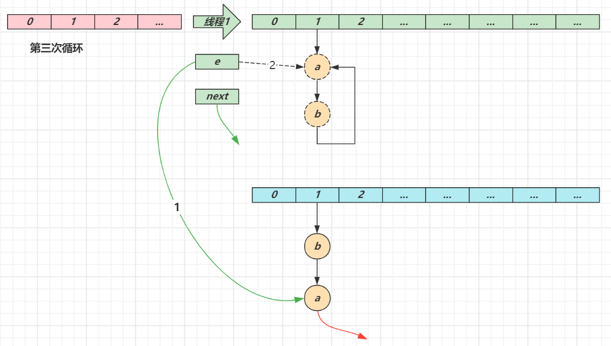


### key 的设计

**key 的设计要求**

1. HashMap 的 key 可以为 null，但 Map 的其他实现则不然
2. 作为 key 的对象，必须实现 hashCode 和 equals，并且 key 的内容不能修改（不可变）
3. key 的 hashCode 应该有良好的散列性


**String 对象的 hashCode() 设计**

* 目标是达到较为均匀的散列效果，每个字符串的 hashCode 足够独特
* 字符串中的每个字符都可以表现为一个数字，称为 $S_i$，其中 i 的范围是 0 ~ n - 1 
* 散列公式为： $S_0∗31^{(n-1)}+ S_1∗31^{(n-2)}+ … S_i ∗ 31^{(n-1-i)}+ …S_{(n-1)}∗31^0$
* 31 代入公式有较好的散列特性，并且 31 * h 可以被优化为 
  * 即 $32 ∗h -h $
  * 即 $2^5  ∗h -h$
  * 即 $h≪5  -h$


## 什么是序列化?什么是反序列化?

如果我们需要持久化 Java 对象比如将 Java 对象保存在文件中，或者在网络传输 Java 对象，这些场景都需要用到序列化。

简单来说：

- **序列化**： 将数据结构或对象转换成二进制字节流的过程
- **反序列化**：将在序列化过程中所生成的二进制字节流的过程转换成数据结构或者对象的过程

对于 Java 这种面向对象编程语言来说，我们序列化的都是对象（Object）也就是实例化后的类(Class)，但是在 C++这种半面向对象的语言中，struct(结构体)定义的是数据结构类型，而 class 对应的是对象类型


序列化的主要目的是通过网络传输对象或者说是将对象存储到文件系统、数据库、内存中


## 实际开发中有哪些用到序列化和反序列化的场景？

1. 对象在进行网络传输（比如远程方法调用 RPC 的时候）之前需要先被序列化，接收到序列化的对象之后需要再进行反序列化；
2. 将对象存储到文件中的时候需要进行序列化，将对象从文件中读取出来需要进行反序列化。
3. 将对象存储到缓存数据库（如 Redis）时需要用到序列化，将对象从缓存数据库中读取出来需要反序列化。


## 序列化协议对应于 TCP/IP 4 层模型的哪一层？

我们知道网络通信的双方必须要采用和遵守相同的协议。TCP/IP 四层模型是下面这样的，序列化协议属于哪一层呢？

1. 网络接口层
2. 网络层
3. 传输层
4. 应用层


OSI 七层协议模型中，表示层做的事情主要就是对应用层的用户数据进行处理转换为二进制流。反过来的话，就是将二进制流转换成应用层的用户数据。这不就对应的是序列化和反序列化么？

因为，OSI 七层协议模型中的应用层、表示层和会话层对应的都是 TCP/IP 四层模型中的应用层，所以序列化协议属于 TCP/IP 协议应用层的一部分


## 何为反射？

Java 反射机制是在运行状态中，对于任意一个类，都能够知道这个类的所有属性和方法；对于任意一个对象，都能够调用它的任意方法和属性；这种动态获取信息以及动态调用对象方法的功能称为 Java 语言的反射机制。简单来说，反射机制指的是程序在运行时能够获取自身的信息。在 Java 中，只要给定类的名字，就可以通过反射机制来获得类的所有信息


## 反射的应用场景了解么？

像咱们平时大部分时候都是在写业务代码，很少会接触到直接使用反射机制的场景。

但是，这并不代表反射没有用。相反，正是因为反射，你才能这么轻松地使用各种框架。像 Spring/Spring Boot、MyBatis 等等框架中都大量使用了反射机制。

这些框架中也大量使用了动态代理，而动态代理的实现也依赖反射


另外，像 Java 中的一大利器 **注解** 的实现也用到了反射


## 谈谈反射机制的优缺点

**优点** ： 可以让咱们的代码更加灵活、为各种框架提供开箱即用的功能提供了便利

**缺点** ：让我们在运行时有了分析操作类的能力，这同样也增加了安全问题。比如可以无视泛型参数的安全检查（泛型参数的安全检查发生在编译时）。另外，反射的性能也要稍差点，不过，对于框架来说实际是影响不大的


## 获取 Class 对象的四种方式

**1. 知道具体类的情况下可以使用：**

```java
Class alunbarClass = TargetObject.class;
```

但是我们一般是不知道具体类的，基本都是通过遍历包下面的类来获取 Class 对象，通过此方式获取 Class 对象不会进行初始化

**2. 通过 `Class.forName()`传入类的全路径获取：**

```java
Class alunbarClass1 = Class.forName("包名.类名");
```

**3. 通过对象实例`instance.getClass()`获取：**

```java
TargetObject o = new TargetObject();
Class alunbarClass2 = o.getClass();
```

**4. 通过类加载器`xxxClassLoader.loadClass()`传入类路径获取:**

```java
ClassLoader.getSystemClassLoader().loadClass("包名.类名");
```

通过类加载器获取 Class 对象不会进行初始化，意味着不进行包括初始化等一系列步骤，静态代码块和静态对象不会得到执行


## 动态代理

动态代理的实现方式有很多种，比如 **JDK 动态代理**、**CGLIB 动态代理**等等


1. **JDK 动态代理只能代理实现了接口的类或者直接代理接口，而 CGLIB 可以代理未实现任何接口的类。** 另外， CGLIB 动态代理是通过生成一个被代理类的子类来拦截被代理类的方法调用，因此不能代理声明为 final 类型的类和方法。
2. 就二者的效率来说，大部分情况都是 JDK 动态代理更优秀，随着 JDK 版本的升级，这个优势更加明显。


## SPI

SPI 即 Service Provider Interface ，字面意思就是：“服务提供者的接口”，SPI 将服务接口和具体的服务实现分离开来，将服务调用方和服务实现者解耦，能够提升程序的扩展性、可维护性。修改或者替换服务实现并不需要修改调用方。很多框架都使用了 Java 的 SPI 机制，比如：Spring 框架、数据库加载驱动、日志接口、以及 Dubbo 的扩展实现等等


SPI 和 API 有啥区别？


一般模块之间都是通过通过接口进行通讯，那我们在服务调用方和服务实现方（也称服务提供者）之间引入一个“接口”。

当实现方提供了接口和实现，我们可以通过调用实现方的接口从而拥有实现方给我们提供的能力，这就是 API ，这种接口和实现都是放在实现方的。

当接口存在于调用方这边时，就是 SPI ，由接口调用方确定接口规则，然后由不同的厂商去根据这个规则对这个接口进行实现，从而提供服务。

举个通俗易懂的例子：公司 H 是一家科技公司，新设计了一款芯片，然后现在需要量产了，而市面上有好几家芯片制造业公司，这个时候，只要 H 公司指定好了这芯片生产的标准（定义好了接口标准），那么这些合作的芯片公司（服务提供者）就按照标准交付自家特色的芯片（提供不同方案的实现，但是给出来的结果是一样的）


## JVM vs JDK vs JRE

### JVM

Java 虚拟机（JVM）是运行 Java 字节码的虚拟机。JVM 有针对不同系统的特定实现（Windows，Linux，macOS），目的是使用相同的字节码，它们都会给出相同的结果。字节码和不同系统的 JVM 实现是 Java 语言“一次编译，随处可以运行”的关键所在。

**JVM 并不是只有一种！只要满足 JVM 规范，每个公司、组织或者个人都可以开发自己的专属 JVM。** 也就是说我们平时接触到的 HotSpot VM 仅仅是是 JVM 规范的一种实现而已。

除了我们平时最常用的 HotSpot VM 外，还有 J9 VM、Zing VM、JRockit VM 等 JVM 


### JDK 和 JRE

JDK 是 Java Development Kit 缩写，它是功能齐全的 Java SDK。它拥有 JRE 所拥有的一切，还有编译器（javac）和工具（如 javadoc 和 jdb）。它能够创建和编译程序。

JRE 是 Java 运行时环境。它是运行已编译 Java 程序所需的所有内容的集合，包括 Java 虚拟机（JVM），Java 类库，java 命令和其他的一些基础构件。但是，它不能用于创建新程序。

如果你只是为了运行一下 Java 程序的话，那么你只需要安装 JRE 就可以了。如果你需要进行一些 Java 编程方面的工作，那么你就需要安装 JDK 了。但是，这不是绝对的。有时，即使您不打算在计算机上进行任何 Java 开发，仍然需要安装 JDK。例如，如果要使用 JSP 部署 Web 应用程序，那么从技术上讲，您只是在应用程序服务器中运行 Java 程序。那你为什么需要 JDK 呢？因为应用程序服务器会将 JSP 转换为 Java servlet，并且需要使用 JDK 来编译 servlet。


## 什么是字节码?采用字节码的好处是什么?

在 Java 中，JVM 可以理解的代码就叫做字节码（即扩展名为 `.class` 的文件），它不面向任何特定的处理器，只面向虚拟机。Java 语言通过字节码的方式，在一定程度上解决了传统解释型语言执行效率低的问题，同时又保留了解释型语言可移植的特点。所以， Java 程序运行时相对来说还是高效的（不过，和 C++，Rust，Go 等语言还是有一定差距的），而且，由于字节码并不针对一种特定的机器，因此，Java 程序无须重新编译便可在多种不同操作系统的计算机上运行


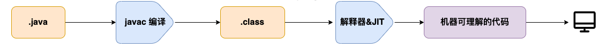


我们需要格外注意的是 `.class->机器码` 这一步。在这一步 JVM 类加载器首先加载字节码文件，然后通过解释器逐行解释执行，这种方式的执行速度会相对比较慢。而且，有些方法和代码块是经常需要被调用的(也就是所谓的热点代码)，所以后面引进了 JIT（just-in-time compilation） 编译器，而 JIT 属于运行时编译。当 JIT 编译器完成第一次编译后，其会将字节码对应的机器码保存下来，下次可以直接使用。而我们知道，机器码的运行效率肯定是高于 Java 解释器的。这也解释了我们为什么经常会说 **Java 是编译与解释共存的语言** 


## 为什么不全部使用 AOT 呢？

AOT 可以提前编译节省启动时间，那为什么不全部使用这种编译方式呢？

长话短说，这和 Java 语言的动态特性有千丝万缕的联系了。举个例子，CGLIB 动态代理使用的是 ASM 技术，而这种技术大致原理是运行时直接在内存中生成并加载修改后的字节码文件也就是 `.class` 文件，如果全部使用 AOT 提前编译，也就不能使用 ASM 技术了。为了支持类似的动态特性，所以选择使用 JIT 即时编译器


## 为什么说 Java 语言“编译与解释并存”？

我们可以将高级编程语言按照程序的执行方式分为两种：

- **编译型** ：[编译型语言](https://zh.wikipedia.org/wiki/%E7%B7%A8%E8%AD%AF%E8%AA%9E%E8%A8%80) 会通过[编译器](https://zh.wikipedia.org/wiki/%E7%B7%A8%E8%AD%AF%E5%99%A8)将源代码一次性翻译成可被该平台执行的机器码。一般情况下，编译语言的执行速度比较快，开发效率比较低。常见的编译性语言有 C、C++、Go、Rust 等等。
- **解释型** ：[解释型语言](https://zh.wikipedia.org/wiki/%E7%9B%B4%E8%AD%AF%E8%AA%9E%E8%A8%80)会通过[解释器](https://zh.wikipedia.org/wiki/直譯器)一句一句的将代码解释（interpret）为机器代码后再执行。解释型语言开发效率比较快，执行速度比较慢。常见的解释性语言有 Python、JavaScript、PHP 等等


这是因为 Java 语言既具有编译型语言的特征，也具有解释型语言的特征。因为 Java 程序要经过先编译，后解释两个步骤，由 Java 编写的程序需要先经过编译步骤，生成字节码（`.class` 文件），这种字节码必须由 Java 解释器来解释执行


## Java 和 C++ 的区别?

- Java 不提供指针来直接访问内存，程序内存更加安全
- Java 的类是单继承的，C++ 支持多重继承；虽然 Java 的类不可以多继承，但是接口可以多继承。
- Java 有自动内存管理垃圾回收机制(GC)，不需要程序员手动释放无用内存。
- C ++同时支持方法重载和操作符重载，但是 Java 只支持方法重载


## 基本类型和包装类型的区别？

- 成员变量包装类型不赋值就是 `null` ，而基本类型有默认值且不是 `null`。
- 包装类型可用于泛型，而基本类型不可以。
- 基本数据类型的局部变量存放在 Java 虚拟机栈中的局部变量表中，基本数据类型的成员变量（未被 `static` 修饰 ）存放在 Java 虚拟机的堆中。包装类型属于对象类型，我们知道几乎所有对象实例都存在于堆中。
- 相比于对象类型， 基本数据类型占用的空间非常小


**为什么说是几乎所有对象实例呢？** 这是因为 HotSpot 虚拟机引入了 JIT 优化之后，会对对象进行逃逸分析，如果发现某一个对象并没有逃逸到方法外部，那么就可能通过标量替换来实现栈上分配，而避免堆上分配内存


## 基本数据类型存放在栈中吗？

**基本数据类型存放在栈中是一个常见的误区！** 基本数据类型的成员变量如果没有被 `static` 修饰的话（不建议这么使用，应该要使用基本数据类型对应的包装类型），就存放在堆中


## 包装类型的缓存机制了解么？

Java 基本数据类型的包装类型的大部分都用到了缓存机制来提升性能。

`Byte`,`Short`,`Integer`,`Long` 这 4 种包装类默认创建了数值 **[-128，127]** 的相应类型的缓存数据，`Character` 创建了数值在 **[0,127]** 范围的缓存数据，`Boolean` 直接返回 `True` or `False`


## 自动装箱与拆箱了解吗？原理是什么？

**什么是自动拆装箱？**

- **装箱**：将基本类型用它们对应的引用类型包装起来；
- **拆箱**：将包装类型转换为基本数据类型；


装箱其实就是调用了 包装类的`valueOf()`方法，拆箱其实就是调用了 `xxxValue()`方法


如果频繁拆装箱的话，也会严重影响系统的性能。我们应该尽量避免不必要的拆装箱操作


## 为什么浮点数运算的时候会有精度丢失的风险

这个和计算机保存浮点数的机制有很大关系。我们知道计算机是二进制的，而且计算机在表示一个数字时，宽度是有限的，无限循环的小数存储在计算机时，只能被截断，所以就会导致小数精度发生损失的情况。这也就是解释了为什么浮点数没有办法用二进制精确表示


## 如何解决浮点数运算的精度丢失问题？

`BigDecimal` 可以实现对浮点数的运算，不会造成精度丢失。通常情况下，大部分需要浮点数精确运算结果的业务场景（比如涉及到钱的场景）都是通过 `BigDecimal` 来做的


## 超过 long 整型的数据应该如何表示？

基本数值类型都有一个表达范围，如果超过这个范围就会有数值溢出的风险。

在 Java 中，64 位 long 整型是最大的整数类型


`BigInteger` 内部使用 `int[]` 数组来存储任意大小的整形数据

相对于常规整数类型的运算来说，`BigInteger` 运算的效率会相对较低


## 面向对象和面向过程的区别

两者的主要区别在于解决问题的方式不同：

- 面向过程把解决问题的过程拆成一个个方法，通过一个个方法的执行解决问题。
- 面向对象会先抽象出对象，然后用对象执行方法的方式解决问题。

另外，面向对象开发的程序一般更易维护、易复用、易扩展


## 接口和抽象类有什么共同点和区别？

**共同点** ：

- 都不能被实例化。
- 都可以包含抽象方法。
- 都可以有默认实现的方法（Java 8 可以用 `default` 关键字在接口中定义默认方法）。

**区别** ：

- 接口主要用于对类的行为进行约束，你实现了某个接口就具有了对应的行为。抽象类主要用于代码复用，强调的是所属关系。
- 一个类只能继承一个类，但是可以实现多个接口。
- 接口中的成员变量只能是 `public static final` 类型的，不能被修改且必须有初始值，而抽象类的成员变量默认 default，可在子类中被重新定义，也可被重新赋值。


## 深拷贝和浅拷贝区别了解吗？什么是引用拷贝？

- **浅拷贝**：浅拷贝会在堆上创建一个新的对象（区别于引用拷贝的一点），不过，如果原对象内部的属性是引用类型的话，浅拷贝会直接复制内部对象的引用地址，也就是说拷贝对象和原对象共用同一个内部对象。
- **深拷贝** ：深拷贝会完全复制整个对象，包括这个对象所包含的内部对象


**那什么是引用拷贝呢？** 简单来说，引用拷贝就是两个不同的引用指向同一个对象


## hashCode() 有什么用？

`hashCode()` 的作用是获取哈希码（`int` 整数），也称为散列码。这个哈希码的作用是确定该对象在哈希表中的索引位置。

`hashCode()`定义在 JDK 的 `Object` 类中，这就意味着 Java 中的任何类都包含有 `hashCode()` 函数。另外需要注意的是： `Object` 的 `hashCode()` 方法是本地方法，也就是用 C 语言或 C++ 实现的，该方法通常用来将对象的内存地址转换为整数之后返回


**那为什么 JDK 还要同时提供这两个方法呢？**

这是因为在一些容器（比如 `HashMap`、`HashSet`）中，有了 `hashCode()` 之后，判断元素是否在对应容器中的效率会更高

我们在前面也提到了添加元素进`HashSet`的过程，如果 `HashSet` 在对比的时候，同样的 `hashCode` 有多个对象，它会继续使用 `equals()` 来判断是否真的相同。也就是说 `hashCode` 帮助我们大大缩小了查找成本


**那为什么不只提供 `hashCode()` 方法呢？**

这是因为两个对象的`hashCode` 值相等并不代表两个对象就相等。


**那为什么两个对象有相同的 `hashCode` 值，它们也不一定是相等的？**

因为 `hashCode()` 所使用的哈希算法也许刚好会让多个对象传回相同的哈希值。越糟糕的哈希算法越容易碰撞，但这也与数据值域分布的特性有关（所谓哈希碰撞也就是指的是不同的对象得到相同的 `hashCode` )。

总结下来就是 ：

- 如果两个对象的`hashCode` 值相等，那这两个对象不一定相等（哈希碰撞）。
- 如果两个对象的`hashCode` 值相等并且`equals()`方法也返回 `true`，我们才认为这两个对象相等。
- 如果两个对象的`hashCode` 值不相等，我们就可以直接认为这两个对象不相等


## 为什么重写 equals() 时必须重写 hashCode() 方法？

因为两个相等的对象的 `hashCode` 值必须是相等。也就是说如果 `equals` 方法判断两个对象是相等的，那这两个对象的 `hashCode` 值也要相等。

如果重写 `equals()` 时没有重写 `hashCode()` 方法的话就可能会导致 `equals` 方法判断是相等的两个对象，`hashCode` 值却不相等


## String#equals() 和 Object#equals() 有何区别？

`String` 中的 `equals` 方法是被重写过的，比较的是 String 字符串的值是否相等。 `Object` 的 `equals` 方法是比较的对象的内存地址


## 字符串常量池的作用了解吗？

**字符串常量池** 是 JVM 为了提升性能和减少内存消耗针对字符串（String 类）专门开辟的一块区域，主要目的是为了避免字符串的重复创建


```java
// 在堆中创建字符串对象”ab“
// 将字符串对象”ab“的引用保存在字符串常量池中
String aa = "ab";
// 直接返回字符串常量池中字符串对象”ab“的引用
String bb = "ab";
System.out.println(aa==bb);// true
```


## String s1 = new String("abc");这句话创建了几个字符串对象？

会创建 1 或 2 个字符串对象。

如果字符串常量池中不存在字符串对象“abc”的引用，那么会在堆中创建 2 个字符串对象“abc”


`ldc` 命令用于判断字符串常量池中是否保存了对应的字符串对象的引用，如果保存了的话直接返回，如果没有保存的话，会在堆中创建对应的字符串对象并将该字符串对象的引用保存到字符串常量池中。

如果字符串常量池中已存在字符串对象“abc”的引用，则只会在堆中创建 1 个字符串对象“abc”


## intern 方法有什么作用?

`String.intern()` 是一个 native（本地）方法，其作用是将指定的字符串对象的引用保存在字符串常量池中，可以简单分为两种情况：

- 如果字符串常量池中保存了对应的字符串对象的引用，就直接返回该引用。
- 如果字符串常量池中没有保存了对应的字符串对象的引用，那就在常量池中创建一个指向该字符串对象的引用并返回


## String 类型的变量和常量做“+”运算时发生了什么？

```java
String str1 = "str";
String str2 = "ing";
String str3 = "str" + "ing";
String str4 = str1 + str2;
String str5 = "string";
System.out.println(str3 == str4);//false
System.out.println(str3 == str5);//true
System.out.println(str4 == str5);//false
```


**对于编译期可以确定值的字符串，也就是常量字符串 ，jvm 会将其存入字符串常量池。并且，字符串常量拼接得到的字符串常量在编译阶段就已经被存放字符串常量池，这个得益于编译器的优化。**


在编译过程中，Javac 编译器（下文中统称为编译器）会进行一个叫做 **常量折叠(Constant Folding)** 的代码优化


常量折叠会把常量表达式的值求出来作为常量嵌在最终生成的代码中，这是 Javac 编译器会对源代码做的极少量优化措施之一(代码优化几乎都在即时编译器中进行)。

对于 `String str3 = "str" + "ing";` 编译器会给你优化成 `String str3 = "string";` 。

并不是所有的常量都会进行折叠，只有编译器在程序编译期就可以确定值的常量才可以：

- 基本数据类型( `byte`、`boolean`、`short`、`char`、`int`、`float`、`long`、`double`)以及字符串常量。
- `final` 修饰的基本数据类型和字符串变量
- 字符串通过 “+”拼接得到的字符串、基本数据类型之间算数运算（加减乘除）、基本数据类型的位运算（<<、\>>、\>>> )


**引用的值在程序编译期是无法确定的，编译器无法对其进行优化。**


对象引用和“+”的字符串拼接方式，实际上是通过 `StringBuilder` 调用 `append()` 方法实现的，拼接完成之后调用 `toString()` 得到一个 `String` 对象 。

```java
String str4 = new StringBuilder().append(str1).append(str2).toString();
```

我们在平时写代码的时候，尽量避免多个字符串对象拼接，因为这样会重新创建对象。如果需要改变字符串的话，可以使用 `StringBuilder` 或者 `StringBuffer`。

不过，字符串使用 `final` 关键字声明之后，可以让编译器当做常量来处理


被 `final` 关键字修改之后的 `String` 会被编译器当做常量来处理，编译器在程序编译期就可以确定它的值，其效果就相当于访问常量。

如果 ，编译器在运行时才能知道其确切值的话，就无法对其优化。


## finally 中的代码一定会执行吗？

不一定的！在某些情况下，finally 中的代码不会被执行。

就比如说 finally 之前虚拟机被终止运行的话，finally 中的代码就不会被执行


1. 程序所在的线程死亡。
2. 关闭 CPU


## 如果有些字段不想进行序列化怎么办？

对于不想进行序列化的变量，使用 `transient` 关键字修饰。

`transient` 关键字的作用是：阻止实例中那些用此关键字修饰的的变量序列化；当对象被反序列化时，被 `transient` 修饰的变量值不会被持久化和恢复。

关于 `transient` 还有几点注意：

- `transient` 只能修饰变量，不能修饰类和方法。
- `transient` 修饰的变量，在反序列化后变量值将会被置成类型的默认值。例如，如果是修饰 `int` 类型，那么反序列后结果就是 `0`。
- `static` 变量因为不属于任何对象(Object)，所以无论有没有 `transient` 关键字修饰，均不会被序列化


## I/O 流为什么要分为字节流和字符流呢?

问题本质想问：**不管是文件读写还是网络发送接收，信息的最小存储单元都是字节，那为什么 I/O 流操作要分为字节流操作和字符流操作呢？**


- 字符流是由 Java 虚拟机将字节转换得到的，这个过程还算是比较耗时；
- 如果我们不知道编码类型的话，使用字节流的过程中很容易出现乱码问题。


## 何为 I/O?

I/O（**I**nput/**O**utpu） 即**输入／输出** 。

**我们先从计算机结构的角度来解读一下 I/O。**

根据冯.诺依曼结构，计算机结构分为 5 大部分：运算器、控制器、存储器、输入设备、输出设备


输入设备（比如键盘）和输出设备（比如显示器）都属于外部设备。网卡、硬盘这种既可以属于输入设备，也可以属于输出设备。

输入设备向计算机输入数据，输出设备接收计算机输出的数据。

**从计算机结构的视角来看的话， I/O 描述了计算机系统与外部设备之间通信的过程。**

**我们再先从应用程序的角度来解读一下 I/O。**

根据大学里学到的操作系统相关的知识：为了保证操作系统的稳定性和安全性，一个进程的地址空间划分为 **用户空间（User space）** 和 **内核空间（Kernel space ）** 。

像我们平常运行的应用程序都是运行在用户空间，只有内核空间才能进行系统态级别的资源有关的操作，比如文件管理、进程通信、内存管理等等。也就是说，我们想要进行 IO 操作，一定是要依赖内核空间的能力。

并且，用户空间的程序不能直接访问内核空间。

当想要执行 IO 操作时，由于没有执行这些操作的权限，只能发起系统调用请求操作系统帮忙完成。

因此，用户进程想要执行 IO 操作的话，必须通过 **系统调用** 来间接访问内核空间

我们在平常开发过程中接触最多的就是 **磁盘 IO（读写文件）** 和 **网络 IO（网络请求和响应）**。

**从应用程序的视角来看的话，我们的应用程序对操作系统的内核发起 IO 调用（系统调用），操作系统负责的内核执行具体的 IO 操作。也就是说，我们的应用程序实际上只是发起了 IO 操作的调用而已，具体 IO 的执行是由操作系统的内核来完成的。**

当应用程序发起 I/O 调用后，会经历两个步骤：

1. 内核等待 I/O 设备准备好数据
2. 内核将数据从内核空间拷贝到用户空间。


## 有哪些常见的 IO 模型?

UNIX 系统下， IO 模型一共有 5 种： **同步阻塞 I/O**、**同步非阻塞 I/O**、**I/O 多路复用**、**信号驱动 I/O** 和**异步 I/O**


## Java 中 3 种常见 IO 模型

### BIO (Blocking I/O)


**BIO 属于同步阻塞 IO 模型** 。

同步阻塞 IO 模型中，应用程序发起 read 调用后，会一直阻塞，直到内核把数据拷贝到用户空间


在客户端连接数量不高的情况下，是没问题的。但是，当面对十万甚至百万级连接的时候，传统的 BIO 模型是无能为力的。因此，我们需要一种更高效的 I/O 处理模型来应对更高的并发量


### NIO (Non-blocking/New I/O)

Java 中的 NIO 于 Java 1.4 中引入，对应 `java.nio` 包，提供了 `Channel` , `Selector`，`Buffer` 等抽象。NIO 中的 N 可以理解为 Non-blocking，不单纯是 New。它是支持面向缓冲的，基于通道的 I/O 操作方法。 对于高负载、高并发的（网络）应用，应使用 NIO 。

Java 中的 NIO 可以看作是 **I/O 多路复用模型**。也有很多人认为，Java 中的 NIO 属于同步非阻塞 IO 模型


同步非阻塞 IO 模型中，应用程序会一直发起 read 调用，等待数据从内核空间拷贝到用户空间的这段时间里，线程依然是阻塞的，直到在内核把数据拷贝到用户空间。

相比于同步阻塞 IO 模型，同步非阻塞 IO 模型确实有了很大改进。通过轮询操作，避免了一直阻塞。

但是，这种 IO 模型同样存在问题：**应用程序不断进行 I/O 系统调用轮询数据是否已经准备好的过程是十分消耗 CPU 资源的**


这个时候，**I/O 多路复用模型** 就上场了


IO 多路复用模型中，线程首先发起 select 调用，询问内核数据是否准备就绪，等内核把数据准备好了，用户线程再发起 read 调用。read 调用的过程（数据从内核空间 -> 用户空间）还是阻塞的


IO 多路复用模型中，线程首先发起 select 调用，询问内核数据是否准备就绪，等内核把数据准备好了，用户线程再发起 read 调用。read 调用的过程（数据从内核空间 -> 用户空间）还是阻塞的。

> 目前支持 IO 多路复用的系统调用，有 select，epoll 等等。select 系统调用，目前几乎在所有的操作系统上都有支持。
>
> - **select 调用** ：内核提供的系统调用，它支持一次查询多个系统调用的可用状态。几乎所有的操作系统都支持。
> - **epoll 调用** ：linux 2.6 内核，属于 select 调用的增强版本，优化了 IO 的执行效率。

**IO 多路复用模型，通过减少无效的系统调用，减少了对 CPU 资源的消耗。**


Java 中的 NIO ，有一个非常重要的**选择器 ( Selector )** 的概念，也可以被称为 **多路复用器**。通过它，只需要一个线程便可以管理多个客户端连接。当客户端数据到了之后，才会为其服务


### AIO (Asynchronous I/O)

AIO 也就是 NIO 2。Java 7 中引入了 NIO 的改进版 NIO 2,它是异步 IO 模型。

异步 IO 是基于事件和回调机制实现的，也就是应用操作之后会直接返回，不会堵塞在那里，当后台处理完成，操作系统会通知相应的线程进行后续的操作


目前来说 AIO 的应用还不是很广泛。Netty 之前也尝试使用过 AIO，不过又放弃了。这是因为，Netty 使用了 AIO 之后，在 Linux 系统上的性能并没有多少提升。


## 说说 List, Set, Queue, Map 四者的区别？

- `List`(对付顺序的好帮手): 存储的元素是有序的、可重复的。
- `Set`(注重独一无二的性质): 存储的元素是无序的、不可重复的。
- `Queue`(实现排队功能的叫号机): 按特定的排队规则来确定先后顺序，存储的元素是有序的、可重复的。
- `Map`(用 key 来搜索的专家): 使用键值对（key-value）存储，类似于数学上的函数 y=f(x)，"x" 代表 key，"y" 代表 value，key 是无序的、不可重复的，value 是无序的、可重复的，每个键最多映射到一个值。


## 集合框架底层数据结构

### List

- `ArrayList`： `Object[]` 数组
- `Vector`：`Object[]` 数组
- `LinkedList`： 双向链表(JDK1.6 之前为循环链表，JDK1.7 取消了循环)

### Set

- `HashSet`(无序，唯一): 基于 `HashMap` 实现的，底层采用 `HashMap` 来保存元素
- `LinkedHashSet`: `LinkedHashSet` 是 `HashSet` 的子类，并且其内部是通过 `LinkedHashMap` 来实现的。有点类似于我们之前说的 `LinkedHashMap` 其内部是基于 `HashMap` 实现一样，不过还是有一点点区别的
- `TreeSet`(有序，唯一): 红黑树(自平衡的排序二叉树)


### Queue

- `PriorityQueue`: `Object[]` 数组来实现二叉堆
- `ArrayQueue`: `Object[]` 数组 + 双指针


### Map

- `HashMap`： JDK1.8 之前 `HashMap` 由数组+链表组成的，数组是 `HashMap` 的主体，链表则是主要为了解决哈希冲突而存在的（“拉链法”解决冲突）。JDK1.8 以后在解决哈希冲突时有了较大的变化，当链表长度大于阈值（默认为 8）（将链表转换成红黑树前会判断，如果当前数组的长度小于 64，那么会选择先进行数组扩容，而不是转换为红黑树）时，将链表转化为红黑树，以减少搜索时间
- `LinkedHashMap`： `LinkedHashMap` 继承自 `HashMap`，所以它的底层仍然是基于拉链式散列结构即由数组和链表或红黑树组成。另外，`LinkedHashMap` 在上面结构的基础上，增加了一条双向链表，使得上面的结构可以保持键值对的插入顺序。同时通过对链表进行相应的操作，实现了访问顺序相关逻辑

- `Hashtable`： 数组+链表组成的，数组是 `Hashtable` 的主体，链表则是主要为了解决哈希冲突而存在的
- `TreeMap`： 红黑树（自平衡的排序二叉树）


## ArrayList 和 Vector 的区别?

- `ArrayList` 是 `List` 的主要实现类，底层使用 `Object[]`存储，适用于频繁的查找工作，线程不安全 ；
- `Vector` 是 `List` 的古老实现类，底层使用`Object[]` 存储，线程安全的。


## comparable 和 Comparator 的区别

- `comparable` 接口实际上是出自`java.lang`包 它有一个 `compareTo(Object obj)`方法用来排序
- `comparator`接口实际上是出自 java.util 包它有一个`compare(Object obj1, Object obj2)`方法用来排序


### Comparator 定制排序

```java
 Collections.sort(arrayList, new Comparator<Integer>() {

            @Override
            public int compare(Integer o1, Integer o2) {
                return o2.compareTo(o1);
            }
        });
```


### 重写 compareTo 方法实现排序

```java
public  class Person implements Comparable<Person> {
    private String name;
    private int age;

    public Person(String name, int age) {
        super();
        this.name = name;
        this.age = age;
    }

    public String getName() {
        return name;
    }

    public void setName(String name) {
        this.name = name;
    }

    public int getAge() {
        return age;
    }

    public void setAge(int age) {
        this.age = age;
    }

    /**
     * T重写compareTo方法实现按年龄来排序
     */
    @Override
    public int compareTo(Person o) {
        if (this.age > o.getAge()) {
            return 1;
        }
        if (this.age < o.getAge()) {
            return -1;
        }
        return 0;
    }
}
```


## 无序性和不可重复性的含义是什么

- 无序性不等于随机性 ，无序性是指存储的数据在底层数组中并非按照数组索引的顺序添加 ，而是根据数据的哈希值决定的。
- 不可重复性是指添加的元素按照 `equals()` 判断时 ，返回 false，需要同时重写 `equals()` 方法和 `hashCode()` 方法


## 比较 HashSet、LinkedHashSet 和 TreeSet 三者的异同

- `HashSet`、`LinkedHashSet` 和 `TreeSet` 都是 `Set` 接口的实现类，都能保证元素唯一，并且都不是线程安全的。
- `HashSet`、`LinkedHashSet` 和 `TreeSet` 的主要区别在于底层数据结构不同。`HashSet` 的底层数据结构是哈希表（基于 `HashMap` 实现）。`LinkedHashSet` 的底层数据结构是链表和哈希表，元素的插入和取出顺序满足 FIFO。`TreeSet` 底层数据结构是红黑树，元素是有序的，排序的方式有自然排序和定制排序。
- 底层数据结构不同又导致这三者的应用场景不同。`HashSet` 用于不需要保证元素插入和取出顺序的场景，`LinkedHashSet` 用于保证元素的插入和取出顺序满足 FIFO 的场景，`TreeSet` 用于支持对元素自定义排序规则的场景


## Queue 与 Deque 的区别

`Queue` 是单端队列，只能从一端插入元素，另一端删除元素，实现上一般遵循 **先进先出（FIFO）** 规则。

`Queue` 扩展了 `Collection` 的接口，根据 **因为容量问题而导致操作失败后处理方式的不同** 可以分为两类方法: 一种在操作失败后会抛出异常，另一种则会返回特殊值。

| `Queue` 接口 | 抛出异常  | 返回特殊值 |
| ------------ | --------- | ---------- |
| 插入队尾     | add(E e)  | offer(E e) |
| 删除队首     | remove()  | poll()     |
| 查询队首元素 | element() | peek()     |

`Deque` 是双端队列，在队列的两端均可以插入或删除元素。

`Deque` 扩展了 `Queue` 的接口, 增加了在队首和队尾进行插入和删除的方法，同样根据失败后处理方式的不同分为两类：

| `Deque` 接口 | 抛出异常      | 返回特殊值      |
| ------------ | ------------- | --------------- |
| 插入队首     | addFirst(E e) | offerFirst(E e) |
| 插入队尾     | addLast(E e)  | offerLast(E e)  |
| 删除队首     | removeFirst() | pollFirst()     |
| 删除队尾     | removeLast()  | pollLast()      |
| 查询队首元素 | getFirst()    | peekFirst()     |
| 查询队尾元素 | getLast()     | peekLast()      |

事实上，`Deque` 还提供有 `push()` 和 `pop()` 等其他方法，可用于模拟栈。


## ArrayDeque 与 LinkedList 的区别

`ArrayDeque` 和 `LinkedList` 都实现了 `Deque` 接口，两者都具有队列的功能，但两者有什么区别呢？

- `ArrayDeque` 是基于可变长的数组和双指针来实现，而 `LinkedList` 则通过链表来实现。

- `ArrayDeque` 不支持存储 `NULL` 数据，但 `LinkedList` 支持。

- `ArrayDeque` 是在 JDK1.6 才被引入的，而`LinkedList` 早在 JDK1.2 时就已经存在。

- `ArrayDeque` 插入时可能存在扩容过程, 不过均摊后的插入操作依然为 O(1)。虽然 `LinkedList` 不需要扩容，但是每次插入数据时均需要申请新的堆空间，均摊性能相比更慢。

从性能的角度上，选用 `ArrayDeque` 来实现队列要比 `LinkedList` 更好。此外，`ArrayDeque` 也可以用于实现栈


## 说一说 PriorityQueue

`PriorityQueue` 是在 JDK1.5 中被引入的, 其与 `Queue` 的区别在于元素出队顺序是与优先级相关的，即总是优先级最高的元素先出队。

这里列举其相关的一些要点：

- `PriorityQueue` 利用了二叉堆的数据结构来实现的，底层使用可变长的数组来存储数据
- `PriorityQueue` 通过堆元素的上浮和下沉，实现了在 O(logn) 的时间复杂度内插入元素和删除堆顶元素。
- `PriorityQueue` 是非线程安全的，且不支持存储 `NULL` 和 `non-comparable` 的对象。
- `PriorityQueue` 默认是小顶堆，但可以接收一个 `Comparator` 作为构造参数，从而来自定义元素优先级的先后。


## HashMap 和 Hashtable 的区别

- **线程是否安全：** `HashMap` 是非线程安全的，`Hashtable` 是线程安全的,因为 `Hashtable` 内部的方法基本都经过`synchronized` 修饰。（如果你要保证线程安全的话就使用 `ConcurrentHashMap` 吧！）；
- **效率：** 因为线程安全的问题，`HashMap` 要比 `Hashtable` 效率高一点。另外，`Hashtable` 基本被淘汰，不要在代码中使用它；
- **对 Null key 和 Null value 的支持：** `HashMap` 可以存储 null 的 key 和 value，但 null 作为键只能有一个，null 作为值可以有多个；Hashtable 不允许有 null 键和 null 值，否则会抛出 `NullPointerException`。
- **初始容量大小和每次扩充容量大小的不同 ：** ① 创建时如果不指定容量初始值，`Hashtable` 默认的初始大小为 11，之后每次扩充，容量变为原来的 2n+1。`HashMap` 默认的初始化大小为 16。之后每次扩充，容量变为原来的 2 倍。② 创建时如果给定了容量初始值，那么 `Hashtable` 会直接使用你给定的大小，而 `HashMap` 会将其扩充为 2 的幂次方大小。也就是说 `HashMap` 总是使用 2 的幂作为哈希表的大小。
- **底层数据结构：** JDK1.8 以后的 `HashMap` 在解决哈希冲突时有了较大的变化，当链表长度大于阈值（默认为 8）时，将链表转化为红黑树（将链表转换成红黑树前会判断，如果当前数组的长度小于 64，那么会选择先进行数组扩容，而不是转换为红黑树），以减少搜索时间（后文中我会结合源码对这一过程进行分析）。`Hashtable` 没有这样的机制。


## HashMap 和 HashSet 区别

`HashSet` 底层就是基于 `HashMap` 实现的。（`HashSet` 的源码非常非常少，因为除了 `clone()`、`writeObject()`、`readObject()`是 `HashSet` 自己不得不实现之外，其他方法都是直接调用 `HashMap` 中的方法


|               `HashMap`                |                          `HashSet`                           |
| :------------------------------------: | :----------------------------------------------------------: |
|           实现了 `Map` 接口            |                       实现 `Set` 接口                        |
|               存储键值对               |                          仅存储对象                          |
|     调用 `put()`向 map 中添加元素      |             调用 `add()`方法向 `Set` 中添加元素              |
| `HashMap` 使用键（Key）计算 `hashcode` | `HashSet` 使用成员对象来计算 `hashcode` 值，对于两个对象来说 `hashcode` 可能相同，所以`equals()`方法用来判断对象的相等性 |


## HashMap 和 TreeMap 区别

相比于`HashMap`来说 `TreeMap` 主要多了对集合中的元素根据键排序的能力以及对集合内元素的搜索的能力


# 操作系统

## 什么是操作系统？

1. **操作系统（Operating System，简称 OS）是管理计算机硬件与软件资源的程序，是计算机的基石。**
2. **操作系统本质上是一个运行在计算机上的软件程序 ，用于管理计算机硬件和软件资源。** 举例：运行在你电脑上的所有应用程序都通过操作系统来调用系统内存以及磁盘等等硬件。
3. **操作系统存在屏蔽了硬件层的复杂性。** 操作系统就像是硬件使用的负责人，统筹着各种相关事项。
4. **操作系统的内核（Kernel）是操作系统的核心部分，它负责系统的内存管理，硬件设备的管理，文件系统的管理以及应用程序的管理**。 内核是连接应用程序和硬件的桥梁，决定着系统的性能和稳定性。


## 什么是系统调用呢？

介绍系统调用之前，我们先来了解一下用户态和系统态。

根据进程访问资源的特点，我们可以把进程在系统上的运行分为两个级别：

1. 用户态(user mode) : 用户态运行的进程可以直接读取用户程序的数据。
2. 系统态(kernel mode):可以简单的理解系统态运行的进程或程序几乎可以访问计算机的任何资源，不受限制。

说了用户态和系统态之后，那么什么是系统调用呢？

我们运行的程序基本都是运行在用户态，如果我们调用操作系统提供的系统态级别的子功能咋办呢？那就需要系统调用了！

也就是说在我们运行的用户程序中，凡是与系统态级别的资源有关的操作（如文件管理、进程控制、内存管理等)，都必须通过系统调用方式向操作系统提出服务请求，并由操作系统代为完成。

这些系统调用按功能大致可分为如下几类：

- 设备管理。完成设备的请求或释放，以及设备启动等功能。
- 文件管理。完成文件的读、写、创建及删除等功能。
- 进程控制。完成进程的创建、撤销、阻塞及唤醒等功能。
- 进程通信。完成进程之间的消息传递或信号传递等功能。
- 内存管理。完成内存的分配、回收以及获取作业占用内存区大小及地址等功能。


## 进程和线程的区别

 线程是进程划分成的更小的运行单位,一个进程在其执行的过程中可以产生多个线程。线程和进程最大的不同在于基本上各进程是独立的，而各线程则不一定，因为同一进程中的线程极有可能会相互影响。线程执行开销小，但不利于资源的管理和保护；而进程正相反。


## 进程间的通信常见的的有哪几种方式呢?

1. **管道/匿名管道(Pipes)** ：用于具有亲缘关系的父子进程间或者兄弟进程之间的通信。
1. **有名管道(Names Pipes)** : 匿名管道由于没有名字，只能用于亲缘关系的进程间通信。为了克服这个缺点，提出了有名管道。有名管道严格遵循**先进先出(first in first out)**。有名管道以磁盘文件的方式存在，可以实现本机任意两个进程通信。
1. **信号(Signal)** ：信号是一种比较复杂的通信方式，用于通知接收进程某个事件已经发生；
1. **消息队列(Message Queuing)** ：消息队列是消息的链表,具有特定的格式,存放在内存中并由消息队列标识符标识。管道和消息队列的通信数据都是先进先出的原则。与管道（无名管道：只存在于内存中的文件；命名管道：存在于实际的磁盘介质或者文件系统）不同的是消息队列存放在内核中，只有在内核重启(即，操作系统重启)或者显式地删除一个消息队列时，该消息队列才会被真正的删除。消息队列可以实现消息的随机查询,消息不一定要以先进先出的次序读取,也可以按消息的类型读取.比 FIFO 更有优势。**消息队列克服了信号承载信息量少，管道只能承载无格式字 节流以及缓冲区大小受限等缺点。**
1. **信号量(Semaphores)** ：信号量是一个计数器，用于多进程对共享数据的访问，信号量的意图在于进程间同步。这种通信方式主要用于解决与同步相关的问题并避免竞争条件。
1. **共享内存(Shared memory)** ：使得多个进程可以访问同一块内存空间，不同进程可以及时看到对方进程中对共享内存中数据的更新。这种方式需要依靠某种同步操作，如互斥锁和信号量等。可以说这是最有用的进程间通信方式。
1. **套接字(Sockets)** : 此方法主要用于在客户端和服务器之间通过网络进行通信。套接字是支持 TCP/IP 的网络通信的基本操作单元，可以看做是不同主机之间的进程进行双向通信的端点，简单的说就是通信的两方的一种约定，用套接字中的相关函数来完成通信过程。


## 线程间的同步的方式有哪些呢?

1. **互斥量(Mutex)**：采用互斥对象机制，只有拥有互斥对象的线程才有访问公共资源的权限。因为互斥对象只有一个，所以可以保证公共资源不会被多个线程同时访问。比如 Java 中的 synchronized 关键词和各种 Lock 都是这种机制。
1. **信号量(Semaphore)** ：它允许同一时刻多个线程访问同一资源，但是需要控制同一时刻访问此资源的最大线程数量。
1. **事件(Event)** :Wait/Notify：通过通知操作的方式来保持多线程同步，还可以方便的实现多线程优先级的比较操作。


## 你知道操作系统中进程的调度算法有哪些吗?

为了确定首先执行哪个进程以及最后执行哪个进程以实现最大 CPU 利用率，计算机科学家已经定义了一些算法，它们是：

- **先到先服务(FCFS)调度算法** : 从就绪队列中选择一个最先进入该队列的进程为之分配资源，使它立即执行并一直执行到完成或发生某事件而被阻塞放弃占用 CPU 时再重新调度。
- **短作业优先(SJF)的调度算法** : 从就绪队列中选出一个估计运行时间最短的进程为之分配资源，使它立即执行并一直执行到完成或发生某事件而被阻塞放弃占用 CPU 时再重新调度。
- **时间片轮转调度算法** : 时间片轮转调度是一种最古老，最简单，最公平且使用最广的算法，又称 RR(Round robin)调度。每个进程被分配一个时间段，称作它的时间片，即该进程允许运行的时间。
- **多级反馈队列调度算法** ：前面介绍的几种进程调度的算法都有一定的局限性。如**短进程优先的调度算法，仅照顾了短进程而忽略了长进程** 。多级反馈队列调度算法既能使高优先级的作业得到响应又能使短作业（进程）迅速完成。，因而它是目前**被公认的一种较好的进程调度算法**，UNIX 操作系统采取的便是这种调度算法。
- **优先级调度** ： 为每个流程分配优先级，首先执行具有最高优先级的进程，依此类推。具有相同优先级的进程以 FCFS 方式执行。可以根据内存要求，时间要求或任何其他资源要求来确定优先级。


## 你知道什么是死锁吗?

死锁描述的是这样一种情况：多个进程/线程同时被阻塞，它们中的一个或者全部都在等待某个资源被释放。由于进程/线程被无限期地阻塞，因此程序不可能正常终止。


## 产生死锁的四个必要条件是什么?

- **互斥**：资源必须处于非共享模式，即一次只有一个进程可以使用。如果另一进程申请该资源，那么必须等待直到该资源被释放为止。
- **占有并等待**：一个进程至少应该占有一个资源，并等待另一资源，而该资源被其他进程所占有。
- **非抢占**：资源不能被抢占。只能在持有资源的进程完成任务后，该资源才会被释放。
- **循环等待**：有一组等待进程 `{P0, P1,..., Pn}`， `P0` 等待的资源被 `P1` 占有，`P1` 等待的资源被 `P2` 占有，......，`Pn-1` 等待的资源被 `Pn` 占有，`Pn` 等待的资源被 `P0` 占有。

注意，只有四个条件同时成立时，死锁才会出现。


## 解决死锁的方法

解决死锁的方法可以从多个角度去分析，一般的情况下，有**预防，避免，检测和解除四种**。

- **预防** 是采用某种策略，**限制并发进程对资源的请求**，从而使得死锁的必要条件在系统执行的任何时间上都不满足。
- **避免**则是系统在分配资源时，根据资源的使用情况**提前做出预测**，从而**避免死锁的发生**
- **检测**是指系统设有**专门的机构**，当死锁发生时，该机构能够检测死锁的发生，并精确地确定与死锁有关的进程和资源。
- **解除** 是与检测相配套的一种措施，用于**将进程从死锁状态下解脱出来**。


### 死锁的预防

死锁四大必要条件上面都已经列出来了，很显然，只要破坏四个必要条件中的任何一个就能够预防死锁的发生。

破坏第一个条件 **互斥条件**：使得资源是可以同时访问的，这是种简单的方法，磁盘就可以用这种方法管理，但是我们要知道，有很多资源 **往往是不能同时访问的** ，所以这种做法在大多数的场合是行不通的。

破坏第三个条件 **非抢占** ：也就是说可以采用 **剥夺式调度算法**，但剥夺式调度方法目前一般仅适用于 **主存资源** 和 **处理器资源** 的分配，并不适用于所以的资源，会导致 **资源利用率下降**。

所以一般比较实用的 **预防死锁的方法**，是通过考虑破坏第二个条件和第四个条件


**1、静态分配策略**

静态分配策略可以破坏死锁产生的第二个条件（占有并等待）。所谓静态分配策略，就是指一个进程必须在执行前就申请到它所需要的全部资源，并且知道它所要的资源都得到满足之后才开始执行。进程要么占有所有的资源然后开始执行，要么不占有资源，不会出现占有一些资源等待一些资源的情况。

静态分配策略逻辑简单，实现也很容易，但这种策略 **严重地降低了资源利用率**，因为在每个进程所占有的资源中，有些资源是在比较靠后的执行时间里采用的，甚至有些资源是在额外的情况下才是用的，这样就可能造成了一个进程占有了一些 **几乎不用的资源而使其他需要该资源的进程产生等待** 的情况。

**2、层次分配策略**

层次分配策略破坏了产生死锁的第四个条件(循环等待)。在层次分配策略下，所有的资源被分成了多个层次，一个进程得到某一次的一个资源后，它只能再申请较高一层的资源；当一个进程要释放某层的一个资源时，必须先释放所占用的较高层的资源，按这种策略，是不可能出现循环等待链的，因为那样的话，就出现了已经申请了较高层的资源，反而去申请了较低层的资源，不符合层次分配策略


### 死锁的避免

上面提到的 **破坏** 死锁产生的四个必要条件之一就可以成功 **预防系统发生死锁** ，但是会导致 **低效的进程运行** 和 **资源使用率** 。而死锁的避免相反，它的角度是允许系统中**同时存在四个必要条件** ，只要掌握并发进程中与每个进程有关的资源动态申请情况，做出 **明智和合理的选择** ，仍然可以避免死锁，因为四大条件仅仅是产生死锁的必要条件。

我们将系统的状态分为 **安全状态** 和 **不安全状态** ，每当在未申请者分配资源前先测试系统状态，若把系统资源分配给申请者会产生死锁，则拒绝分配，否则接受申请，并为它分配资源。

> 如果操作系统能够保证所有的进程在有限的时间内得到需要的全部资源，则称系统处于安全状态，否则说系统是不安全的。很显然，系统处于安全状态则不会发生死锁，系统若处于不安全状态则可能发生死锁。

那么如何保证系统保持在安全状态呢？通过算法，其中最具有代表性的 **避免死锁算法** 就是 Dijkstra 的银行家算法，银行家算法用一句话表达就是：当一个进程申请使用资源的时候，**银行家算法** 通过先 **试探** 分配给该进程资源，然后通过 **安全性算法** 判断分配后系统是否处于安全状态，若不安全则试探分配作废，让该进程继续等待，若能够进入到安全的状态，则就 **真的分配资源给该进程**


死锁的避免(银行家算法)改善解决了 **资源使用率低的问题** ，但是它要不断地检测每个进程对各类资源的占用和申请情况，以及做 **安全性检查** ，需要花费较多的时间。


### 死锁的检测

对资源的分配加以限制可以 **预防和避免** 死锁的发生，但是都不利于各进程对系统资源的**充分共享**。解决死锁问题的另一条途径是 **死锁检测和解除**


### 死锁的解除

当死锁检测程序检测到存在死锁发生时，应设法让其解除，让系统从死锁状态中恢复过来，常用的解除死锁的方法有以下四种：

1. **立即结束所有进程的执行，重新启动操作系统** ：这种方法简单，但以前所在的工作全部作废，损失很大。
2. **撤销涉及死锁的所有进程，解除死锁后继续运行** ：这种方法能彻底打破**死锁的循环等待**条件，但将付出很大代价，例如有些进程可能已经计算了很长时间，由于被撤销而使产生的部分结果也被消除了，再重新执行时还要再次进行计算。
3. **逐个撤销涉及死锁的进程，回收其资源直至死锁解除。**
4. **抢占资源** ：从涉及死锁的一个或几个进程中抢占资源，把夺得的资源再分配给涉及死锁的进程直至死锁解除


## 操作系统的内存管理主要是做什么？

操作系统的内存管理主要负责内存的分配与回收（malloc 函数：申请内存，free 函数：释放内存），另外地址转换也就是将逻辑地址转换成相应的物理地址等功能也是操作系统内存管理做的事情


## 内存管理有哪几种方式?

简单分为**连续分配管理方式**和**非连续分配管理方式**这两种。连续分配管理方式是指为一个用户程序分配一个连续的内存空间，常见的如 **块式管理** 。同样地，非连续分配管理方式允许一个程序使用的内存分布在离散或者说不相邻的内存中，常见的如**页式管理** 和 **段式管理**。

1. **块式管理** ： 远古时代的计算机操作系统的内存管理方式。将内存分为几个固定大小的块，每个块中只包含一个进程。如果程序运行需要内存的话，操作系统就分配给它一块，如果程序运行只需要很小的空间的话，分配的这块内存很大一部分几乎被浪费了。这些在每个块中未被利用的空间，我们称之为碎片。
2. **页式管理** ：把主存分为大小相等且固定的一页一页的形式，页较小，相比于块式管理的划分粒度更小，提高了内存利用率，减少了碎片。页式管理通过页表对应逻辑地址和物理地址。
3. **段式管理** ： 页式管理虽然提高了内存利用率，但是页式管理其中的页并无任何实际意义。 段式管理把主存分为一段段的，段是有实际意义的，每个段定义了一组逻辑信息，例如,有主程序段 MAIN、子程序段 X、数据段 D 及栈段 S 等。 段式管理通过段表对应逻辑地址和物理地址。

简单来说：页是物理单位，段是逻辑单位。分页可以有效提高内存利用率，分段可以更好满足用户需求


**段页式管理机制**结合了段式管理和页式管理的优点。简单来说段页式管理机制就是把主存先分成若干段，每个段又分成若干页，也就是说 **段页式管理机制** 中段与段之间以及段的内部的都是离散的


## 快表和多级页表

在分页内存管理中，很重要的两点是：

1. 虚拟地址到物理地址的转换要快。
2. 解决虚拟地址空间大，页表也会很大的问题。


### 快表

为了提高虚拟地址到物理地址的转换速度，操作系统在 **页表方案** 基础之上引入了 **快表** 来加速虚拟地址到物理地址的转换。我们可以把快表理解为一种特殊的高速缓冲存储器（Cache），其中的内容是页表的一部分或者全部内容。作为页表的 Cache，它的作用与页表相似，但是提高了访问速率。由于采用页表做地址转换，读写内存数据时 CPU 要访问两次主存。有了快表，有时只要访问一次高速缓冲存储器，一次主存，这样可加速查找并提高指令执行速度。

使用快表之后的地址转换流程是这样的：

1. 根据虚拟地址中的页号查快表；
2. 如果该页在快表中，直接从快表中读取相应的物理地址；
3. 如果该页不在快表中，就访问内存中的页表，再从页表中得到物理地址，同时将页表中的该映射表项添加到快表中；
4. 当快表填满后，又要登记新页时，就按照一定的淘汰策略淘汰掉快表中的一个页。


### 多级页表

引入多级页表的主要目的是为了避免把全部页表一直放在内存中占用过多空间，特别是那些根本就不需要的页表就不需要保留在内存中。

多级页表属于时间换空间的典型场景


## 分页机制和分段机制有哪些共同点和区别呢？

1. **共同点** ：
   - 分页机制和分段机制都是为了提高内存利用率，减少内存碎片。
   - 页和段都是离散存储的，所以两者都是离散分配内存的方式。但是，每个页和段中的内存是连续的。
2. **区别** ：
   - 页的大小是固定的，由操作系统决定；而段的大小不固定，取决于我们当前运行的程序。
   - 分页仅仅是为了满足操作系统内存管理的需求，而段是逻辑信息的单位，在程序中可以体现为代码段，数据段，能够更好满足用户的需要。


## 逻辑(虚拟)地址和物理地址

我们编程一般只有可能和逻辑地址打交道，比如在 C 语言中，指针里面存储的数值就可以理解成为内存里的一个地址，这个地址也就是我们说的逻辑地址，逻辑地址由操作系统决定。物理地址指的是真实物理内存中地址，更具体一点来说就是内存地址寄存器中的地址。物理地址是内存单元真正的地址


## CPU 寻址了解吗?为什么需要虚拟地址空间?

现代处理器使用的是一种称为 **虚拟寻址(Virtual Addressing)** 的寻址方式。**使用虚拟寻址，CPU 需要将虚拟地址翻译成物理地址，这样才能访问到真实的物理内存。** 实际上完成虚拟地址转换为物理地址转换的硬件是 CPU 中含有一个被称为 **内存管理单元（Memory Management Unit, MMU）** 的硬件


**为什么要有虚拟地址空间呢？**

先从没有虚拟地址空间的时候说起吧！没有虚拟地址空间的时候，**程序直接访问和操作的都是物理内存** 。但是这样有什么问题呢？

1. 用户程序可以访问任意内存，寻址内存的每个字节，这样就很容易（有意或者无意）破坏操作系统，造成操作系统崩溃。
2. 想要同时运行多个程序特别困难，比如你想同时运行一个微信和一个 QQ 音乐都不行。为什么呢？举个简单的例子：微信在运行的时候给内存地址 1xxx 赋值后，QQ 音乐也同样给内存地址 1xxx 赋值，那么 QQ 音乐对内存的赋值就会覆盖微信之前所赋的值，这就造成了微信这个程序就会崩溃。

**总结来说：如果直接把物理地址暴露出来的话会带来严重问题，比如可能对操作系统造成伤害以及给同时运行多个程序造成困难。**

通过虚拟地址访问内存有以下优势：

- 程序可以使用一系列相邻的虚拟地址来访问物理内存中不相邻的大内存缓冲区。
- 程序可以使用一系列虚拟地址来访问大于可用物理内存的内存缓冲区。当物理内存的供应量变小时，内存管理器会将物理内存页（通常大小为 4 KB）保存到磁盘文件。数据或代码页会根据需要在物理内存与磁盘之间移动。
- 不同进程使用的虚拟地址彼此隔离。一个进程中的代码无法更改正在由另一进程或操作系统使用的物理内存。


## 什么是虚拟内存(Virtual Memory)?

这个在我们平时使用电脑特别是 Windows 系统的时候太常见了。很多时候我们使用了很多占内存的软件，这些软件占用的内存可能已经远远超出了我们电脑本身具有的物理内存。**为什么可以这样呢？** 正是因为 **虚拟内存** 的存在，通过 **虚拟内存** 可以让程序可以拥有超过系统物理内存大小的可用内存空间。另外，**虚拟内存为每个进程提供了一个一致的、私有的地址空间，它让每个进程产生了一种自己在独享主存的错觉（每个进程拥有一片连续完整的内存空间）**。这样会更加有效地管理内存并减少出错。

**虚拟内存**是计算机系统内存管理的一种技术，我们可以手动设置自己电脑的虚拟内存。不要单纯认为虚拟内存只是“使用硬盘空间来扩展内存“的技术。**虚拟内存的重要意义是它定义了一个连续的虚拟地址空间**，并且 **把内存扩展到硬盘空间**。


## 局部性原理

局部性原理是虚拟内存技术的基础，正是因为程序运行具有局部性原理，才可以只装入部分程序到内存就开始运行


局部性原理表现在以下两个方面：

1. **时间局部性** ：如果程序中的某条指令一旦执行，不久以后该指令可能再次执行；如果某数据被访问过，不久以后该数据可能再次被访问。产生时间局部性的典型原因，是由于在程序中存在着大量的循环操作。
2. **空间局部性** ：一旦程序访问了某个存储单元，在不久之后，其附近的存储单元也将被访问，即程序在一段时间内所访问的地址，可能集中在一定的范围之内，这是因为指令通常是顺序存放、顺序执行的，数据也一般是以向量、数组、表等形式簇聚存储的。


## 虚拟存储器

基于局部性原理，在程序装入时，可以将程序的一部分装入内存，而将其他部分留在外存，就可以启动程序执行。由于外存往往比内存大很多，所以我们运行的软件的内存大小实际上是可以比计算机系统实际的内存大小大的。在程序执行过程中，当所访问的信息不在内存时，由操作系统将所需要的部分调入内存，然后继续执行程序。另一方面，操作系统将内存中暂时不使用的内容换到外存上，从而腾出空间存放将要调入内存的信息。这样，计算机好像为用户提供了一个比实际内存大得多的存储器——**虚拟存储器**


实际上，我觉得虚拟内存同样是一种时间换空间的策略，你用 CPU 的计算时间，页的调入调出花费的时间，换来了一个虚拟的更大的空间来支持程序的运行。


## 虚拟内存技术的实现呢？

**虚拟内存的实现需要建立在离散分配的内存管理方式的基础上。** 虚拟内存的实现有以下三种方式：

1. **请求分页存储管理** ：建立在分页管理之上，为了支持虚拟存储器功能而增加了请求调页功能和页面置换功能。请求分页是目前最常用的一种实现虚拟存储器的方法。请求分页存储管理系统中，在作业开始运行之前，仅装入当前要执行的部分段即可运行。假如在作业运行的过程中发现要访问的页面不在内存，则由处理器通知操作系统按照对应的页面置换算法将相应的页面调入到主存，同时操作系统也可以将暂时不用的页面置换到外存中。
2. **请求分段存储管理** ：建立在分段存储管理之上，增加了请求调段功能、分段置换功能。请求分段储存管理方式就如同请求分页储存管理方式一样，在作业开始运行之前，仅装入当前要执行的部分段即可运行；在执行过程中，可使用请求调入中断动态装入要访问但又不在内存的程序段；当内存空间已满，而又需要装入新的段时，根据置换功能适当调出某个段，以便腾出空间而装入新的段。
3. **请求段页式存储管理**


## 请求分页与分页存储管理，两者有何不同呢？

请求分页存储管理建立在分页管理之上。他们的根本区别是是否将程序全部所需的全部地址空间都装入主存，这也是请求分页存储管理可以提供虚拟内存的原因


它们之间的根本区别在于是否将一作业的全部地址空间同时装入主存。请求分页存储管理不要求将作业全部地址空间同时装入主存。基于这一点，请求分页存储管理可以提供虚存，而分页存储管理却不能提供虚存。

不管是上面那种实现方式，我们一般都需要：

1. 一定容量的内存和外存：在载入程序的时候，只需要将程序的一部分装入内存，而将其他部分留在外存，然后程序就可以执行了；
2. **缺页中断**：如果**需执行的指令或访问的数据尚未在内存**（称为缺页或缺段），则由处理器通知操作系统将相应的页面或段**调入到内存**，然后继续执行程序；
3. **虚拟地址空间** ：逻辑地址到物理地址的变换。


## 页面置换算法的作用?常见的页面置换算法有哪些?

地址映射过程中，若在页面中发现所要访问的页面不在内存中，则发生缺页中断 。


**缺页中断** 就是要访问的**页**不在主存，需要操作系统将其调入主存后再进行访问。 在这个时候，被内存映射的文件实际上成了一个分页交换文件。


当发生缺页中断时，如果当前内存中并没有空闲的页面，操作系统就必须在内存选择一个页面将其移出内存，以便为即将调入的页面让出空间。用来选择淘汰哪一页的规则叫做页面置换算法，我们可以把页面置换算法看成是淘汰页面的规则。

- **OPT 页面置换算法（最佳页面置换算法）** ：最佳(Optimal, OPT)置换算法所选择的被淘汰页面将是以后永不使用的，或者是在最长时间内不再被访问的页面,这样可以保证获得最低的缺页率。但由于人们目前无法预知进程在内存下的若千页面中哪个是未来最长时间内不再被访问的，因而该算法无法实现。一般作为衡量其他置换算法的方法。
- **FIFO（First In First Out） 页面置换算法（先进先出页面置换算法）** : 总是淘汰最先进入内存的页面，即选择在内存中驻留时间最久的页面进行淘汰。
- **LRU （Least Recently Used）页面置换算法（最近最久未使用页面置换算法）** ：LRU 算法赋予每个页面一个访问字段，用来记录一个页面自上次被访问以来所经历的时间 T，当须淘汰一个页面时，选择现有页面中其 T 值最大的，即最近最久未使用的页面予以淘汰。
- **LFU （Least Frequently Used）页面置换算法（最少使用页面置换算法）** : 该置换算法选择在之前时期使用最少的页面作为淘汰页。


# 计算机网络基础

## TCP 与 UDP 的区别

1. **是否面向连接** ：UDP 在传送数据之前不需要先建立连接。而 TCP 提供面向连接的服务，在传送数据之前必须先建立连接，数据传送结束后要释放连接。
2. **是否是可靠传输**：远地主机在收到 UDP 报文后，不需要给出任何确认，并且不保证数据不丢失，不保证是否顺序到达。TCP 提供可靠的传输服务，TCP 在传递数据之前，会有三次握手来建立连接，而且在数据传递时，有确认、窗口、重传、拥塞控制机制。通过 TCP 连接传输的数据，无差错、不丢失、不重复、并且按序到达。
3. **是否有状态** ：这个和上面的“是否可靠传输”相对应。TCP 传输是有状态的，这个有状态说的是 TCP 会去记录自己发送消息的状态比如消息是否发送了、是否被接收了等等。为此 ，TCP 需要维持复杂的连接状态表。而 UDP 是无状态服务，简单来说就是不管发出去之后的事情了。
4. **传输效率** ：由于使用 TCP 进行传输的时候多了连接、确认、重传等机制，所以 TCP 的传输效率要比 UDP 低很多。
5. **传输形式** ： TCP 是面向字节流的，UDP 是面向报文的。
6. **首部开销** ：TCP 首部开销（20 ～ 60 字节）比 UDP 首部开销（8 字节）要大。
7. **是否提供广播或多播服务** ：TCP 只支持点对点通信，UDP 支持一对一、一对多、多对一、多对多；


|                        | TCP            | UDP        |
| ---------------------- | -------------- | ---------- |
| 是否面向连接           | 是             | 否         |
| 是否可靠               | 是             | 否         |
| 是否有状态             | 是             | 否         |
| 传输效率               | 较慢           | 较快       |
| 传输形式               | 字节流         | 数据报文段 |
| 首部开销               | 20 ～ 60 bytes | 8 bytes    |
| 是否提供广播或多播服务 | 否             | 是         |


## 什么时候选择 TCP,什么时候选 UDP?

- **UDP 一般用于即时通信**，比如： 语音、 视频 、直播等等。这些场景对传输数据的准确性要求不是特别高，比如你看视频即使少个一两帧，实际给人的感觉区别也不大。
- **TCP 用于对传输准确性要求特别高的场景**，比如文件传输、发送和接收邮件、远程登录等等


## HTTP 基于 TCP 还是 UDP？

**HTTP 协议是基于 TCP 协议的**，所以发送 HTTP 请求之前首先要建立 TCP 连接也就是要经历 3 次握手


## 使用 TCP 的协议有哪些?使用 UDP 的协议有哪些?

**运行于 TCP 协议之上的协议** ：

1. **HTTP 协议** ：超文本传输协议（HTTP，HyperText Transfer Protocol)主要是为 Web 浏览器与 Web 服务器之间的通信而设计的。当我们使用浏览器浏览网页的时候，我们网页就是通过 HTTP 请求进行加载的。
2. **HTTPS 协议** ：更安全的超文本传输协议(HTTPS,Hypertext Transfer Protocol Secure)，身披 SSL 外衣的 HTTP 协议
3. **FTP 协议**：文件传输协议 FTP（File Transfer Protocol），提供文件传输服务，**基于 TCP** 实现可靠的传输。使用 FTP 传输文件的好处是可以屏蔽操作系统和文件存储方式。
4. **SMTP 协议**：简单邮件传输协议（SMTP，Simple Mail Transfer Protocol）的缩写，**基于 TCP 协议**，用来发送电子邮件。注意 ⚠️：接受邮件的协议不是 SMTP 而是 POP3 协议。
5. **POP3/IMAP 协议**： POP3 和 IMAP 两者都是负责邮件接收的协议。
6. **Telent 协议**：远程登陆协议，通过一个终端登陆到其他服务器。被一种称为 SSH 的非常安全的协议所取代。
7. **SSH 协议** : SSH（ Secure Shell）是目前较可靠，专为远程登录会话和其他网络服务提供安全性的协议。利用 SSH 协议可以有效防止远程管理过程中的信息泄露问题。SSH 建立在可靠的传输协议 TCP 之上。


**运行于 UDP 协议之上的协议** ：

1. **DHCP 协议**：动态主机配置协议，动态配置 IP 地址
2. **DNS** ： **域名系统（DNS，Domain Name System）将人类可读的域名 (例如，www.baidu.com) 转换为机器可读的 IP 地址 (例如，220.181.38.148)。** 我们可以将其理解为专为互联网设计的电话薄。实际上 DNS 同时支持 UDP 和 TCP 协议。


## TCP 三次握手和四次挥手

**相关面试题** ：

- 为什么要三次握手?
- 第 2 次握手传回了ACK，为什么还要传回SYN？
- 为什么要四次挥手？
- 为什么不能把服务器发送的 ACK 和 FIN 合并起来，变成三次挥手？
- 如果第二次挥手时服务器的 ACK 没有送达客户端，会怎样？
- 为什么第四次挥手客户端需要等待 2\*MSL（报文段最长寿命）时间后才进入 CLOSED 状态？


### 为什么要三次握手?

建立一个 TCP 连接需要“三次握手”，缺一不可

三次握手的目的是建立可靠的通信信道，说到通讯，简单来说就是数据的发送与接收，而三次握手最主要的目的就是双方确认自己与对方的发送与接收是正常的


- **一次握手**:客户端发送带有 SYN（SEQ=x） 标志的数据包 -> 服务端，然后客户端进入 **SYN_SEND** 状态，等待服务器的确认；
- **二次握手**:服务端发送带有 SYN+ACK(SEQ=y,ACK=x+1) 标志的数据包 –> 客户端,然后服务端进入 **SYN_RECV** 状态
- **三次握手**:客户端发送带有带有 ACK(ACK=y+1) 标志的数据包 –> 服务端，然后客户端和服务器端都进入**ESTABLISHED** 状态，完成TCP三次握手


1. **第一次握手** ：Client 什么都不能确认；Server 确认了对方发送正常，自己接收正常
2. **第二次握手** ：Client 确认了：自己发送、接收正常，对方发送、接收正常；Server 确认了：对方发送正常，自己接收正常
3. **第三次握手** ：Client 确认了：自己发送、接收正常，对方发送、接收正常；Server 确认了：自己发送、接收正常，对方发送、接收正常


### 第2次握手传回了ACK，为什么还要传回SYN？

服务端传回发送端所发送的 ACK 是为了告诉客户端：“我接收到的信息确实就是你所发送的信号了”，这表明从客户端到服务端的通信是正常的。回传 SYN 则是为了建立并确认从服务端到客户端的通信


SYN 同步序列编号(Synchronize Sequence Numbers) 是 TCP/IP 建立连接时使用的握手信号。在客户机和服务器之间建立正常的 TCP 网络连接时，客户机首先发出一个 SYN 消息，服务器使用 SYN-ACK 应答表示接收到了这个消息，最后客户机再以 ACK(Acknowledgement）消息响应。这样在客户机和服务器之间才能建立起可靠的 TCP 连接，数据才可以在客户机和服务器之间传递


### 为什么要四次挥手？

TCP是全双工通信，可以双向传输数据。任何一方都可以在数据传送结束后发出连接释放的通知，待对方确认后进入半关闭状态。当另一方也没有数据再发送的时候，则发出连接释放通知，对方确认后就完全关闭了 TCP 连接


断开一个 TCP 连接则需要“四次挥手”，缺一不可 


1. **第一次挥手** ：客户端发送一个 FIN（SEQ=X） 标志的数据包->服务端，用来关闭客户端到服务器的数据传送。然后，客户端进入 **FIN-WAIT-1** 状态。
2. **第二次挥手** ：服务器收到这个 FIN（SEQ=X） 标志的数据包，它发送一个 ACK （SEQ=X+1）标志的数据包->客户端 。然后，此时服务端进入**CLOSE-WAIT**状态，客户端进入**FIN-WAIT-2**状态。
3. **第三次挥手** ：服务端关闭与客户端的连接并发送一个 FIN (SEQ=y)标志的数据包->客户端请求关闭连接，然后，服务端进入**LAST-ACK**状态。
4. **第四次挥手** ：客户端发送 ACK (SEQ=y+1)标志的数据包->服务端并且进入**TIME-WAIT**状态，服务端在收到 ACK (SEQ=y+1)标志的数据包后进入 CLOSE 状态。此时，如果客户端等待 **2MSL** 后依然没有收到回复，就证明服务端已正常关闭，随后，客户端也可以关闭连接了。


举个例子：A 和 B 打电话，通话即将结束后。

1. **第一次挥手** ： A 说“我没啥要说的了”
2. **第二次挥手** ：B 回答“我知道了”，但是 B 可能还会有要说的话，A 不能要求 B 跟着自己的节奏结束通话
3. **第三次挥手** ：于是 B 可能又巴拉巴拉说了一通，最后 B 说“我说完了”
4. **第四次挥手** ：A 回答“知道了”，这样通话才算结束。


### 为什么不能把服务器发送的 ACK 和 FIN 合并起来，变成三次挥手？

因为服务器收到客户端断开连接的请求时，可能还有一些数据没有发完，这时先回复 ACK，表示接收到了断开连接的请求。等到数据发完之后再发 FIN，断开服务器到客户端的数据传送。


### 如果第二次挥手时服务器的 ACK 没有送达客户端，会怎样？

客户端没有收到 ACK 确认，会重新发送 FIN 请求。


### 为什么第四次挥手客户端需要等待 2\*MSL（报文段最长寿命）时间后才进入 CLOSED 状态？

第四次挥手时，客户端发送给服务器的 ACK 有可能丢失，如果服务端没有因为某些原因而没有收到 ACK 的话，服务端就会重发 FIN，如果客户端在 2\*MSL 的时间内收到了 FIN，就会重新发送 ACK 并再次等待 2MSL，防止 Server 没有收到 ACK 而不断重发 FIN

**MSL(Maximum Segment Lifetime)** : 一个片段在网络中最大的存活时间，2MSL 就是一个发送和一个回复所需的最大时间。如果直到 2MSL，Client 都没有再次收到 FIN，那么 Client 推断 ACK 已经被成功接收，则结束 TCP 连接


## TCP 如何保证传输的可靠性？

1. **基于数据块传输** ：应用数据被分割成 TCP 认为最适合发送的数据块，再传输给网络层，数据块被称为报文段或段。
2. **对失序数据包重新排序以及去重**：TCP 为了保证不发生丢包，就给每个包一个序列号，有了序列号能够将接收到的数据根据序列号排序，并且去掉重复序列号的数据就可以实现数据包去重。
3. **校验和** : TCP 将保持它首部和数据的检验和。这是一个端到端的检验和，目的是检测数据在传输过程中的任何变化。如果收到段的检验和有差错，TCP 将丢弃这个报文段和不确认收到此报文段。
4. **超时重传** : 当发送方发送数据之后，它启动一个定时器，等待目的端确认收到这个报文段。接收端实体对已成功收到的包发回一个相应的确认信息（ACK）。如果发送端实体在合理的往返时延（RTT）内未收到确认消息，那么对应的数据包就被假设为[已丢失](https://zh.wikipedia.org/wiki/丢包 )并进行重传。
5. **流量控制** : TCP 连接的每一方都有固定大小的缓冲空间，TCP 的接收端只允许发送端发送接收端缓冲区能接纳的数据。当接收方来不及处理发送方的数据，能提示发送方降低发送的速率，防止包丢失。TCP 使用的流量控制协议是可变大小的滑动窗口协议（TCP 利用滑动窗口实现流量控制）。
6. **拥塞控制** : 当网络拥塞时，减少数据的发送。


## TCP 如何实现流量控制？

**TCP 利用滑动窗口实现流量控制。流量控制是为了控制发送方发送速率，保证接收方来得及接收。** 接收方发送的确认报文中的窗口字段可以用来控制发送方窗口大小，从而影响发送方的发送速率。将窗口字段设置为 0，则发送方不能发送数据。

**为什么需要流量控制?** 这是因为双方在通信的时候，发送方的速率与接收方的速率是不一定相等，如果发送方的发送速率太快，会导致接收方处理不过来。如果接收方处理不过来的话，就只能把处理不过来的数据存在 **接收缓冲区(Receiving Buffers)** 里（失序的数据包也会被存放在缓存区里）。如果缓存区满了发送方还在狂发数据的话，接收方只能把收到的数据包丢掉。出现丢包问题的同时又疯狂浪费着珍贵的网络资源。因此，我们需要控制发送方的发送速率，让接收方与发送方处于一种动态平衡才好。


**TCP 发送窗口可以划分成四个部分** ：

1. 已经发送并且确认的TCP段（已经发送并确认）；
2. 已经发送但是没有确认的TCP段（已经发送未确认）；
3. 未发送但是接收方准备接收的TCP段（可以发送）；
4. 未发送并且接收方也并未准备接受的TCP段（不可发送）。


- **SND.WND** ：发送窗口。
- **SND.UNA**：Send Unacknowledged 指针，指向发送窗口的第一个字节。
- **SND.NXT**：Send Next 指针，指向可用窗口的第一个字节。

**可用窗口大小** =  `SND.UNA + SND.WND - SND.NXT` 。


**TCP 接收窗口可以划分成三个部分** ：

1. 已经接收并且已经确认的 TCP 段（已经接收并确认）；
2. 等待接收且允许发送方发送 TCP 段（可以接收未确认）；
3. 不可接收且不允许发送方发送TCP段（不可接收）。


**接收窗口的大小是根据接收端处理数据的速度动态调整的。** 如果接收端读取数据快，接收窗口可能会扩大。 否则，它可能会缩小。


## TCP 的拥塞控制是怎么实现的？

在某段时间，若对网络中某一资源的需求超过了该资源所能提供的可用部分，网络的性能就要变坏。这种情况就叫拥塞。拥塞控制就是为了防止过多的数据注入到网络中，这样就可以使网络中的路由器或链路不致过载。拥塞控制所要做的都有一个前提，就是网络能够承受现有的网络负荷。拥塞控制是一个全局性的过程，涉及到所有的主机，所有的路由器，以及与降低网络传输性能有关的所有因素。相反，流量控制往往是点对点通信量的控制，是个端到端的问题。流量控制所要做到的就是抑制发送端发送数据的速率，以便使接收端来得及接收。


为了进行拥塞控制，TCP 发送方要维持一个 **拥塞窗口(cwnd)** 的状态变量。拥塞控制窗口的大小取决于网络的拥塞程度，并且动态变化。发送方让自己的发送窗口取为拥塞窗口和接收方的接受窗口中较小的一个。

TCP 的拥塞控制采用了四种算法，即 **慢开始** 、 **拥塞避免** 、**快重传** 和 **快恢复**。在网络层也可以使路由器采用适当的分组丢弃策略（如主动队列管理 AQM），以减少网络拥塞的发生。

- **慢开始：** 慢开始算法的思路是当主机开始发送数据时，如果立即把大量数据字节注入到网络，那么可能会引起网络阻塞，因为现在还不知道网络的符合情况。经验表明，较好的方法是先探测一下，即由小到大逐渐增大发送窗口，也就是由小到大逐渐增大拥塞窗口数值。cwnd 初始值为 1，每经过一个传播轮次，cwnd 加倍。
- **拥塞避免：** 拥塞避免算法的思路是让拥塞窗口 cwnd 缓慢增大，即每经过一个往返时间 RTT 就把发送放的 cwnd 加 1.
- **快重传与快恢复：** 在 TCP/IP 中，快速重传和恢复（fast retransmit and recovery，FRR）是一种拥塞控制算法，它能快速恢复丢失的数据包。没有 FRR，如果数据包丢失了，TCP 将会使用定时器来要求传输暂停。在暂停的这段时间内，没有新的或复制的数据包被发送。有了 FRR，如果接收机接收到一个不按顺序的数据段，它会立即给发送机发送一个重复确认。如果发送机接收到三个重复确认，它会假定确认件指出的数据段丢失了，并立即重传这些丢失的数据段。有了 FRR，就不会因为重传时要求的暂停被耽误。 　当有单独的数据包丢失时，快速重传和恢复（FRR）能最有效地工作。当有多个数据信息包在某一段很短的时间内丢失时，它则不能很有效地工作。


## ARQ 协议了解吗?

**自动重传请求**（Automatic Repeat-reQuest，ARQ）是 OSI 模型中数据链路层和传输层的错误纠正协议之一。它通过使用确认和超时这两个机制，在不可靠服务的基础上实现可靠的信息传输。如果发送方在发送后一段时间之内没有收到确认信息（Acknoledgements，就是我们常说的 ACK），它通常会重新发送，直到收到确认或者重试超过一定的次数。

ARQ 包括停止等待 ARQ 协议和连续 ARQ 协议。


### 停止等待 ARQ 协议

停止等待协议是为了实现可靠传输的，它的基本原理就是每发完一个分组就停止发送，等待对方确认（回复 ACK）。如果过了一段时间（超时时间后），还是没有收到 ACK 确认，说明没有发送成功，需要重新发送，直到收到确认后再发下一个分组；

在停止等待协议中，若接收方收到重复分组，就丢弃该分组，但同时还要发送确认。

**1) 无差错情况:**

发送方发送分组,接收方在规定时间内收到,并且回复确认.发送方再次发送。

**2) 出现差错情况（超时重传）:**

停止等待协议中超时重传是指只要超过一段时间仍然没有收到确认，就重传前面发送过的分组（认为刚才发送过的分组丢失了）。因此每发送完一个分组需要设置一个超时计时器，其重传时间应比数据在分组传输的平均往返时间更长一些。这种自动重传方式常称为 **自动重传请求 ARQ** 。另外在停止等待协议中若收到重复分组，就丢弃该分组，但同时还要发送确认。

**3) 确认丢失和确认迟到**

- **确认丢失** ：确认消息在传输过程丢失。当 A 发送 M1 消息，B 收到后，B 向 A 发送了一个 M1 确认消息，但却在传输过程中丢失。而 A 并不知道，在超时计时过后，A 重传 M1 消息，B 再次收到该消息后采取以下两点措施：1. 丢弃这个重复的 M1 消息，不向上层交付。 2. 向 A 发送确认消息。（不会认为已经发送过了，就不再发送。A 能重传，就证明 B 的确认消息丢失）。
- **确认迟到** ：确认消息在传输过程中迟到。A 发送 M1 消息，B 收到并发送确认。在超时时间内没有收到确认消息，A 重传 M1 消息，B 仍然收到并继续发送确认消息（B 收到了 2 份 M1）。此时 A 收到了 B 第二次发送的确认消息。接着发送其他数据。过了一会，A 收到了 B 第一次发送的对 M1 的确认消息（A 也收到了 2 份确认消息）。处理如下：1. A 收到重复的确认后，直接丢弃。2. B 收到重复的 M1 后，也直接丢弃重复的 M1。


### 连续 ARQ 协议

连续 ARQ 协议可提高信道利用率。发送方维持一个发送窗口，凡位于发送窗口内的分组可以连续发送出去，而不需要等待对方确认。接收方一般采用累计确认，对按序到达的最后一个分组发送确认，表明到这个分组为止的所有分组都已经正确收到了。

**优点：** 信道利用率高，容易实现，即使确认丢失，也不必重传。

**缺点：** 不能向发送方反映出接收方已经正确收到的所有分组的信息。 比如：发送方发送了 5 条 消息，中间第三条丢失（3 号），这时接收方只能对前两个发送确认。发送方无法知道后三个分组的下落，而只好把后三个全部重传一次。这也叫 Go-Back-N（回退 N），表示需要退回来重传已经发送过的 N 个消息。


## 从输入URL 到页面展示到底发生了什么？


总体来说分为以下几个过程:

1. DNS 解析
2. TCP 连接
3. 发送 HTTP 请求
4. 服务器处理请求并返回 HTTP 报文
5. 浏览器解析渲染页面
6. 连接结束


## HTTP 状态码有哪些？

HTTP 状态码用于描述 HTTP 请求的结果，比如2xx 就代表请求被成功处理


### 1xx Informational（信息性状态码）

相比于其他类别状态码来说，1xx 你平时你大概率不会碰到


### 2xx Success（成功状态码）

- **200 OK** ：请求被成功处理。比如我们发送一个查询用户数据的HTTP 请求到服务端，服务端正确返回了用户数据。这个是我们平时最常见的一个 HTTP 状态码。
- **201 Created** ：请求被成功处理并且在服务端创建了一个新的资源。比如我们通过 POST 请求创建一个新的用户。
- **202 Accepted** ：服务端已经接收到了请求，但是还未处理。
- **204 No Content** ： 服务端已经成功处理了请求，但是没有返回任何内容。


简单来说，204状态码描述的是我们向服务端发送 HTTP 请求之后，只关注处理结果是否成功的场景。也就是说我们需要的就是一个结果：true/false


### 3xx Redirection（重定向状态码）

- **301 Moved Permanently** ： 资源被永久重定向了。比如你的网站的网址更换了。
- **302 Found** ：资源被临时重定向了。比如你的网站的某些资源被暂时转移到另外一个网址。


### 4xx Client Error（客户端错误状态码）

- **400 Bad Request** ： 发送的HTTP请求存在问题。比如请求参数不合法、请求方法错误。
- **401 Unauthorized** ： 未认证却请求需要认证之后才能访问的资源。
- **403 Forbidden** ：直接拒绝HTTP请求，不处理。一般用来针对非法请求。
- **404 Not Found** ： 你请求的资源未在服务端找到。比如你请求某个用户的信息，服务端并没有找到指定的用户。
- **409 Conflict** ： 表示请求的资源与服务端当前的状态存在冲突，请求无法被处理。


### 5xx Server Error（服务端错误状态码）

- **500 Internal Server Error** ： 服务端出问题了（通常是服务端出Bug了）。比如你服务端处理请求的时候突然抛出异常，但是异常并未在服务端被正确处理。
- **502 Bad Gateway** ：我们的网关将请求转发到服务端，但是服务端返回的却是一个错误的响应。


## HTTP 和 HTTPS 有什么区别？

- **端口号** ：HTTP 默认是 80，HTTPS 默认是 443。
- **URL 前缀** ：HTTP 的 URL 前缀是 `http://`，HTTPS 的 URL 前缀是 `https://`。
- **安全性和资源消耗** ： HTTP 协议运行在 TCP 之上，所有传输的内容都是明文，客户端和服务器端都无法验证对方的身份。HTTPS 是运行在 SSL/TLS 之上的 HTTP 协议，SSL/TLS 运行在 TCP 之上。所有传输的内容都经过加密，加密采用对称加密，但对称加密的密钥用服务器方的证书进行了非对称加密。所以说，HTTP 安全性没有 HTTPS 高，但是 HTTPS 比 HTTP 耗费更多服务器资源。


### HTTP 协议

#### HTTP 协议介绍

HTTP 协议，全称超文本传输协议（Hypertext Transfer Protocol）。顾名思义，HTTP 协议就是用来规范超文本的传输，超文本，也就是网络上的包括文本在内的各式各样的消息，具体来说，主要是来规范浏览器和服务器端的行为的。

并且，HTTP 是一个无状态（stateless）协议，也就是说服务器不维护任何有关客户端过去所发请求的消息。这其实是一种懒政，有状态协议会更加复杂，需要维护状态（历史信息），而且如果客户或服务器失效，会产生状态的不一致，解决这种不一致的代价更高。


#### HTTP 协议通信过程

HTTP 是应用层协议，它以 TCP（传输层）作为底层协议，默认端口为 80. 通信过程主要如下：

1. 服务器在 80 端口等待客户的请求。
2. 浏览器发起到服务器的 TCP 连接（创建套接字 Socket）。
3. 服务器接收来自浏览器的 TCP 连接。
4. 浏览器（HTTP 客户端）与 Web 服务器（HTTP 服务器）交换 HTTP 消息。
5. 关闭 TCP 连接。


#### HTTP 协议优点

扩展性强、速度快、跨平台支持性好。


### HTTPS 协议

#### HTTPS 协议介绍

HTTPS 协议（Hyper Text Transfer Protocol Secure），是 HTTP 的加强安全版本。HTTPS 是基于 HTTP 的，也是用 TCP 作为底层协议，并额外使用 SSL/TLS 协议用作加密和安全认证。默认端口号是 443.

HTTPS 协议中，SSL 通道通常使用基于密钥的加密算法，密钥长度通常是 40 比特或 128 比特。


#### HTTPS 协议优点

保密性好、信任度高。


## HTTPS 的核心—SSL/TLS协议

HTTPS 之所以能达到较高的安全性要求，就是结合了 SSL/TLS 和 TCP 协议，对通信数据进行加密，解决了 HTTP 数据透明的问题。接下来重点介绍一下 SSL/TLS 的工作原理。


### SSL 和 TLS 的区别？

SSL 指安全套接字协议（Secure Sockets Layer），首次发布与 1996 年。SSL 的首次发布其实已经是他的 3.0 版本，SSL 1.0 从未面世，SSL 2.0 则具有较大的缺陷（DROWN 缺陷——Decrypting RSA with Obsolete and Weakened eNcryption）。很快，在 1999 年，SSL 3.0 进一步升级，**新版本被命名为 TLS 1.0**。因此，TLS 是基于 SSL 之上的，但由于习惯叫法，通常把 HTTPS 中的核心加密协议混成为 SSL/TLS。


### SSL/TLS 的工作原理

#### 非对称加密

SSL/TLS 的核心要素是**非对称加密**。非对称加密采用两个密钥——一个公钥，一个私钥。在通信时，私钥仅由解密者保存，公钥由任何一个想与解密者通信的发送者（加密者）所知。可以设想一个场景


在某个自助邮局，每个通信信道都是一个邮箱，每一个邮箱所有者都在旁边立了一个牌子，上面挂着一把钥匙：这是我的公钥，发送者请将信件放入我的邮箱，并用公钥锁好。

但是公钥只能加锁，并不能解锁。解锁只能由邮箱的所有者——因为只有他保存着私钥。

这样，通信信息就不会被其他人截获了，这依赖于私钥的保密性。


非对称加密的公钥和私钥需要采用一种复杂的数学机制生成（密码学认为，为了较高的安全性，尽量不要自己创造加密方案）。公私钥对的生成算法依赖于单向陷门函数。


单向函数：已知单向函数 f，给定任意一个输入 x，易计算输出 y=f(x)；而给定一个输出 y，假设存在 f(x)=y，很难根据 f 来计算出 x。

单向陷门函数：一个较弱的单向函数。已知单向陷门函数 f，陷门 h，给定任意一个输入 x，易计算出输出 y=f(x;h)；而给定一个输出 y，假设存在 f(x;h)=y，很难根据 f 来计算出 x，但可以根据 f 和 h 来推导出 x。


上图就是一个单向函数（不是单项陷门函数），假设有一个绝世秘籍，任何知道了这个秘籍的人都可以把苹果汁榨成苹果，那么这个秘籍就是“陷门”了吧。

在这里，函数 f 的计算方法相当于公钥，陷门 h 相当于私钥。公钥 f 是公开的，任何人对已有输入，都可以用 f 加密，而要想根据加密信息还原出原信息，必须要有私钥才行。


#### 对称加密

使用 SSL/TLS 进行通信的双方需要使用非对称加密方案来通信，但是非对称加密设计了较为复杂的数学算法，在实际通信过程中，计算的代价较高，效率太低，因此，SSL/TLS 实际对消息的加密使用的是对称加密。


对称加密：通信双方共享唯一密钥 k，加解密算法已知，加密方利用密钥 k 加密，解密方利用密钥 k 解密，保密性依赖于密钥 k 的保密性


对称加密的密钥生成代价比公私钥对的生成代价低得多，那么有的人会问了，为什么 SSL/TLS 还需要使用非对称加密呢？因为对称加密的保密性完全依赖于密钥的保密性。在双方通信之前，需要商量一个用于对称加密的密钥。我们知道网络通信的信道是不安全的，传输报文对任何人是可见的，密钥的交换肯定不能直接在网络信道中传输。因此，使用非对称加密，对对称加密的密钥进行加密，保护该密钥不在网络信道中被窃听。这样，通信双方只需要一次非对称加密，交换对称加密的密钥，在之后的信息通信中，使用绝对安全的密钥，对信息进行对称加密，即可保证传输消息的保密性


#### 公钥传输的信赖性

客户端 C 和服务器 S 想要使用 SSL/TLS 通信，由上述 SSL/TLS 通信原理，C 需要先知道 S 的公钥，而 S 公钥的唯一获取途径，就是把 S 公钥在网络信道中传输。要注意网络信道通信中有几个前提：

1. 任何人都可以捕获通信包
2. 通信包的保密性由发送者设计
3. 保密算法设计方案默认为公开，而（解密）密钥默认是安全的

因此，假设 S 公钥不做加密，在信道中传输，那么很有可能存在一个攻击者 A，发送给 C 一个诈包，假装是 S 公钥，其实是诱饵服务器 AS 的公钥。当 C 收获了 AS 的公钥（却以为是 S 的公钥），C 后续就会使用 AS 公钥对数据进行加密，并在公开信道传输，那么 A 将捕获这些加密包，用 AS 的私钥解密，就截获了 C 本要给 S 发送的内容，而 C 和 S 二人全然不知。

同样的，S 公钥即使做加密，也难以避免这种信任性问题


为了公钥传输的信赖性问题，第三方机构应运而生——证书颁发机构（CA，Certificate Authority）。CA 默认是受信任的第三方。CA 会给各个服务器颁发证书，证书存储在服务器上，并附有 CA 的**电子签名**

当客户端（浏览器）向服务器发送 HTTPS 请求时，一定要先获取目标服务器的证书，并根据证书上的信息，检验证书的合法性。一旦客户端检测到证书非法，就会发生错误。客户端获取了服务器的证书后，由于证书的信任性是由第三方信赖机构认证的，而证书上又包含着服务器的公钥信息，客户端就可以放心的信任证书上的公钥就是目标服务器的公钥


#### 数字签名

数字签名要解决的问题，是防止证书被伪造。第三方信赖机构 CA 之所以能被信赖，就是 **靠数字签名技术** 。


数字签名，是 CA 在给服务器颁发证书时，使用散列+加密的组合技术，在证书上盖个章，以此来提供验伪的功能。具体行为如下：

* CA 知道服务器的公钥，对证书采用散列技术生成一个摘要。CA 使用 CA 私钥对该摘要进行加密，并附在证书下方，发送给服务器。

* 现在服务器将该证书发送给客户端，客户端需要验证该证书的身份。客户端找到第三方机构 CA，获知 CA 的公钥，并用 CA 公钥对证书的签名进行解密，获得了 CA 生成的摘要。

* 客户端对证书数据（包含服务器的公钥）做相同的散列处理，得到摘要，并将该摘要与之前从签名中解码出的摘要做对比，如果相同，则身份验证成功；否则验证失败。


总结来说，带有证书的公钥传输机制如下：

1. 设有服务器 S，客户端 C，和第三方信赖机构 CA。
2. S 信任 CA，CA 是知道 S 公钥的，CA 向 S 颁发证书。并附上 CA 私钥对消息摘要的加密签名。
3. S 获得 CA 颁发的证书，将该证书传递给 C。
4. C 获得 S 的证书，信任 CA 并知晓 CA 公钥，使用 CA 公钥对 S 证书上的签名解密，同时对消息进行散列处理，得到摘要。比较摘要，验证 S 证书的真实性。
5. 如果 C 验证 S 证书是真实的，则信任 S 的公钥（在 S 证书中）。


## HTTP 1.0 和 HTTP 1.1 有什么区别？

- **连接方式** : HTTP 1.0 为短连接，HTTP 1.1 支持长连接。
- **状态响应码** : HTTP/1.1中新加入了大量的状态码，光是错误响应状态码就新增了24种。比如说，`100 (Continue)`——在请求大资源前的预热请求，`206 (Partial Content)`——范围请求的标识码，`409 (Conflict)`——请求与当前资源的规定冲突，`410 (Gone)`——资源已被永久转移，而且没有任何已知的转发地址。
- **缓存处理** : 在 HTTP1.0 中主要使用 header 里的 If-Modified-Since,Expires 来做为缓存判断的标准，HTTP1.1 则引入了更多的缓存控制策略例如 Entity tag，If-Unmodified-Since, If-Match, If-None-Match 等更多可供选择的缓存头来控制缓存策略。
- **带宽优化及网络连接的使用** :HTTP1.0 中，存在一些浪费带宽的现象，例如客户端只是需要某个对象的一部分，而服务器却将整个对象送过来了，并且不支持断点续传功能，HTTP1.1 则在请求头引入了 range 头域，它允许只请求资源的某个部分，即返回码是 206（Partial Content），这样就方便了开发者自由的选择以便于充分利用带宽和连接。
- **Host头处理** : HTTP/1.1在请求头中加入了`Host`字段。


## HTTP 是不保存状态的协议, 如何保存用户状态?

HTTP 是一种不保存状态，即无状态（stateless）协议。也就是说 HTTP 协议自身不对请求和响应之间的通信状态进行保存。那么我们保存用户状态呢？Session 机制的存在就是为了解决这个问题，Session 的主要作用就是通过服务端记录用户的状态。典型的场景是购物车，当你要添加商品到购物车的时候，系统不知道是哪个用户操作的，因为 HTTP 协议是无状态的。服务端给特定的用户创建特定的 Session 之后就可以标识这个用户并且跟踪这个用户了（一般情况下，服务器会在一定时间内保存这个 Session，过了时间限制，就会销毁这个 Session）。

在服务端保存 Session 的方法很多，最常用的就是内存和数据库(比如是使用内存数据库 redis 保存)。既然 Session 存放在服务器端，那么我们如何实现 Session 跟踪呢？大部分情况下，我们都是通过在 Cookie 中附加一个 Session ID 来方式来跟踪。


**Cookie 被禁用怎么办?**

最常用的就是利用 URL 重写把 Session ID 直接附加在 URL 路径的后面。


## URI 和 URL 的区别是什么?

* URI(Uniform Resource Identifier) 是统一资源标志符，可以唯一标识一个资源。
* URL(Uniform Resource Locator) 是统一资源定位符，可以提供该资源的路径。它是一种具体的 URI，即 URL 可以用来标识一个资源，而且还指明了如何 locate 这个资源。

URI 的作用像身份证号一样，URL 的作用更像家庭住址一样。URL 是一种具体的 URI，它不仅唯一标识资源，而且还提供了定位该资源的信息。


## 什么是 Mac 地址？

MAC 地址的全称是 **媒体访问控制地址（Media Access Control Address）**。如果说，互联网中每一个资源都由 IP 地址唯一标识（IP 协议内容），那么一切网络设备都由 MAC 地址唯一标识。


可以理解为，MAC 地址是一个网络设备真正的身份证号，IP 地址只是一种不重复的定位方式（比如说住在某省某市某街道的张三，这种逻辑定位是 IP 地址，他的身份证号才是他的 MAC 地址），也可以理解为 MAC 地址是身份证号，IP 地址是邮政地址。MAC 地址也有一些别称，如 LAN 地址、物理地址、以太网地址等。


MAC 地址的长度为 6 字节（48 比特），地址空间大小有 280 万亿之多（$2^{48}$），MAC 地址由 IEEE 统一管理与分配，理论上，一个网络设备中的网卡上的 MAC 地址是永久的。不同的网卡生产商从 IEEE 那里购买自己的 MAC 地址空间（MAC 的前 24 比特），也就是前 24 比特由 IEEE 统一管理，保证不会重复。而后 24 比特，由各家生产商自己管理，同样保证生产的两块网卡的 MAC 地址不会重复。

MAC 地址具有可携带性、永久性，身份证号永久地标识一个人的身份，不论他到哪里都不会改变。而 IP 地址不具有这些性质，当一台设备更换了网络，它的 IP 地址也就可能发生改变，也就是它在互联网中的定位发生了变化。


MAC 地址有一个特殊地址：FF-FF-FF-FF-FF-FF（全 1 地址），该地址表示广播地址


## ARP 协议解决了什么问题？地位如何？

ARP 协议，全称 **地址解析协议（Address Resolution Protocol）**，它解决的是网络层地址和链路层地址之间的转换问题。因为一个 IP 数据报在物理上传输的过程中，总是需要知道下一跳（物理上的下一个目的地）该去往何处，但 IP 地址属于逻辑地址，而 MAC 地址才是物理地址，ARP 协议解决了 IP 地址转 MAC 地址的一些问题。


# 并发

## 线程池的 7 大核心参数

1. corePoolSize 核心线程数目 - 池中会保留的最多线程数
2. maximumPoolSize 最大线程数目 - 核心线程+救急线程的最大数目
3. keepAliveTime 生存时间 - 救急线程的生存时间，生存时间内没有新任务，此线程资源会释放
4. unit 时间单位 - 救急线程的生存时间单位，如秒、毫秒等
5. workQueue - 当没有空闲核心线程时，新来任务会加入到此队列排队，队列满会创建救急线程执行任务
6. threadFactory 线程工厂 - 可以定制线程对象的创建，例如设置线程名字、是否是守护线程等
7. handler 拒绝策略 - 当所有线程都在繁忙，workQueue 也放满时，会触发拒绝策略
   1. 抛异常 java.util.concurrent.ThreadPoolExecutor.AbortPolicy
   2. 由调用者执行任务 java.util.concurrent.ThreadPoolExecutor.CallerRunsPolicy
   3. 丢弃任务 java.util.concurrent.ThreadPoolExecutor.DiscardPolicy
   4. 丢弃最早排队任务 java.util.concurrent.ThreadPoolExecutor.DiscardOldestPolicy


## lock vs synchronized

* 语法层面
  * synchronized 是关键字，源码在 jvm 中，用 c++ 语言实现
  * Lock 是接口，源码由 jdk 提供，用 java 语言实现
  * 使用 synchronized 时，退出同步代码块锁会自动释放，而使用 Lock 时，需要手动调用 unlock 方法释放锁
* 功能层面
  * 二者均属于悲观锁、都具备基本的互斥、同步、锁重入功能
  * Lock 提供了许多 synchronized 不具备的功能，例如获取等待状态、公平锁、可打断、可超时、多条件变量
  * Lock 有适合不同场景的实现，如 ReentrantLock， ReentrantReadWriteLock
* 性能层面
  * 在没有竞争时，synchronized 做了很多优化，如偏向锁、轻量级锁，性能不赖
  * 在竞争激烈时，Lock 的实现通常会提供更好的性能


**公平锁**

* 公平锁的公平体现
  * **已经处在阻塞队列**中的线程（不考虑超时）始终都是公平的，先进先出
  * 公平锁是指**未处于阻塞队列**中的线程来争抢锁，如果队列不为空，则老实到队尾等待
  * 非公平锁是指**未处于阻塞队列**中的线程来争抢锁，与队列头唤醒的线程去竞争，谁抢到算谁的
* 公平锁会降低吞吐量，一般不用


**条件变量**

* ReentrantLock 中的条件变量功能类似于普通 synchronized 的 wait，notify，用在当线程获得锁后，发现条件不满足时，临时等待的链表结构
* 与 synchronized 的等待集合不同之处在于，ReentrantLock 中的条件变量可以有多个，可以实现更精细的等待、唤醒控制


## volatile

**原子性**

* 起因：多线程下，不同线程的**指令发生了交错**导致的共享变量的读写混乱
* 解决：用悲观锁或乐观锁解决，volatile 并不能解决原子性

**可见性**

* 起因：由于**编译器优化、或缓存优化、或 CPU 指令重排序优化**导致的对共享变量所做的修改另外的线程看不到
* 解决：用 volatile 修饰共享变量，能够防止编译器等优化发生，让一个线程对共享变量的修改对另一个线程可见

**有序性**

* 起因：由于**编译器优化、或缓存优化、或 CPU 指令重排序优化**导致指令的实际执行顺序与编写顺序不一致
* 解决：用 volatile 修饰共享变量会在读、写共享变量时加入不同的屏障，阻止其他读写操作越过屏障，从而达到阻止重排序的效果
* 注意：
  * **volatile 变量写**加的屏障是阻止上方其它写操作越过屏障排到 **volatile 变量写**之下
  * **volatile 变量读**加的屏障是阻止下方其它读操作越过屏障排到 **volatile 变量读**之上
  * volatile 读写加入的屏障只能防止同一线程内的指令重排


## 悲观锁 vs 乐观锁

* 悲观锁的代表是 synchronized 和 Lock 锁
  * 其核心思想是【线程只有占有了锁，才能去操作共享变量，每次只有一个线程占锁成功，获取锁失败的线程，都得停下来等待】
  * 线程从运行到阻塞、再从阻塞到唤醒，涉及线程上下文切换，如果频繁发生，影响性能
  * 实际上，线程在获取 synchronized 和 Lock 锁时，如果锁已被占用，都会做几次重试操作，减少阻塞的机会
* 乐观锁的代表是 AtomicInteger，使用 cas 来保证原子性
  * 其核心思想是【无需加锁，每次只有一个线程能成功修改共享变量，其它失败的线程不需要停止，不断重试直至成功】
  * 由于线程一直运行，不需要阻塞，因此不涉及线程上下文切换
  * 它需要多核 cpu 支持，且线程数不应超过 cpu 核数


## Hashtable vs ConcurrentHashMap

**Hashtable 对比 ConcurrentHashMap**

* Hashtable 与 ConcurrentHashMap 都是线程安全的 Map 集合
* Hashtable 并发度低，整个 Hashtable 对应一把锁，同一时刻，只能有一个线程操作它
* ConcurrentHashMap 并发度高，整个 ConcurrentHashMap 对应多把锁，只要线程访问的是不同锁，那么不会冲突

**ConcurrentHashMap 1.7**

* 数据结构：`Segment(大数组) + HashEntry(小数组) + 链表`，每个 Segment 对应一把锁，如果多个线程访问不同的 Segment，则不会冲突
* 并发度：Segment 数组大小即并发度，决定了同一时刻最多能有多少个线程并发访问。Segment 数组不能扩容，意味着并发度在 ConcurrentHashMap 创建时就固定了
* 索引计算
  * 假设大数组长度是 $2^m$，key 在大数组内的索引是 key 的二次 hash 值的高 m 位
  * 假设小数组长度是 $2^n$，key 在小数组内的索引是 key 的二次 hash 值的低 n 位
* 扩容：每个小数组的扩容相对独立，小数组在超过扩容因子时会触发扩容，每次扩容翻倍
* Segment[0] 原型：首次创建其它小数组时，会以此原型为依据，数组长度，扩容因子都会以原型为准

**ConcurrentHashMap 1.8**

* 数据结构：`Node 数组 + 链表或红黑树`，数组的每个头节点作为锁，如果多个线程访问的头节点不同，则不会冲突。首次生成头节点时如果发生竞争，利用 cas 而非 syncronized，进一步提升性能
* 并发度：Node 数组有多大，并发度就有多大，与 1.7 不同，Node 数组可以扩容
* 扩容条件：Node 数组满 3/4 时就会扩容
* 扩容单位：以链表为单位从后向前迁移链表，迁移完成的将旧数组头节点替换为 ForwardingNode
* 扩容时并发 get
  * 根据是否为 ForwardingNode 来决定是在新数组查找还是在旧数组查找，不会阻塞
  * 如果链表长度超过 1，则需要对节点进行复制（创建新节点），怕的是节点迁移后 next 指针改变
  * 如果链表最后几个元素扩容后索引不变，则节点无需复制
* 扩容时并发 put
  * 如果 put 的线程与扩容线程操作的链表是同一个，put 线程会阻塞
  * 如果 put 的线程操作的链表还未迁移完成，即头节点不是 ForwardingNode，则可以并发执行
  * 如果 put 的线程操作的链表已经迁移完成，即头结点是 ForwardingNode，则可以协助扩容
* 与 1.7 相比是懒惰初始化
* capacity 代表预估的元素个数，capacity / factory 来计算出初始数组大小，需要贴近 $2^n$ 
* loadFactor 只在计算初始数组大小时被使用，之后扩容固定为 3/4
* 超过树化阈值时的扩容问题，如果容量已经是 64，直接树化，否则在原来容量基础上做 3 轮扩容


## ThreadLocal

**作用**

* ThreadLocal 可以实现【资源对象】的线程隔离，让每个线程各用各的【资源对象】，避免争用引发的线程安全问题
* ThreadLocal 同时实现了线程内的资源共享

**原理**

每个线程内有一个 ThreadLocalMap 类型的成员变量，用来存储资源对象

* 调用 set 方法，就是以 ThreadLocal 自己作为 key，资源对象作为 value，放入当前线程的 ThreadLocalMap 集合中
* 调用 get 方法，就是以 ThreadLocal 自己作为 key，到当前线程中查找关联的资源值
* 调用 remove 方法，就是以 ThreadLocal 自己作为 key，移除当前线程关联的资源值

ThreadLocalMap 的一些特点

* key 的 hash 值统一分配
* 初始容量 16，扩容因子 2/3，扩容容量翻倍
* key 索引冲突后用开放寻址法解决冲突

**弱引用 key**

ThreadLocalMap 中的 key 被设计为弱引用，原因如下

* Thread 可能需要长时间运行（如线程池中的线程），如果 key 不再使用，需要在内存不足（GC）时释放其占用的内存

**内存释放时机**

* 被动 GC 释放 key
  * 仅是让 key 的内存释放，关联 value 的内存并不会释放
* 懒惰被动释放 value
  * get key 时，发现是 null key，则释放其 value 内存
  * set key 时，会使用启发式扫描，清除临近的 null key 的 value 内存，启发次数与元素个数，是否发现 null key 有关
* 主动 remove 释放 key，value
  * 会同时释放 key，value 的内存，也会清除临近的 null key 的 value 内存
  * 推荐使用它，因为一般使用 ThreadLocal 时都把它作为静态变量（即强引用），因此无法被动依靠 GC 回收


## ThreadLocal 内存泄露问题是怎么导致的？

`ThreadLocalMap` 中使用的 key 为 `ThreadLocal` 的弱引用，而 value 是强引用。所以，如果 `ThreadLocal` 没有被外部强引用的情况下，在垃圾回收的时候，key 会被清理掉，而 value 不会被清理掉。

这样一来，`ThreadLocalMap` 中就会出现 key 为 null 的 Entry。假如我们不做任何措施的话，value 永远无法被 GC 回收，这个时候就可能会产生内存泄露。`ThreadLocalMap` 实现中已经考虑了这种情况，在调用 `set()`、`get()`、`remove()` 方法的时候，会清理掉 key 为 null 的记录。使用完 `ThreadLocal`方法后 最好手动调用`remove()`方法


## 为什么要用线程池？

**线程池**提供了一种限制和管理资源（包括执行一个任务）的方式。 每个**线程池**还维护一些基本统计信息，例如已完成任务的数量。


**使用线程池的好处**：

- **降低资源消耗**。通过重复利用已创建的线程降低线程创建和销毁造成的消耗。
- **提高响应速度**。当任务到达时，任务可以不需要等到线程创建就能立即执行。
- **提高线程的可管理性**。线程是稀缺资源，如果无限制的创建，不仅会消耗系统资源，还会降低系统的稳定性，使用线程池可以进行统一的分配，调优和监控。


## 实现 Runnable 接口和 Callable 接口的区别

`Runnable`自 Java 1.0 以来一直存在，但`Callable`仅在 Java 1.5 中引入,目的就是为了来处理`Runnable`不支持的用例。**`Runnable` 接口** 不会返回结果或抛出检查异常，但是 **`Callable` 接口** 可以。所以，如果任务不需要返回结果或抛出异常推荐使用 **`Runnable` 接口** ，这样代码看起来会更加简洁。


## 执行 execute()方法和 submit()方法的区别是什么呢？

1. **`execute()`方法用于提交不需要返回值的任务，所以无法判断任务是否被线程池执行成功与否；**
2. **`submit()`方法用于提交需要返回值的任务。线程池会返回一个 `Future` 类型的对象，通过这个 `Future` 对象可以判断任务是否执行成功**，并且可以通过 `Future` 的 `get()`方法来获取返回值，`get()`方法会阻塞当前线程直到任务完成，而使用 `get(long timeout，TimeUnit unit)`方法则会阻塞当前线程一段时间后立即返回，这时候有可能任务没有执行完。


# java虚拟机

## JVM 内存结构

**要求**

* 掌握 JVM 内存结构划分
* 尤其要知道方法区、永久代、元空间的关系


* 执行 javac 命令编译源代码为字节码
* 执行 java 命令
  1. 创建 JVM，调用类加载子系统加载 class，将类的信息存入**方法区**
  2. 创建 main 线程，使用的内存区域是 **JVM 虚拟机栈**，开始执行 main 方法代码
  3. 如果遇到了未见过的类，会继续触发类加载过程，同样会存入**方法区**
  4. 需要创建对象，会使用**堆**内存来存储对象
  5. 不再使用的对象，会由**垃圾回收器**在内存不足时回收其内存
  6. 调用方法时，方法内的局部变量、方法参数所使用的是  **JVM 虚拟机栈**中的栈帧内存
  7. 调用方法时，先要到**方法区**获得到该方法的字节码指令，由**解释器**将字节码指令解释为机器码执行
  8. 调用方法时，会将要执行的指令行号读到**程序计数器**，这样当发生了线程切换，恢复时就可以从中断的位置继续
  9. 对于非 java 实现的方法调用，使用内存称为**本地方法栈**（见说明）
  10. 对于热点方法调用，或者频繁的循环代码，由 **JIT 即时编译器**将这些代码编译成机器码缓存，提高执行性能


**会发生内存溢出的区域**

* 不会出现内存溢出的区域 – 程序计数器
* 出现 OutOfMemoryError 的情况
  * 堆内存耗尽 – 对象越来越多，又一直在使用，不能被垃圾回收
  * 方法区内存耗尽 – 加载的类越来越多，很多框架都会在运行期间动态产生新的类
  * 虚拟机栈累积 – 每个线程最多会占用 1 M 内存，线程个数越来越多，而又长时间运行不销毁时
* 出现 StackOverflowError 的区域
  * JVM 虚拟机栈，原因有方法递归调用未正确结束、反序列化 json 时循环引用


**方法区、永久代、元空间**

* **方法区**是 JVM 规范中定义的一块内存区域，用来存储类元数据、方法字节码、即时编译器需要的信息等
* **永久代**是 Hotspot 虚拟机对 JVM 规范的实现（1.8 之前）
* **元空间**是 Hotspot 虚拟机对 JVM 规范的另一种实现（1.8 以后），使用本地内存作为这些信息的存储空间


| JDK版本 |      方法区的实现       | 运行时常量池所在的位置  |
| :-----: | :---------------------: | :---------------------: |
|  JDK6   | PermGen space（永久代） | PermGen space（永久代） |
|  JDK7   | PermGen space（永久代） |       Heap（堆）        |
|  JDK8   |   Metaspace（元空间）   |       Heap（堆）        |


**JDK 1.8 之前** ：

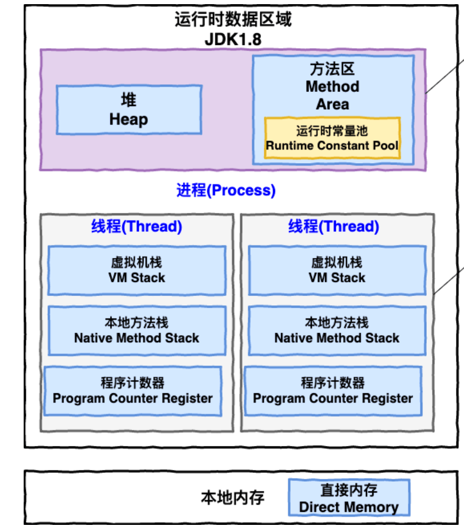


**JDK 1.8 之后** ：


**线程私有的：**

- 程序计数器
- 虚拟机栈
- 本地方法栈

**线程共享的：**

- 堆
- 方法区
- 直接内存 (非运行时数据区的一部分)


### 程序计数器

程序计数器是一块较小的内存空间，可以看作是当前线程所执行的字节码的行号指示器。字节码解释器工作时通过改变这个计数器的值来选取下一条需要执行的字节码指令，分支、循环、跳转、异常处理、线程恢复等功能都需要依赖这个计数器来完成。

另外，为了线程切换后能恢复到正确的执行位置，每条线程都需要有一个独立的程序计数器，各线程之间计数器互不影响，独立存储，我们称这类内存区域为“线程私有”的内存。


程序计数器主要有两个作用：

- 字节码解释器通过改变程序计数器来依次读取指令，从而实现代码的流程控制，如：顺序执行、选择、循环、异常处理。
- 在多线程的情况下，程序计数器用于记录当前线程执行的位置，从而当线程被切换回来的时候能够知道该线程上次运行到哪儿了。


**程序计数器是唯一一个不会出现 `OutOfMemoryError` 的内存区域**，它的生命周期随着线程的创建而创建，随着线程的结束而死亡。


### Java 虚拟机栈

与程序计数器一样，Java 虚拟机栈（后文简称栈）也是线程私有的，它的生命周期和线程相同，随着线程的创建而创建，随着线程的死亡而死亡。

栈绝对算的上是 JVM 运行时数据区域的一个核心，除了一些 Native 方法调用是通过本地方法栈实现的(后面会提到)，其他所有的 Java 方法调用都是通过栈来实现的（也需要和其他运行时数据区域比如程序计数器配合）。

方法调用的数据需要通过栈进行传递，每一次方法调用都会有一个对应的栈帧被压入栈中，每一个方法调用结束后，都会有一个栈帧被弹出。

栈由一个个栈帧组成，而每个栈帧中都拥有：局部变量表、操作数栈、动态链接、方法返回地址。和数据结构上的栈类似，两者都是先进后出的数据结构，只支持出栈和入栈两种操作。


**局部变量表** 主要存放了编译期可知的各种数据类型（boolean、byte、char、short、int、float、long、double）、对象引用（reference 类型，它不同于对象本身，可能是一个指向对象起始地址的引用指针，也可能是指向一个代表对象的句柄或其他与此对象相关的位置）。


**操作数栈** 主要作为方法调用的中转站使用，用于存放方法执行过程中产生的中间计算结果。另外，计算过程中产生的临时变量也会放在操作数栈中。


**动态链接** 主要服务一个方法需要调用其他方法的场景。在 Java 源文件被编译成字节码文件时，所有的变量和方法引用都作为符号引用（Symbilic Reference）保存在 Class 文件的常量池里。当一个方法要调用其他方法，需要将常量池中指向方法的符号引用转化为其在内存地址中的直接引用。动态链接的作用就是为了将符号引用转换为调用方法的直接引用。


栈空间虽然不是无限的，但一般正常调用的情况下是不会出现问题的。不过，如果函数调用陷入无限循环的话，就会导致栈中被压入太多栈帧而占用太多空间，导致栈空间过深。那么当线程请求栈的深度超过当前 Java 虚拟机栈的最大深度的时候，就抛出 `StackOverFlowError` 错误。

Java 方法有两种返回方式，一种是 return 语句正常返回，一种是抛出异常。不管哪种返回方式，都会导致栈帧被弹出。也就是说， **栈帧随着方法调用而创建，随着方法结束而销毁。无论方法正常完成还是异常完成都算作方法结束。**

除了 `StackOverFlowError` 错误之外，栈还可能会出现`OutOfMemoryError`错误，这是因为如果栈的内存大小可以动态扩展， 如果虚拟机在动态扩展栈时无法申请到足够的内存空间，则抛出`OutOfMemoryError`异常。


### 本地方法栈

和虚拟机栈所发挥的作用非常相似，区别是： **虚拟机栈为虚拟机执行 Java 方法 （也就是字节码）服务，而本地方法栈则为虚拟机使用到的 Native 方法服务。** 在 HotSpot 虚拟机中和 Java 虚拟机栈合二为一。

本地方法被执行的时候，在本地方法栈也会创建一个栈帧，用于存放该本地方法的局部变量表、操作数栈、动态链接、出口信息。

方法执行完毕后相应的栈帧也会出栈并释放内存空间，也会出现 `StackOverFlowError` 和 `OutOfMemoryError` 两种错误。


### 堆

Java 虚拟机所管理的内存中最大的一块，Java 堆是所有线程共享的一块内存区域，在虚拟机启动时创建。**此内存区域的唯一目的就是存放对象实例，几乎所有的对象实例以及数组都在这里分配内存。**

Java 世界中“几乎”所有的对象都在堆中分配，但是，随着 JIT 编译器的发展与逃逸分析技术逐渐成熟，栈上分配、标量替换优化技术将会导致一些微妙的变化，所有的对象都分配到堆上也渐渐变得不那么“绝对”了。从 JDK 1.7 开始已经默认开启逃逸分析，如果某些方法中的对象引用没有被返回或者未被外面使用（也就是未逃逸出去），那么对象可以直接在栈上分配内存。

Java 堆是垃圾收集器管理的主要区域，因此也被称作 **GC 堆（Garbage Collected Heap）**。从垃圾回收的角度，由于现在收集器基本都采用分代垃圾收集算法，所以 Java 堆还可以细分为：新生代和老年代；再细致一点有：Eden、Survivor、Old 等空间。进一步划分的目的是更好地回收内存，或者更快地分配内存。


### 方法区

方法区属于是 JVM 运行时数据区域的一块逻辑区域，是各个线程共享的内存区域。在不同的虚拟机实现上，方法区的实现是不同的。

当虚拟机要使用一个类时，它需要读取并解析 Class 文件获取相关信息，再将信息存入到方法区。方法区会存储已被虚拟机加载的 **类信息、字段信息、方法信息、常量、静态变量、即时编译器编译后的代码缓存等数据**。


**方法区和永久代以及元空间是什么关系呢？** 方法区和永久代以及元空间的关系很像 Java 中接口和类的关系，类实现了接口，这里的类就可以看作是永久代和元空间，接口可以看作是方法区，也就是说永久代以及元空间是 HotSpot 虚拟机对虚拟机规范中方法区的两种实现方式。并且，永久代是 JDK 1.8 之前的方法区实现，JDK 1.8 及以后方法区的实现变成了元空间。


**为什么要将永久代 (PermGen) 替换为元空间 (MetaSpace) 呢?**

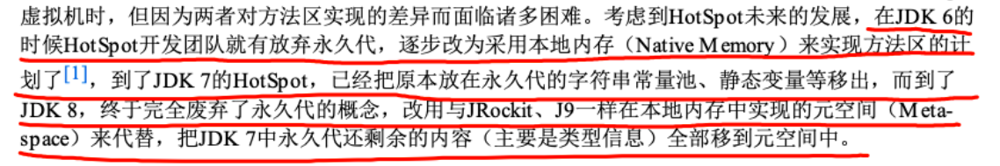


整个永久代有一个 JVM 本身设置的固定大小上限，无法进行调整，而元空间使用的是直接内存，受本机可用内存的限制，虽然元空间仍旧可能溢出，但是比原来出现的几率会更小。


### 运行时常量池

Class 文件中除了有类的版本、字段、方法、接口等描述信息外，还有用于存放编译期生成的各种字面量（Literal）和符号引用（Symbolic Reference）的 **常量池表(Constant Pool Table)** 。

字面量是源代码中的固定值的表示法，即通过字面我们就能知道其值的含义。字面量包括整数、浮点数和字符串字面量，符号引用包括类符号引用、字段符号引用、方法符号引用和接口方法符号引用。

常量池表会在类加载后存放到方法区的运行时常量池中。

运行时常量池的功能类似于传统编程语言的符号表，尽管它包含了比典型符号表更广泛的数据。

既然运行时常量池是方法区的一部分，自然受到方法区内存的限制，当常量池无法再申请到内存时会抛出 `OutOfMemoryError` 错误。


### 字符串常量池

**字符串常量池** 是 JVM 为了提升性能和减少内存消耗针对字符串（String 类）专门开辟的一块区域，主要目的是为了避免字符串的重复创建。

**`StringTable` 中保存的是字符串对象的引用，字符串对象的引用指向堆中的字符串对象。**


JDK1.7 之前，字符串常量池存放在永久代。JDK1.7 字符串常量池和静态变量从永久代移动了 Java 堆中。


**JDK 1.7 为什么要将字符串常量池移动到堆中？**

主要是因为永久代（方法区实现）的 GC 回收效率太低，只有在整堆收集 (Full GC)的时候才会被执行 GC。Java 程序中通常会有大量的被创建的字符串等待回收，将字符串常量池放到堆中，能够更高效及时地回收字符串内存。


### 直接内存

直接内存并不是虚拟机运行时数据区的一部分，也不是虚拟机规范中定义的内存区域，但是这部分内存也被频繁地使用。而且也可能导致 OutOfMemoryError 错误出现。

JDK1.4 中新加入的 **NIO(New Input/Output) 类**，引入了一种基于**通道（Channel）**与**缓存区（Buffer）**的 I/O 方式，它可以直接使用 Native 函数库直接分配堆外内存，然后通过一个存储在 Java 堆中的 DirectByteBuffer 对象作为这块内存的引用进行操作。这样就能在一些场景中显著提高性能，因为**避免了在 Java 堆和 Native 堆之间来回复制数据**。

本机直接内存的分配不会受到 Java 堆的限制，但是，既然是内存就会受到本机总内存大小以及处理器寻址空间的限制。


## HotSpot 虚拟机

### 对象的创建

#### Step1:类加载检查

虚拟机遇到一条 new 指令时，首先将去检查这个指令的参数是否能在常量池中定位到这个类的符号引用，并且检查这个符号引用代表的类是否已被加载过、解析和初始化过。如果没有，那必须先执行相应的类加载过程。


#### Step2:分配内存

在**类加载检查**通过后，接下来虚拟机将为新生对象**分配内存**。对象所需的内存大小在类加载完成后便可确定，为对象分配空间的任务等同于把一块确定大小的内存从 Java 堆中划分出来。**分配方式**有 **“指针碰撞”** 和 **“空闲列表”** 两种，**选择哪种分配方式由 Java 堆是否规整决定，而 Java 堆是否规整又由所采用的垃圾收集器是否带有压缩整理功能决定**。


**内存分配的两种方式**

- 指针碰撞 ：
  - 适用场合 ：堆内存规整（即没有内存碎片）的情况下。
  - 原理 ：用过的内存全部整合到一边，没有用过的内存放在另一边，中间有一个分界指针，只需要向着没用过的内存方向将该指针移动对象内存大小位置即可。
  - 使用该分配方式的 GC 收集器：Serial, ParNew
- 空闲列表 ：
  - 适用场合 ： 堆内存不规整的情况下。
  - 原理 ：虚拟机会维护一个列表，该列表中会记录哪些内存块是可用的，在分配的时候，找一块儿足够大的内存块儿来划分给对象实例，最后更新列表记录。
  - 使用该分配方式的 GC 收集器：CMS


选择以上两种方式中的哪一种，取决于 Java 堆内存是否规整。而 Java 堆内存是否规整，取决于 GC 收集器的算法是"标记-清除"，还是"标记-整理"（也称作"标记-压缩"），值得注意的是，复制算法内存也是规整的。


**内存分配并发问题**

在创建对象的时候有一个很重要的问题，就是线程安全，因为在实际开发过程中，创建对象是很频繁的事情，作为虚拟机来说，必须要保证线程是安全的，通常来讲，虚拟机采用两种方式来保证线程安全：

- **CAS+失败重试：** CAS 是乐观锁的一种实现方式。所谓乐观锁就是，每次不加锁而是假设没有冲突而去完成某项操作，如果因为冲突失败就重试，直到成功为止。**虚拟机采用 CAS 配上失败重试的方式保证更新操作的原子性。**
- **TLAB：** 为每一个线程预先在 Eden 区分配一块儿内存，JVM 在给线程中的对象分配内存时，首先在 TLAB 分配，当对象大于 TLAB 中的剩余内存或 TLAB 的内存已用尽时，再采用上述的 CAS 进行内存分配


#### Step3:初始化零值

内存分配完成后，虚拟机需要将分配到的内存空间都初始化为零值（不包括对象头），这一步操作保证了对象的实例字段在 Java 代码中可以不赋初始值就直接使用，程序能访问到这些字段的数据类型所对应的零值。


#### Step4:设置对象头

初始化零值完成之后，**虚拟机要对对象进行必要的设置**，例如这个对象是哪个类的实例、如何才能找到类的元数据信息、对象的哈希码、对象的 GC 分代年龄等信息。 **这些信息存放在对象头中。** 另外，根据虚拟机当前运行状态的不同，如是否启用偏向锁等，对象头会有不同的设置方式。


#### Step5:执行 init 方法

在上面工作都完成之后，从虚拟机的视角来看，一个新的对象已经产生了，但从 Java 程序的视角来看，对象创建才刚开始，`<init>` 方法还没有执行，所有的字段都还为零。所以一般来说，执行 new 指令之后会接着执行 `<init>` 方法，把对象按照程序员的意愿进行初始化，这样一个真正可用的对象才算完全产生出来。


### 对象的内存布局

在 Hotspot 虚拟机中，对象在内存中的布局可以分为 3 块区域：**对象头**、**实例数据**和**对齐填充**。

**Hotspot 虚拟机的对象头包括两部分信息**，**第一部分用于存储对象自身的运行时数据**（哈希码、GC 分代年龄、锁状态标志等等），**另一部分是类型指针**，即对象指向它的类元数据的指针，虚拟机通过这个指针来确定这个对象是哪个类的实例。

**实例数据部分是对象真正存储的有效信息**，也是在程序中所定义的各种类型的字段内容。

**对齐填充部分不是必然存在的，也没有什么特别的含义，仅仅起占位作用。** 因为 Hotspot 虚拟机的自动内存管理系统要求对象起始地址必须是 8 字节的整数倍，换句话说就是对象的大小必须是 8 字节的整数倍。而对象头部分正好是 8 字节的倍数（1 倍或 2 倍），因此，当对象实例数据部分没有对齐时，就需要通过对齐填充来补全。


### 对象的访问定位

建立对象就是为了使用对象，我们的 Java 程序通过栈上的 reference 数据来操作堆上的具体对象。对象的访问方式由虚拟机实现而定，目前主流的访问方式有：**使用句柄**、**直接指针**。


#### 句柄

如果使用句柄的话，那么 Java 堆中将会划分出一块内存来作为句柄池，reference 中存储的就是对象的句柄地址，而句柄中包含了对象实例数据与对象类型数据各自的具体地址信息。


#### 直接指针

如果使用直接指针访问，reference 中存储的直接就是对象的地址。

这两种对象访问方式各有优势。使用句柄来访问的最大好处是 reference 中存储的是稳定的句柄地址，在对象被移动时只会改变句柄中的实例数据指针，而 reference 本身不需要修改。使用直接指针访问方式最大的好处就是速度快，它节省了一次指针定位的时间开销。


## JVM 内存参数

**要求** 

* 熟悉常见的 JVM 参数，尤其和大小相关的


### 堆内存，按大小设置


* -Xms 最小堆内存（包括新生代和老年代）
* -Xmx 最大堆内存（包括新生代和老年代）
* 通常建议将 -Xms 与 -Xmx 设置为大小相等，即不需要保留内存，不需要从小到大增长，这样性能较好
* -XX:NewSize 与 -XX:MaxNewSize 设置新生代的最小与最大值，但一般不建议设置，由 JVM 自己控制
* -Xmn 设置新生代大小，相当于同时设置了 -XX:NewSize 与 -XX:MaxNewSize 并且取值相等
* 保留是指，一开始不会占用那么多内存，随着使用内存越来越多，会逐步使用这部分保留内存。下同


### 堆内存，按比例设置


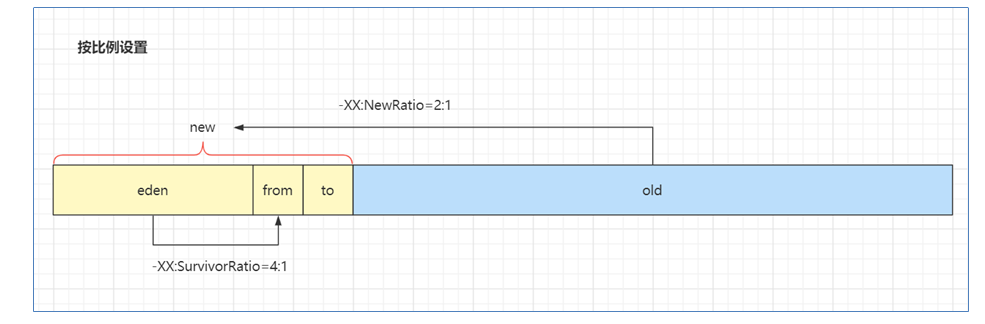


* -XX:NewRatio=2:1 表示老年代占两份，新生代占一份
* -XX:SurvivorRatio=4:1 表示新生代分成六份，伊甸园占四份，from 和 to 各占一份


### 元空间内存设置


* class space 存储类的基本信息，最大值受 -XX:CompressedClassSpaceSize 控制
* non-class space 存储除类的基本信息以外的其它信息（如方法字节码、注解等）
* class space 和 non-class space 总大小受 -XX:MaxMetaspaceSize 控制


这里 -XX:CompressedClassSpaceSize 这段空间还与是否开启了指针压缩有关，指针压缩默认开启


### 代码缓存内存设置


* 如果 -XX:ReservedCodeCacheSize < 240m，所有优化机器代码不加区分存在一起
* 否则，分成三个区域（图中笔误 mthod 拼写错误，少一个 e）
  * non-nmethods - JVM 自己用的代码
  * profiled nmethods - 部分优化的机器码
  * non-profiled nmethods - 完全优化的机器码


## JVM 垃圾回收

**要求**

* 掌握垃圾回收算法
* 掌握分代回收思想
* 理解三色标记及漏标处理
* 了解常见垃圾回收器


### 三种垃圾回收算法

#### 标记清除法


解释：

1. 找到 GC Root 对象，即那些一定不会被回收的对象，如正执行方法内局部变量引用的对象、静态变量引用的对象
2. 标记阶段：沿着 GC Root 对象的引用链找，直接或间接引用到的对象加上标记
3. 清除阶段：释放未加标记的对象占用的内存


要点：

* 标记速度与存活对象线性关系
* 清除速度与内存大小线性关系
* 缺点是会产生内存碎片


#### 标记整理法


解释：

1. 前面的标记阶段、清理阶段与标记清除法类似
2. 多了一步整理的动作，将存活对象向一端移动，可以避免内存碎片产生


特点：

* 标记速度与存活对象线性关系
* 清除与整理速度与内存大小成线性关系
* 缺点是性能上较慢


#### 标记复制法


解释：

1. 将整个内存分成两个大小相等的区域，from 和 to，其中 to 总是处于空闲，from 存储新创建的对象
2. 标记阶段与前面的算法类似
3. 在找出存活对象后，会将它们从 from 复制到 to 区域，复制的过程中自然完成了碎片整理
4. 复制完成后，交换 from 和 to 的位置即可


特点：

* 标记与复制速度与存活对象成线性关系
* 缺点是会占用成倍的空间


### GC 与分代回收算法

GC 的目的在于实现无用对象内存自动释放，减少内存碎片、加快分配速度


GC 要点：

* 回收区域是**堆内存**，不包括虚拟机栈
* 判断无用对象，使用**可达性分析算法**，**三色标记法**标记存活对象，回收未标记对象
* GC 具体的实现称为**垃圾回收器**
* GC 大都采用了**分代回收思想**
  * 理论依据是大部分对象朝生夕灭，用完立刻就可以回收，另有少部分对象会长时间存活，每次很难回收
  * 根据这两类对象的特性将回收区域分为**新生代**和**老年代**，**新生代采用标记复制法、老年代一般采用标记整理法**
* 根据 GC 的规模可以分成 **Minor GC**，**Mixed GC**，**Full GC**


#### 分代回收

1. 伊甸园 eden，最初对象都分配到这里，与幸存区 survivor（分成 from 和 to）合称新生代


2. 当伊甸园内存不足，标记伊甸园与 from（现阶段没有）的存活对象


3. 将存活对象采用复制算法复制到 to 中，复制完毕后，伊甸园和 from 内存都得到释放


4. 将 from 和 to 交换位置


5. 经过一段时间后伊甸园的内存又出现不足


6. 标记伊甸园与 from（现阶段没有）的存活对象


7. 将存活对象采用复制算法复制到 to 中


8. 复制完毕后，伊甸园和 from 内存都得到释放


9. 将 from 和 to 交换位置


10. 老年代 old，当幸存区对象熬过几次回收（最多15次），晋升到老年代（幸存区内存不足或大对象会导致提前晋升）


#### GC 规模

* Minor GC 发生在新生代的垃圾回收，暂停时间短
* Mixed GC 新生代 + 老年代部分区域的垃圾回收，G1 收集器特有
* Full GC 新生代 + 老年代完整垃圾回收，暂停时间长，**应尽力避免**


#### 三色标记

即用三种颜色记录对象的标记状态

* 黑色 – 已标记
* 灰色 – 标记中
* 白色 – 还未标记


1. 起始的三个对象还未处理完成，用灰色表示


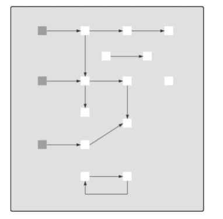


2. 该对象的引用已经处理完成，用黑色表示，黑色引用的对象变为灰色


3. 依次类推


4. 沿着引用链都标记了一遍


5. 最后为标记的白色对象，即为垃圾


**并发漏标问题**

比较先进的垃圾回收器都支持**并发标记**，即在标记过程中，用户线程仍然能工作。但这样带来一个新的问题，如果用户线程修改了对象引用，那么就存在漏标问题。


1. 如图所示标记工作尚未完成


2. 用户线程同时在工作，断开了第一层 3、4 两个对象之间的引用，这时对于正在处理 3 号对象的垃圾回收线程来讲，它会将 4 号对象当做是白色垃圾


3. 但如果其他用户线程又建立了 2、4 两个对象的引用，这时因为 2 号对象是黑色已处理对象了，因此垃圾回收线程不会察觉到这个引用关系的变化，从而产生了漏标


4. 如果用户线程让黑色对象引用了一个新增对象，一样会存在漏标问题


因此对于**并发标记**而言，必须解决漏标问题，也就是要记录标记过程中的变化。有两种解决方法：

1. Incremental Update 增量更新法，CMS 垃圾回收器采用
   * 思路是拦截每次赋值动作，只要赋值发生，被赋值的对象就会被记录下来，在重新标记阶段再确认一遍
2. Snapshot At The Beginning，SATB 原始快照法，G1 垃圾回收器采用
   * 思路也是拦截每次赋值动作，不过记录的对象不同，也需要在重新标记阶段对这些对象二次处理
   * 新加对象会被记录
   * 被删除引用关系的对象也被记录


### 垃圾回收器

#### Parallel GC

* eden 内存不足发生 Minor GC，采用标记复制算法，需要暂停用户线程
* old 内存不足发生 Full GC，采用标记整理算法，需要暂停用户线程
* **注重吞吐量**


#### ConcurrentMarkSweep GC

* 它是工作在 old 老年代，支持**并发标记**的一款回收器，采用**并发清除**算法
  * 并发标记时不需暂停用户线程
  * 重新标记时仍需暂停用户线程
* 如果并发失败（即回收速度赶不上创建新对象速度），会触发 Full GC
* **注重响应时间**


#### G1 GC

* **响应时间与吞吐量兼顾**
* 划分成多个区域，每个区域都可以充当 eden，survivor，old， humongous，其中 humongous 专为大对象准备
* 分成三个阶段：新生代回收、并发标记、混合收集
* 如果并发失败（即回收速度赶不上创建新对象速度），会触发 Full GC


### G1 

#### G1 回收阶段 - 新生代回收


1. 初始时，所有区域都处于空闲状态


2. 创建了一些对象，挑出一些空闲区域作为伊甸园区存储这些对象


3. 当伊甸园需要垃圾回收时，挑出一个空闲区域作为幸存区，用复制算法复制存活对象，需要暂停用户线程


4. 复制完成，将之前的伊甸园内存释放


5. 随着时间流逝，伊甸园的内存又有不足


6. 将伊甸园以及之前幸存区中的存活对象，采用复制算法，复制到新的幸存区，其中较老对象晋升至老年代


7. 释放伊甸园以及之前幸存区的内存


#### G1 回收阶段 - 并发标记与混合收集


1. 当老年代占用内存超过阈值后，触发并发标记，这时无需暂停用户线程


2. 并发标记之后，会有重新标记阶段解决漏标问题，此时需要暂停用户线程。这些都完成后就知道了老年代有哪些存活对象，随后进入混合收集阶段。此时不会对所有老年代区域进行回收，而是根据**暂停时间目标**优先回收价值高（存活对象少）的区域（这也是 Gabage First 名称的由来）。


3. 混合收集阶段中，参与复制的有 eden、survivor、old，下图显示了伊甸园和幸存区的存活对象复制


4. 下图显示了老年代和幸存区晋升的存活对象的复制


5. 复制完成，内存得到释放。进入下一轮的新生代回收、并发标记、混合收集


## 内存溢出

**要求**

* 能够说出几种典型的导致内存溢出的情况


**典型情况**

* 误用线程池导致的内存溢出
* 查询数据量太大导致的内存溢出
* 动态生成类导致的内存溢出


## 类加载

**要求**

* 掌握类加载阶段
* 掌握类加载器
* 理解双亲委派机制


### 类加载过程的三个阶段

1. 加载

   1. 将类的字节码载入方法区，并创建类.class 对象

   2. 如果此类的父类没有加载，先加载父类
   3. 加载是懒惰执行

2. 链接
   1. 验证 – 验证类是否符合 Class 规范，合法性、安全性检查
   2. 准备 – 为 static 变量分配空间，设置默认值
   3. 解析 – 将常量池的符号引用解析为直接引用

3. 初始化
   1. 静态代码块、static 修饰的变量赋值、static final 修饰的引用类型变量赋值，会被合并成一个 `<cinit>` 方法，在初始化时被调用
   2. static final 修饰的基本类型变量赋值，在链接阶段就已完成
   3. 初始化是懒惰执行


### jdk 8 的类加载器

|        **名称**         |    **加载哪的类**     |            **说明**            |
| :---------------------: | :-------------------: | :----------------------------: |
|  Bootstrap ClassLoader  |   JAVA_HOME/jre/lib   |          无法直接访问          |
|  Extension ClassLoader  | JAVA_HOME/jre/lib/ext | 上级为 Bootstrap，显示为  null |
| Application ClassLoader |       classpath       |        上级为 Extension        |
|     自定义类加载器      |        自定义         |       上级为 Application       |


### 双亲委派机制

所谓的双亲委派，就是指优先委派上级类加载器进行加载，如果上级类加载器

* 能找到这个类，由上级加载，加载后该类也对下级加载器可见
* 找不到这个类，则下级类加载器才有资格执行加载


双亲委派的目的有两点

1. 让上级类加载器中的类对下级共享（反之不行），即能让你的类能依赖到 jdk 提供的核心类
2. 让类的加载有优先次序，保证核心类优先加载


**自己编写类加载器就能加载一个假冒的 java.lang.System 吗?**

答案是不行。

* 假设你自己的类加载器用双亲委派，那么优先由启动类加载器加载真正的 java.lang.System，自然不会加载假冒的

* 假设你自己的类加载器不用双亲委派，那么你的类加载器加载假冒的 java.lang.System 时，它需要先加载父类 java.lang.Object，而你没有用委派，找不到 java.lang.Object 所以加载会失败

* **以上也仅仅是假设**。事实上操作你就会发现，自定义类加载器加载以 java. 打头的类时，会抛安全异常，在 jdk9 以上版本这些特殊包名都与模块进行了绑定，更连编译都过不了


## 四种引用

**要求**

* 掌握四种引用


### 强引用

1. 普通变量赋值即为强引用，如 A a = new A();
2. 通过 GC Root 的引用链，如果强引用不到该对象，该对象才能被回收


### 软引用

1. 例如：SoftReference a = new SoftReference(new A());
2. 如果仅有软引用该对象时，首次垃圾回收不会回收该对象，如果内存仍不足，再次回收时才会释放对象
3. 软引用自身需要配合引用队列来释放
4. 典型例子是反射数据


### 弱引用

1. 例如：WeakReference a = new WeakReference(new A());
2. 如果仅有弱引用引用该对象时，只要发生垃圾回收，就会释放该对象
3. 弱引用自身需要配合引用队列来释放
4. 典型例子是 ThreadLocalMap 中的 Entry 对象


### 虚引用

1. 例如： PhantomReference a = new PhantomReference(new A(), referenceQueue);
2. 必须配合引用队列一起使用，当虚引用所引用的对象被回收时，由 Reference Handler 线程将虚引用对象入队，这样就可以知道哪些对象被回收，从而对它们关联的资源做进一步处理
3. 典型例子是 Cleaner 释放 DirectByteBuffer 关联的直接内存


## finalize

**要求**

* 掌握 finalize 的工作原理与缺点


* 它是 Object 中的一个方法，如果子类重写它，垃圾回收时此方法会被调用，可以在其中进行资源释放和清理工作
* 将资源释放和清理放在 finalize 方法中非常不好，非常影响性能，严重时甚至会引起 OOM，从 Java9 开始就被标注为 @Deprecated，不建议被使用了


### finalize 原理

1. 对 finalize 方法进行处理的核心逻辑位于 java.lang.ref.Finalizer 类中，它包含了名为 unfinalized 的静态变量（双向链表结构），Finalizer 也可被视为另一种引用对象（地位与软、弱、虚相当，只是不对外，无法直接使用）
2. 当重写了 finalize 方法的对象，在构造方法调用之时，JVM 都会将其包装成一个 Finalizer 对象，并加入 unfinalized 链表中


3. Finalizer 类中还有另一个重要的静态变量，即 ReferenceQueue 引用队列，刚开始它是空的。当狗对象可以被当作垃圾回收时，就会把这些狗对象对应的 Finalizer 对象加入此引用队列
4. 但此时 Dog 对象还没法被立刻回收，因为 unfinalized -> Finalizer 这一引用链还在引用它嘛，为的是【先别着急回收啊，等我调完 finalize 方法，再回收】
5. FinalizerThread 线程会从 ReferenceQueue 中逐一取出每个 Finalizer 对象，把它们从链表断开并真正调用 finallize 方法


6. 由于整个 Finalizer 对象已经从 unfinalized 链表中断开，这样没谁能引用到它和狗对象，所以下次 gc 时就被回收了


### finalize 缺点

* 无法保证资源释放：FinalizerThread 是守护线程，代码很有可能没来得及执行完，线程就结束了
* 无法判断是否发生错误：执行 finalize 方法时，会吞掉任意异常（Throwable）
* 内存释放不及时：重写了 finalize 方法的对象在第一次被 gc 时，并不能及时释放它占用的内存，因为要等着 FinalizerThread 调用完 finalize，把它从 unfinalized 队列移除后，第二次 gc 时才能真正释放内存
* 有的文章提到【Finalizer 线程会和我们的主线程进行竞争，不过由于它的优先级较低，获取到的CPU时间较少，因此它永远也赶不上主线程的步伐】这个显然是错误的，FinalizerThread 的优先级较普通线程更高，原因应该是 finalize 串行执行慢等原因综合导致


# Spring

## Spring bean 生命周期

### 概述

bean 的生命周期从调用 beanFactory 的 getBean 开始，到这个 bean 被销毁，可以总结为以下七个阶段：

1. 处理名称，检查缓存
2. 处理父子容器
3. 处理 dependsOn
4. 选择 scope 策略
5. 创建 bean
6. 类型转换处理
7. 销毁 bean


**1. 处理名称，检查缓存**

* 这一步会处理别名，将别名解析为实际名称
* 对 FactoryBean 也会特殊处理，如果以 & 开头表示要获取 FactoryBean 本身，否则表示要获取其产品
* 这里针对单例对象会检查一级、二级、三级缓存
  * singletonFactories 三级缓存，存放单例工厂对象
  * earlySingletonObjects 二级缓存，存放单例工厂的产品对象
    * 如果发生循环依赖，产品是代理；无循环依赖，产品是原始对象
  * singletonObjects 一级缓存，存放单例成品对象


**2. 处理父子容器**

* 如果当前容器根据名字找不到这个 bean，此时若父容器存在，则执行父容器的 getBean 流程
* 父子容器的 bean 名称可以重复


**3. 处理 dependsOn**

* 如果当前 bean 有通过 dependsOn 指定了非显式依赖的 bean，这一步会提前创建这些 dependsOn 的 bean 
* 所谓非显式依赖，就是指两个 bean 之间不存在直接依赖关系，但需要控制它们的创建先后顺序


**4. 选择 scope 策略**

* 对于 singleton scope，首先到单例池去获取 bean，如果有则直接返回，没有再进入创建流程
* 对于 prototype scope，每次都会进入创建流程
* 对于自定义 scope，例如 request，首先到 request 域获取 bean，如果有则直接返回，没有再进入创建流程


**5.1 创建 bean - 创建 bean 实例**

| **要点**                             | **总结**                                                     |
| ------------------------------------ | ------------------------------------------------------------ |
| 有自定义 TargetSource 的情况         | 由 AnnotationAwareAspectJAutoProxyCreator 创建代理返回       |
| Supplier 方式创建 bean 实例          | 为 Spring 5.0 新增功能，方便编程方式创建  bean  实例         |
| FactoryMethod 方式  创建 bean  实例  | ① 分成静态工厂与实例工厂；② 工厂方法若有参数，需要对工厂方法参数进行解析，利用  resolveDependency；③ 如果有多个工厂方法候选者，还要进一步按权重筛选 |
| AutowiredAnnotationBeanPostProcessor | ① 优先选择带  @Autowired  注解的构造；② 若有唯一的带参构造，也会入选 |
| mbd.getPreferredConstructors         | 选择所有公共构造，这些构造之间按权重筛选                     |
| 采用默认构造                         | 如果上面的后处理器和 BeanDefiniation 都没找到构造，采用默认构造，即使是私有的 |


**5.2 创建 bean - 依赖注入**

| **要点**                             | **总结**                                                     |
| ------------------------------------ | ------------------------------------------------------------ |
| AutowiredAnnotationBeanPostProcessor | 识别   @Autowired  及 @Value  标注的成员，封装为  InjectionMetadata 进行依赖注入 |
| CommonAnnotationBeanPostProcessor    | 识别   @Resource  标注的成员，封装为  InjectionMetadata 进行依赖注入 |
| resolveDependency                    | 用来查找要装配的值，可以识别：① Optional；② ObjectFactory 及 ObjectProvider；③ @Lazy  注解；④ @Value  注解（${  }, #{ }, 类型转换）；⑤ 集合类型（Collection，Map，数组等）；⑥ 泛型和  @Qualifier（用来区分类型歧义）；⑦ primary  及名字匹配（用来区分类型歧义） |
| AUTOWIRE_BY_NAME                     | 根据成员名字找 bean 对象，修改 mbd 的 propertyValues，不会考虑简单类型的成员 |
| AUTOWIRE_BY_TYPE                     | 根据成员类型执行 resolveDependency 找到依赖注入的值，修改  mbd 的 propertyValues |
| applyPropertyValues                  | 根据 mbd 的 propertyValues 进行依赖注入（即xml中 `<property name ref|value/>`） |


**5.3 创建 bean - 初始化**

| **要点**              | **总结**                                                     |
| --------------------- | ------------------------------------------------------------ |
| 内置 Aware 接口的装配 | 包括 BeanNameAware，BeanFactoryAware 等                      |
| 扩展 Aware 接口的装配 | 由 ApplicationContextAwareProcessor 解析，执行时机在  postProcessBeforeInitialization |
| @PostConstruct        | 由 CommonAnnotationBeanPostProcessor 解析，执行时机在  postProcessBeforeInitialization |
| InitializingBean      | 通过接口回调执行初始化                                       |
| initMethod            | 根据 BeanDefinition 得到的初始化方法执行初始化，即 `<bean init-method>` 或 @Bean(initMethod) |
| 创建 aop 代理         | 由 AnnotationAwareAspectJAutoProxyCreator 创建，执行时机在  postProcessAfterInitialization |


**5.4 创建 bean - 注册可销毁 bean**

在这一步判断并登记可销毁 bean

* 判断依据
  * 如果实现了 DisposableBean 或 AutoCloseable 接口，则为可销毁 bean
  * 如果自定义了 destroyMethod，则为可销毁 bean
  * 如果采用 @Bean 没有指定 destroyMethod，则采用自动推断方式获取销毁方法名（close，shutdown）
  * 如果有 @PreDestroy 标注的方法
* 存储位置
  * singleton scope 的可销毁 bean 会存储于 beanFactory 的成员当中
  * 自定义 scope 的可销毁 bean 会存储于对应的域对象当中
  * prototype scope 不会存储，需要自己找到此对象销毁
* 存储时都会封装为 DisposableBeanAdapter 类型对销毁方法的调用进行适配


**6. 类型转换处理**

* 如果 getBean 的 requiredType 参数与实际得到的对象类型不同，会尝试进行类型转换


**7. 销毁 bean**

* 销毁时机
  * singleton bean 的销毁在 ApplicationContext.close 时，此时会找到所有 DisposableBean 的名字，逐一销毁
  * 自定义 scope bean 的销毁在作用域对象生命周期结束时
  * prototype bean 的销毁可以通过自己手动调用 AutowireCapableBeanFactory.destroyBean 方法执行销毁
* 同一 bean 中不同形式销毁方法的调用次序
  * 优先后处理器销毁，即 @PreDestroy
  * 其次 DisposableBean 接口销毁
  * 最后 destroyMethod 销毁（包括自定义名称，推断名称，AutoCloseable 接口 多选一）


## Spring bean 循环依赖

### 循环依赖的产生

首先要明白，bean 的创建要遵循一定的步骤，必须是创建、注入、初始化三步，这些顺序不能乱


set 方法（包括成员变量）的循环依赖如图所示

* 可以在【a 创建】和【a set 注入 b】之间加入 b 的整个流程来解决
* 【b set 注入 a】 时可以成功，因为之前 a 的实例已经创建完毕
* a 的顺序，及 b 的顺序都能得到保障


构造方法的循环依赖如图所示，显然无法用前面的方法解决


### 构造循环依赖的解决

* 思路1

  * a 注入 b 的代理对象，这样能够保证 a 的流程走通
  * 后续需要用到 b 的真实对象时，可以通过代理间接访问

  


思路2

* a 注入 b 的工厂对象，让 b 的实例创建被推迟，这样能够保证 a 的流程先走通
* 后续需要用到 b 的真实对象时，再通过 ObjectFactory 工厂间接访问


### 解决 set 循环依赖的原理

**一级缓存**


作用是保证单例对象仅被创建一次

* 第一次走 `getBean("a")` 流程后，最后会将成品 a 放入 singletonObjects 一级缓存
* 后续再走 `getBean("a")` 流程时，先从一级缓存中找，这时已经有成品 a，就无需再次创建


**一级缓存与循环依赖**


一级缓存无法解决循环依赖问题，分析如下

* 无论是获取 bean a 还是获取 bean b，走的方法都是同一个 getBean 方法，假设先走 `getBean("a")`
* 当 a 的实例对象创建，接下来执行 `a.setB()` 时，需要走 `getBean("b")` 流程，红色箭头 1
* 当 b 的实例对象创建，接下来执行 `b.setA()` 时，又回到了 `getBean("a")` 的流程，红色箭头 2
* 但此时 singletonObjects 一级缓存内没有成品的 a，陷入了死循环


**二级缓存**


解决思路如下：

* 再增加一个 singletonFactories 缓存
* 在依赖注入前，即 `a.setB()` 以及 `b.setA()` 将 a 及 b 的半成品对象（未完成依赖注入和初始化）放入此缓存
* 执行依赖注入时，先看看 singletonFactories 缓存中是否有半成品的对象，如果有拿来注入，顺利走完流程

对于上面的图

* `a = new A()` 执行之后就会把这个半成品的 a 放入 singletonFactories 缓存，即 `factories.put(a)`
* 接下来执行 `a.setB()`，走入 `getBean("b")` 流程，红色箭头 3
* 这回再执行到 `b.setA()` 时，需要一个 a 对象，有没有呢？有！
* `factories.get()` 在 singletonFactories  缓存中就可以找到，红色箭头 4 和 5
* b 的流程能够顺利走完，将 b 成品放入 singletonObject 一级缓存，返回到 a 的依赖注入流程，红色箭头 6


**二级缓存与创建代理**


二级缓存无法正确处理循环依赖并且包含有代理创建的场景，分析如下

* spring 默认要求，在 `a.init` 完成之后才能创建代理 `pa = proxy(a)`
* 由于 a 的代理创建时机靠后，在执行 `factories.put(a)` 向 singletonFactories 中放入的还是原始对象
* 接下来箭头 3、4、5 这几步 b 对象拿到和注入的都是原始对象


**三级缓存**


简单分析的话，只需要将代理的创建时机放在依赖注入之前即可，但 spring 仍然希望代理的创建时机在 init 之后，只有出现循环依赖时，才会将代理的创建时机提前。所以解决思路稍显复杂：

* 图中 `factories.put(fa)` 放入的既不是原始对象，也不是代理对象而是工厂对象 fa
* 当检查出发生循环依赖时，fa 的产品就是代理 pa，没有发生循环依赖，fa 的产品是原始对象 a
* 假设出现了循环依赖，拿到了 singletonFactories 中的工厂对象，通过在依赖注入前获得了 pa，红色箭头 5
* 这回 `b.setA()` 注入的就是代理对象，保证了正确性，红色箭头 7
* 还需要把 pa 存入新加的 earlySingletonObjects 缓存，红色箭头 6
* `a.init` 完成后，无需二次创建代理，从哪儿找到 pa 呢？earlySingletonObjects 已经缓存，蓝色箭头 9

当成品对象产生，放入 singletonObject 后，singletonFactories 和 earlySingletonObjects 就中的对象就没有用处，清除即可


## Spring 事务失效

**要求**

* 掌握事务失效的八种场景


### 第一种场景

**抛出检查异常导致事务不能正确回滚**

```java
@Service
public class Service1 {

    @Autowired
    private AccountMapper accountMapper;

    @Transactional
    public void transfer(int from, int to, int amount) throws FileNotFoundException {
        int fromBalance = accountMapper.findBalanceBy(from);
        if (fromBalance - amount >= 0) {
            accountMapper.update(from, -1 * amount);
            new FileInputStream("aaa");
            accountMapper.update(to, amount);
        }
    }
}
```


* 原因：Spring 默认只会回滚非检查异常

* 解法：配置 rollbackFor 属性
  * `@Transactional(rollbackFor = Exception.class)`


### 第二种场景

**业务方法内自己 try-catch 异常导致事务不能正确回滚**

```java
@Service
public class Service2 {

    @Autowired
    private AccountMapper accountMapper;

    @Transactional(rollbackFor = Exception.class)
    public void transfer(int from, int to, int amount)  {
        try {
            int fromBalance = accountMapper.findBalanceBy(from);
            if (fromBalance - amount >= 0) {
                accountMapper.update(from, -1 * amount);
                new FileInputStream("aaa");
                accountMapper.update(to, amount);
            }
        } catch (FileNotFoundException e) {
            e.printStackTrace();
        }
    }
}
```


* 原因：事务通知只有捉到了目标抛出的异常，才能进行后续的回滚处理，如果目标自己处理掉异常，事务通知无法知悉

* 解法1：异常原样抛出
  * 在 catch 块添加 `throw new RuntimeException(e);`

* 解法2：手动设置 TransactionStatus.setRollbackOnly()
  * 在 catch 块添加 `TransactionInterceptor.currentTransactionStatus().setRollbackOnly();`


### 第三种场景

**aop 切面顺序导致导致事务不能正确回滚**

```java
@Service
public class Service3 {

    @Autowired
    private AccountMapper accountMapper;

    @Transactional(rollbackFor = Exception.class)
    public void transfer(int from, int to, int amount) throws FileNotFoundException {
        int fromBalance = accountMapper.findBalanceBy(from);
        if (fromBalance - amount >= 0) {
            accountMapper.update(from, -1 * amount);
            new FileInputStream("aaa");
            accountMapper.update(to, amount);
        }
    }
}
```


```java
@Aspect
public class MyAspect {
    @Around("execution(* transfer(..))")
    public Object around(ProceedingJoinPoint pjp) throws Throwable {
        LoggerUtils.get().debug("log:{}", pjp.getTarget());
        try {
            return pjp.proceed();
        } catch (Throwable e) {
            e.printStackTrace();
            return null;
        }
    }
}
```


* 原因：事务切面优先级最低，但如果自定义的切面优先级和他一样，则还是自定义切面在内层，这时若自定义切面没有正确抛出异常…

* 解法1、2：同情况2 中的解法:1、2
* 解法3：调整切面顺序，在 MyAspect 上添加 `@Order(Ordered.LOWEST_PRECEDENCE - 1)` （不推荐）


### 第四种场景

**非 public 方法导致的事务失效**

```java
@Service
public class Service4 {

    @Autowired
    private AccountMapper accountMapper;

    @Transactional
    void transfer(int from, int to, int amount) throws FileNotFoundException {
        int fromBalance = accountMapper.findBalanceBy(from);
        if (fromBalance - amount >= 0) {
            accountMapper.update(from, -1 * amount);
            accountMapper.update(to, amount);
        }
    }
}
```


* 原因：Spring 为方法创建代理、添加事务通知、前提条件都是该方法是 public 的
* 解法1：改为 public 方法
* 解法2：添加 bean 配置如下（不推荐）

```java
@Bean
public TransactionAttributeSource transactionAttributeSource() {
    return new AnnotationTransactionAttributeSource(false);
}
```


### 第五种场景

**父子容器导致的事务失效**

```java
package day04.tx.app.service;

// ...

@Service
public class Service5 {

    @Autowired
    private AccountMapper accountMapper;

    @Transactional(rollbackFor = Exception.class)
    public void transfer(int from, int to, int amount) throws FileNotFoundException {
        int fromBalance = accountMapper.findBalanceBy(from);
        if (fromBalance - amount >= 0) {
            accountMapper.update(from, -1 * amount);
            accountMapper.update(to, amount);
        }
    }
}
```


控制器类

```java
package day04.tx.app.controller;

// ...

@Controller
public class AccountController {

    @Autowired
    public Service5 service;

    public void transfer(int from, int to, int amount) throws FileNotFoundException {
        service.transfer(from, to, amount);
    }
}
```


App 配置类

```java
@Configuration
@ComponentScan("day04.tx.app.service")
@EnableTransactionManagement
// ...
public class AppConfig {
    // ... 有事务相关配置
}
```


Web 配置类

```java
@Configuration
@ComponentScan("day04.tx.app")
// ...
public class WebConfig {
    // ... 无事务配置
}
```


现在配置了父子容器，WebConfig 对应子容器，AppConfig 对应父容器，发现事务依然失效

* 原因：子容器扫描范围过大，把未加事务配置的 service 扫描进来
* 解法1：各扫描各的，不要图简便
* 解法2：不要用父子容器，所有 bean 放在同一容器


### 第六种场景

**调用本类方法导致传播行为失效**

```java
@Service
public class Service6 {

    @Transactional(propagation = Propagation.REQUIRED, rollbackFor = Exception.class)
    public void foo() throws FileNotFoundException {
        LoggerUtils.get().debug("foo");
        bar();
    }

    @Transactional(propagation = Propagation.REQUIRES_NEW, rollbackFor = Exception.class)
    public void bar() throws FileNotFoundException {
        LoggerUtils.get().debug("bar");
    }
}
```


* 原因：本类方法调用不经过代理，因此无法增强

* 解法1：依赖注入自己（代理）来调用

* 解法2：通过 AopContext 拿到代理对象，来调用

* 解法3：通过 CTW，LTW 实现功能增强


解法1

```java
@Service
public class Service6 {

	@Autowired
	private Service6 proxy; // 本质上是一种循环依赖

    @Transactional(propagation = Propagation.REQUIRED, rollbackFor = Exception.class)
    public void foo() throws FileNotFoundException {
        LoggerUtils.get().debug("foo");
		System.out.println(proxy.getClass());
		proxy.bar();
    }

    @Transactional(propagation = Propagation.REQUIRES_NEW, rollbackFor = Exception.class)
    public void bar() throws FileNotFoundException {
        LoggerUtils.get().debug("bar");
    }
}
```


解法2，还需要在 AppConfig 上添加 `@EnableAspectJAutoProxy(exposeProxy = true)`

```java
@Service
public class Service6 {
    
    @Transactional(propagation = Propagation.REQUIRED, rollbackFor = Exception.class)
    public void foo() throws FileNotFoundException {
        LoggerUtils.get().debug("foo");
        ((Service6) AopContext.currentProxy()).bar();
    }

    @Transactional(propagation = Propagation.REQUIRES_NEW, rollbackFor = Exception.class)
    public void bar() throws FileNotFoundException {
        LoggerUtils.get().debug("bar");
    }
}
```


### 第七种场景

**@Transactional 没有保证原子行为**

```java
@Service
public class Service7 {

    private static final Logger logger = LoggerFactory.getLogger(Service7.class);

    @Autowired
    private AccountMapper accountMapper;

    @Transactional(rollbackFor = Exception.class)
    public void transfer(int from, int to, int amount) {
        int fromBalance = accountMapper.findBalanceBy(from);
        logger.debug("更新前查询余额为: {}", fromBalance);
        if (fromBalance - amount >= 0) {
            accountMapper.update(from, -1 * amount);
            accountMapper.update(to, amount);
        }
    }

    public int findBalance(int accountNo) {
        return accountMapper.findBalanceBy(accountNo);
    }
}
```


上面的代码实际上是有 bug 的，假设 from 余额为 1000，两个线程都来转账 1000，可能会出现扣减为负数的情况

原因：事务的原子性仅涵盖 insert、update、delete、select … for update 语句，select 方法并不阻塞


### 第八种场景

**@Transactional 方法导致的 synchronized 失效**

```java
@Service
public class Service7 {

    private static final Logger logger = LoggerFactory.getLogger(Service7.class);

    @Autowired
    private AccountMapper accountMapper;

    @Transactional(rollbackFor = Exception.class)
    public synchronized void transfer(int from, int to, int amount) {
        int fromBalance = accountMapper.findBalanceBy(from);
        logger.debug("更新前查询余额为: {}", fromBalance);
        if (fromBalance - amount >= 0) {
            accountMapper.update(from, -1 * amount);
            accountMapper.update(to, amount);
        }
    }

    public int findBalance(int accountNo) {
        return accountMapper.findBalanceBy(accountNo);
    }
}
```


针对上面的问题，能否在方法上加 synchronized 锁来解决呢？

答案是不行，原因如下：

* synchronized 保证的仅是目标方法的原子性，环绕目标方法的还有 commit 等操作，它们并未处于 sync 块内


* 解法1：synchronized 范围应扩大至代理方法调用
* 解法2：使用 select … for update 替换 select


## Spring事务的传播行为


| 事务行为              | 说明                                               |
| :-------------------: | :------------------------------------------------: |
| PROPAGATION_REQUIRED  | 支持当前事务，假设当前没有事务。就新建一个事务     |
| PROPAGATION_SUPPORTS  | 支持当前事务，假设当前没有事务，就以非事务方式运行 |
| PROPAGATION_MANDATORY | 支持当前事务，假设当前没有事务，就抛出异常         |
| PROPAGATION_REQUIRES_NEW  | 新建事务，假设当前存在事务。把当前事务挂起               |
| PROPAGATION_NOT_SUPPORTED | 以非事务方式运行操作。假设当前存在事务，就把当前事务挂起 |
| PROPAGATION_NEVER  | 以非事务方式运行，假设当前存在事务，则抛出异常               |
| PROPAGATION_NESTED | 如果当前存在事务，则在嵌套事务内执行。如果当前没有事务，则执行与PROPAGATION_REQUIRED类似的操作。 |


ServiceA

```java
ServiceA 
{   
     void methodA() 
     {
         ServiceB.methodB();
     }
}
```


ServiceB

```java
ServiceB 
{ 
     void methodB() 
     {
         
     }      
}
```


### PROPAGATION_REQUIRED

假如当前正要运行的事务不在另外一个事务里，那么就起一个新的事务 比方说，ServiceB.methodB的事务级别定义PROPAGATION_REQUIRED, 那么因为执行ServiceA.methodA的时候，ServiceA.methodA已经起了事务。这时调用ServiceB.methodB，ServiceB.methodB看到自己已经执行在ServiceA.methodA的事务内部。就不再起新的事务。而假如ServiceA.methodA执行的时候发现自己没有在事务中，他就会为自己分配一个事务。这样，在ServiceA.methodA或者在ServiceB.methodB内的不论什么地方出现异常。事务都会被回滚。即使ServiceB.methodB的事务已经被提交，可是ServiceA.methodA在接下来fail要回滚，ServiceB.methodB也要回滚


### PROPAGATION_SUPPORTS

假设当前在事务中。即以事务的形式执行。假设当前不在一个事务中，那么就以非事务的形式执行


### PROPAGATION_MANDATORY

必须在一个事务中执行。也就是说，他仅仅能被一个父事务调用。否则，他就要抛出异常


### PROPAGATION_REQUIRES_NEW

比方我们设计ServiceA.methodA的事务级别为PROPAGATION_REQUIRED，ServiceB.methodB的事务级别为PROPAGATION_REQUIRES_NEW。那么当运行到ServiceB.methodB的时候，ServiceA.methodA所在的事务就会挂起。ServiceB.methodB会起一个新的事务。等待ServiceB.methodB的事务完毕以后，他才继续运行。
他与PROPAGATION_REQUIRED 的事务差别在于事务的回滚程度了。由于ServiceB.methodB是新起一个事务，那么就是存在两个不同的事务。假设ServiceB.methodB已经提交，那么ServiceA.methodA失败回滚。ServiceB.methodB是不会回滚的。假设ServiceB.methodB失败回滚，假设他抛出的异常被ServiceA.methodA捕获，ServiceA.methodA事务仍然可能提交。


### PROPAGATION_NOT_SUPPORTED

当前不支持事务。比方ServiceA.methodA的事务级别是PROPAGATION_REQUIRED 。而ServiceB.methodB的事务级别是PROPAGATION_NOT_SUPPORTED ，那么当执行到ServiceB.methodB时。ServiceA.methodA的事务挂起。而他以非事务的状态执行完，再继续ServiceA.methodA的事务。


### PROPAGATION_NEVER

不能在事务中执行。
如果ServiceA.methodA的事务级别是PROPAGATION_REQUIRED。 而ServiceB.methodB的事务级别是PROPAGATION_NEVER ，那么ServiceB.methodB就要抛出异常了。


### PROPAGATION_NESTED

如果当前存在事务，则在嵌套事务内执行。如果当前没有事务，则执行与PROPAGATION_REQUIRED类似的操作。


## Spring 中的设计模式

**1. Spring 中的 Singleton**

请大家区分 singleton pattern 与 Spring 中的 singleton bean

* 根据单例模式的目的 *Ensure a class only has one instance, and provide a global point of access to it* 
* 显然 Spring 中的 singleton bean 并非实现了单例模式，singleton bean 只能保证每个容器内，相同 id 的 bean 单实例
* 当然 Spring 中也用到了单例模式，例如
  * org.springframework.transaction.TransactionDefinition#withDefaults
  * org.springframework.aop.TruePointcut#INSTANCE
  * org.springframework.aop.interceptor.ExposeInvocationInterceptor#ADVISOR
  * org.springframework.core.annotation.AnnotationAwareOrderComparator#INSTANCE
  * org.springframework.core.OrderComparator#INSTANCE


**2. Spring 中的 Builder**

定义 *Separate the construction of a complex object from its representation so that the same construction process can create different representations* 

它的主要亮点有三处：

1. 较为灵活的构建产品对象

2. 在不执行最后 build 方法前，产品对象都不可用

3. 构建过程采用链式调用，看起来比较爽

Spring 中体现 Builder 模式的地方：

* org.springframework.beans.factory.support.BeanDefinitionBuilder

* org.springframework.web.util.UriComponentsBuilder

* org.springframework.http.ResponseEntity.HeadersBuilder

* org.springframework.http.ResponseEntity.BodyBuilder


**3. Spring 中的 Factory Method**

定义 *Define an interface for creating an object, but let subclasses decide which class to instantiate. Factory Method lets a class defer instantiation to subclasses* 

根据上面的定义，Spring 中的 ApplicationContext 与 BeanFactory 中的 getBean 都可以视为工厂方法，它隐藏了 bean （产品）的创建过程和具体实现

Spring 中其它工厂：

* org.springframework.beans.factory.FactoryBean

* @Bean 标注的静态方法及实例方法

* ObjectFactory 及 ObjectProvider

前两种工厂主要封装第三方的 bean 的创建过程，后两种工厂可以推迟 bean 创建，解决循环依赖及单例注入多例等问题


**4. Spring 中的 Adapter**

定义 *Convert the interface of a class into another interface clients expect. Adapter lets classes work together that couldn't otherwise because of incompatible interfaces* 

典型的实现有两处：

* org.springframework.web.servlet.HandlerAdapter – 因为控制器实现有各种各样，比如有
  * 大家熟悉的 @RequestMapping 标注的控制器实现
  * 传统的基于 Controller 接口（不是 @Controller注解啊）的实现
  * 较新的基于 RouterFunction 接口的实现
  * 它们的处理方法都不一样，为了统一调用，必须适配为 HandlerAdapter 接口
* org.springframework.beans.factory.support.DisposableBeanAdapter – 因为销毁方法多种多样，因此都要适配为 DisposableBean 来统一调用销毁方法 


**5. Spring 中的 Composite**

定义 *Compose objects into tree structures to represent part-whole hierarchies. Composite lets clients treat individual objects and compositions of objects uniformly* 

典型实现有：

* org.springframework.web.method.support.HandlerMethodArgumentResolverComposite
* org.springframework.web.method.support.HandlerMethodReturnValueHandlerComposite
* org.springframework.web.servlet.handler.HandlerExceptionResolverComposite
* org.springframework.web.servlet.view.ViewResolverComposite

composite 对象的作用是，将分散的调用集中起来，统一调用入口，它的特征是，与具体干活的实现实现同一个接口，当调用 composite 对象的接口方法时，其实是委托具体干活的实现来完成


**6. Spring 中的 Decorator**

定义 *Attach additional responsibilities to an object dynamically. Decorators provide a flexible alternative to subclassing for extending functionality* 

典型实现：

* org.springframework.web.util.ContentCachingRequestWrapper


**7. Spring 中的 Proxy**

定义 *Provide a surrogate or placeholder for another object to control access to it* 

装饰器模式注重的是功能增强，避免子类继承方式进行功能扩展，而代理模式更注重控制目标的访问

典型实现：

* org.springframework.aop.framework.JdkDynamicAopProxy
* org.springframework.aop.framework.ObjenesisCglibAopProxy


**8. Spring 中的 Chain of Responsibility**

定义 *Avoid coupling the sender of a request to its receiver by giving more than one object a chance to handle the request. Chain the receiving objects and pass the request along the chain until an object handles it* 

典型实现：

* org.springframework.web.servlet.HandlerInterceptor


**9. Spring 中的 Observer**

定义 *Define a one-to-many dependency between objects so that when one object changes state, all its dependents are notified and updated automatically* 

典型实现：

* org.springframework.context.ApplicationListener
* org.springframework.context.event.ApplicationEventMulticaster
* org.springframework.context.ApplicationEvent


**10. Spring 中的 Strategy**

定义 *Define a family of algorithms, encapsulate each one, and make them interchangeable. Strategy lets the algorithm vary independently from clients that use it* 

典型实现：

* org.springframework.beans.factory.support.InstantiationStrategy
* org.springframework.core.annotation.MergedAnnotations.SearchStrategy
* org.springframework.boot.autoconfigure.condition.SearchStrategy


**11. Spring 中的 Template Method**

定义 *Define the skeleton of an algorithm in an operation, deferring some steps to subclasses. Template Method lets subclasses redefine certain steps of an algorithm without changing the algorithm's structure* 

典型实现：

* 大部分以 Template 命名的类，如 JdbcTemplate，TransactionTemplate
* 很多以 Abstract 命名的类，如 AbstractApplicationContext


## Spring 注解

**事务注解**

* @EnableTransactionManagement，会额外加载 4 个 bean
  * BeanFactoryTransactionAttributeSourceAdvisor 事务切面类
  * TransactionAttributeSource 用来解析事务属性
  * TransactionInterceptor 事务拦截器
  * TransactionalEventListenerFactory 事务监听器工厂
* @Transactional


**核心**

* @Order


**切面**

* @EnableAspectJAutoProxy
  * 会加载 AnnotationAwareAspectJAutoProxyCreator，它是一个 bean 后处理器，用来创建代理
  * 如果没有配置 @EnableAspectJAutoProxy，又需要用到代理（如事务）则会使用 InfrastructureAdvisorAutoProxyCreator 这个 bean 后处理器


**组件扫描与配置类**

* @Component

* @Controller

* @Service

* @Repository

* @ComponentScan

* @Conditional 

* @Configuration

  * 配置类其实相当于一个工厂, 标注 @Bean 注解的方法相当于工厂方法
  * @Bean 不支持方法重载, 如果有多个重载方法, 仅有一个能入选为工厂方法
  * @Configuration 默认会为标注的类生成代理, 其目的是保证 @Bean 方法相互调用时, 仍然能保证其单例特性
  * @Configuration 中如果含有 BeanFactory 后处理器, 则实例工厂方法会导致 MyConfig 提前创建, 造成其依赖注入失败，解决方法是改用静态工厂方法或直接为 @Bean 的方法参数依赖注入, 针对 Mapper 扫描可以改用注解方式

* @Bean

* @Import 

  * 四种用法

    ① 引入单个 bean

    ② 引入一个配置类

    ③ 通过 Selector 引入多个类

    ④ 通过 beanDefinition 注册器

  * 解析规则

    * 同一配置类中, @Import 先解析  @Bean 后解析
    * 同名定义, 默认后面解析的会覆盖前面解析的
    * 不允许覆盖的情况下, 如何能够让 MyConfig(主配置类) 的配置优先? (虽然覆盖方式能解决)
    * 采用 DeferredImportSelector，因为它最后工作, 可以简单认为先解析 @Bean, 再 Import

* @Lazy

  * 加在类上，表示此类延迟实例化、初始化
  * 加在方法参数上，此参数会以代理方式注入

* @PropertySource


**依赖注入**

* @Autowired
* @Qualifier
* @Value


**mvc mapping**

* @RequestMapping，可以派生多个注解如 @GetMapping 等


**mvc rest**

* @RequestBody
* @ResponseBody，组合 @Controller =>  @RestController
* @ResponseStatus


**mvc 统一处理**

* @ControllerAdvice，组合 @ResponseBody => @RestControllerAdvice
* @ExceptionHandler


**mvc 参数**

* @PathVariable


**mvc ajax**

* @CrossOrigin


**boot auto**

* @SpringBootApplication
* @EnableAutoConfiguration
* @SpringBootConfiguration


**boot condition**

* @ConditionalOnClass，classpath 下存在某个 class 时，条件才成立
* @ConditionalOnMissingBean，beanFactory 内不存在某个 bean 时，条件才成立
* @ConditionalOnProperty，配置文件中存在某个 property（键、值）时，条件才成立


**boot properties**

* @ConfigurationProperties，会将当前 bean 的属性与配置文件中的键值进行绑定
* @EnableConfigurationProperties，会添加两个较为重要的 bean
  * ConfigurationPropertiesBindingPostProcessor，bean 后处理器，在 bean 初始化前调用下面的 binder
  * ConfigurationPropertiesBinder，真正执行绑定操作


## SpringBoot 自动配置原理

**自动配置原理**

@SpringBootConfiguration 是一个组合注解，由 @ComponentScan、@EnableAutoConfiguration 和 @SpringBootConfiguration 组成

1. @SpringBootConfiguration 与普通 @Configuration 相比，唯一区别是前者要求整个 app 中只出现一次
2. @ComponentScan
   * excludeFilters - 用来在组件扫描时进行排除，也会排除自动配置类

3. @EnableAutoConfiguration 也是一个组合注解，由下面注解组成
   * @AutoConfigurationPackage – 用来记住扫描的起始包
   * @Import(AutoConfigurationImportSelector.class) 用来加载 `META-INF/spring.factories` 中的自动配置类

**为什么不使用 @Import 直接引入自动配置类**

有两个原因：

1. 让主配置类和自动配置类变成了强耦合，主配置类不应该知道有哪些从属配置
2. 直接用 `@Import(自动配置类.class)`，引入的配置解析优先级较高，自动配置类的解析应该在主配置没提供时作为默认配置

因此，采用了 `@Import(AutoConfigurationImportSelector.class)`

* 由 `AutoConfigurationImportSelector.class` 去读取 `META-INF/spring.factories` 中的自动配置类，实现了弱耦合。
* 另外 `AutoConfigurationImportSelector.class` 实现了 DeferredImportSelector 接口，让自动配置的解析晚于主配置的解析


## 说说spring都有哪些模块

* Spring Core：主要提供IOC和DI功能，是其他模块的基石。

* Spring AOP：提供面向切面的编程实现，支持JDK与CGLIB。

* Spring JDBC：Java数据库连接。

* Spring JMS：Java消息服务。

* Spring ORM：支持扩展Hibernate、mybatis等ORM工具。

* Spring Web：为创建Web应用程序提供支持。

* Spring Test：提供了对JUnit和TestNG测试的支持。

* Spring tx：事务管理、


## 怎么理解spring的ioc

ioc官方释义为控制反转，按照我的理解就是转让控制权，就拿创建Java对象来说，没有ioc之前，我们创建对象，需要显示的new，再通过构造参数、get、set赋值，然后再使用，有了spring ioc之后，我们就不需要亲力亲为，我们只需要告诉spring要用哪个对象即可，不用我们在代码里new了，对象的控制权由用户转让给了spring容器。


使用spring ioc 主要分为以下两个步骤：

1. 指定需要放入spring容器中的bean，spring提供了xml + bean标签和注解两种方式供我们使用，指定后，spring会通收集对象信息封装成BeanDefinition，然后通过过反射创建bean，最后放入容器里供我们使用
2. 指定需要使用spring容器的哪个bean。spring提供了Autowired（按类型注入）注解，同时支持jdk的Resource（按名称注入）注解


## 说说对spring AOP的理解和使用

aop是一种面向切面编程的思想，是对oop思想的补充，是将多个类处理业务逻辑的公共部分抽离出来，达到现复用、简化代码、解耦的目的。主要通过动态生成其代理对象来实现，常见的主流技术有JDK和CGLIB

spring的AOP是基于JDK和CGLIB两种动态代理技术作为支撑的，默认为JDK代理，可以收到配置强制使用CGLIB，如果代理类没有实现接口也会采用CGLIB进行代理，Spring AOP典型使用为事务、通知等，同时我们也可以用来做请求日志记录、鉴权等操作


## Spring如何保证线程安全的

首先spring并未帮我们解决线程安全的问题，在spring中bean的作用域分别为 单例、多列、request、session级别、容器级别goal-session，其中只有多列是线程安全的，其他都会有线程安全问题，因此如果要解决安全问题，可以将bean设置成多列模式，另外基于bean的创建特性，我们的bean如果是无状态bean，也不会有安全问题，因此我们在设置bean的时候尽量不要给bean动态赋值，保证bean为无状态bean，另外还可以给bean赋值或者操作值时加锁，不过性能比较低。


## Spring事务和Mysql事务有什么区别？

spring是没有事务的，事务是由数据库本身决定的，spring只是管理事务，如果数据库本身不支持，那spring也不会生效


## Spring Framework的事务管理有哪些好处？

它在不同的事务API（如JTA，JDBC，Hibernate，JPA和JDO）之间提供了一致的编程模型。 与许多复杂的事务API（如JTA）相比，它为程序化事务管理提供了更简单的API。 它支持声明式事务管理。 它与Spring的各种数据访问抽象集成得非常好。


## 哪种交易管理类型更可取？

Spring Framework的大多数用户选择声明式事务管理，因为它是对应用程序代码影响最小的选项，因此最符合非侵入式轻量级容器的理想。声明式事务管理优于程序化事务管理，但它不如程序化事务管理灵活，后者允许您通过代码控制事务。


## Spring MVC 执行流程

### 准备阶段

1. 在 Web 容器第一次用到 DispatcherServlet 的时候，会创建其对象并执行 init 方法

2. init 方法内会创建 Spring Web 容器，并调用容器 refresh 方法

3. refresh 过程中会创建并初始化 SpringMVC 中的重要组件， 例如 MultipartResolver，HandlerMapping，HandlerAdapter，HandlerExceptionResolver、ViewResolver 等

4. 容器初始化后，会将上一步初始化好的重要组件，赋值给 DispatcherServlet 的成员变量，留待后用


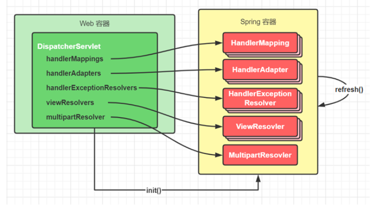


### 匹配阶段

1. 用户发送的请求统一到达前端控制器 DispatcherServlet

2. DispatcherServlet 遍历所有 HandlerMapping ，找到与路径匹配的处理器

   ① HandlerMapping 有多个，每个 HandlerMapping 会返回不同的处理器对象，谁先匹配，返回谁的处理器。其中能识别 @RequestMapping 的优先级最高

   ② 对应 @RequestMapping 的处理器是 HandlerMethod，它包含了控制器对象和控制器方法信息

   ③ 其中路径与处理器的映射关系在 HandlerMapping 初始化时就会建立好


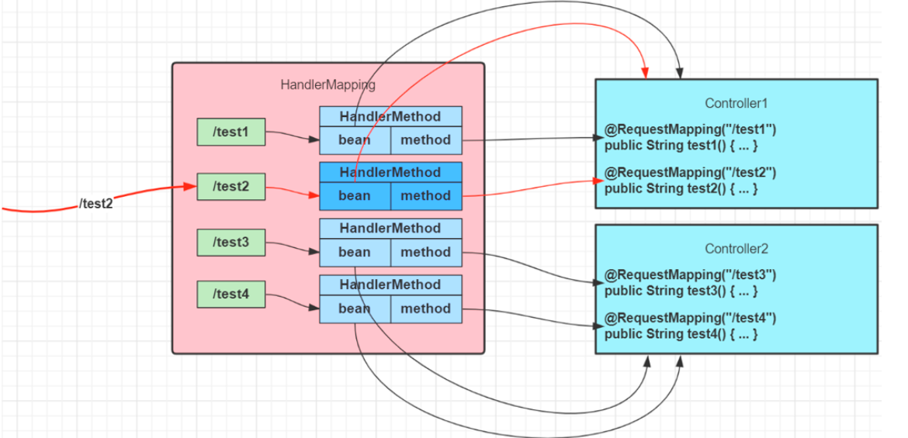


3. 将 HandlerMethod 连同匹配到的拦截器，生成调用链对象 HandlerExecutionChain 返回


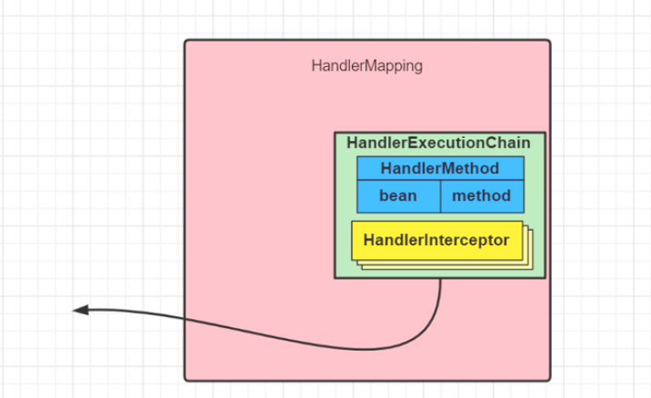


4. 遍历HandlerAdapter 处理器适配器，找到能处理 HandlerMethod 的适配器对象，开始调用


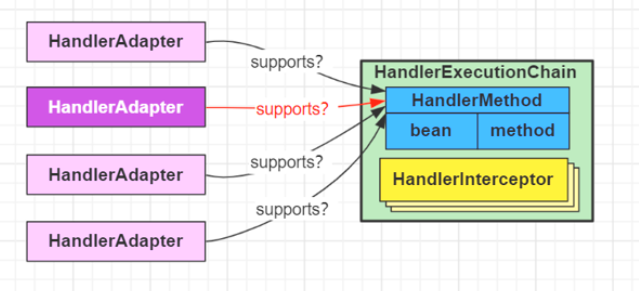


### 调用阶段

1. 执行拦截器 preHandle


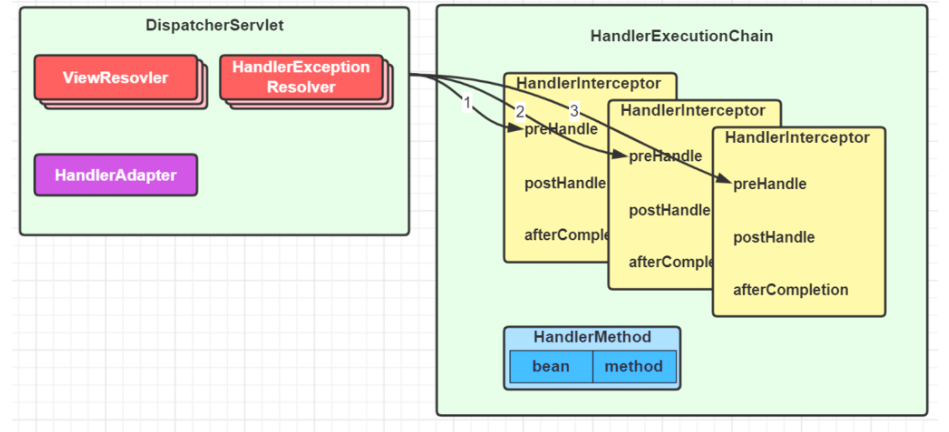


2. 由 HandlerAdapter 调用 HandlerMethod

​    ① 调用前处理不同类型的参数

​    ② 调用后处理不同类型的返回值


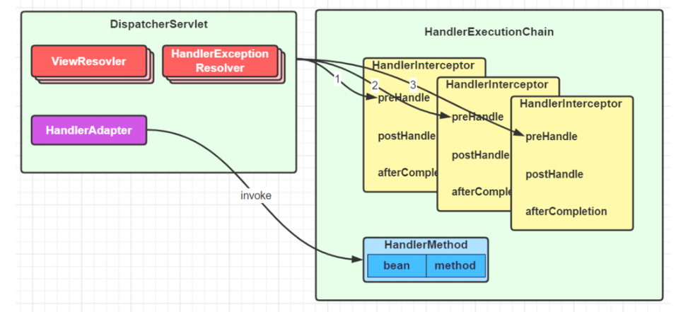


3. 第 2 步没有异常

   ① 返回 ModelAndView

   ② 执行拦截器 postHandle 方法

   ③ 解析视图，得到 View 对象，进行视图渲染


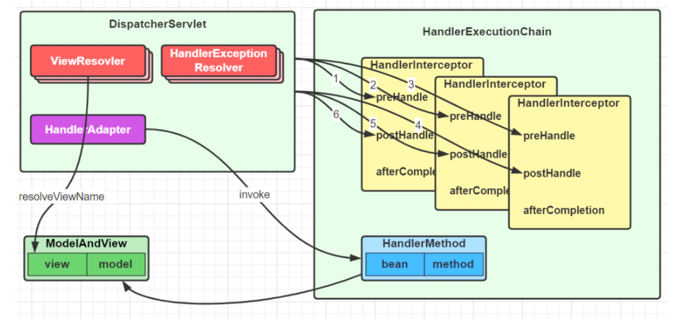


4. 第 2 步有异常，进入 HandlerExceptionResolver 异常处理流程


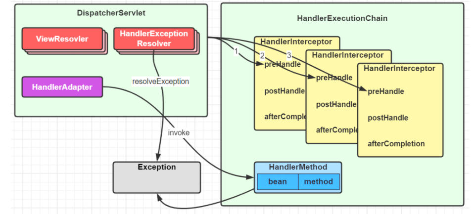


5. 最后都会执行拦截器的 afterCompletion 方法

6. 如果控制器方法标注了 @ResponseBody 注解，则在第 2 步，就会生成 json 结果，并标记 ModelAndView 已处理，这样就不会执行第 3 步的视图渲染


### 总结

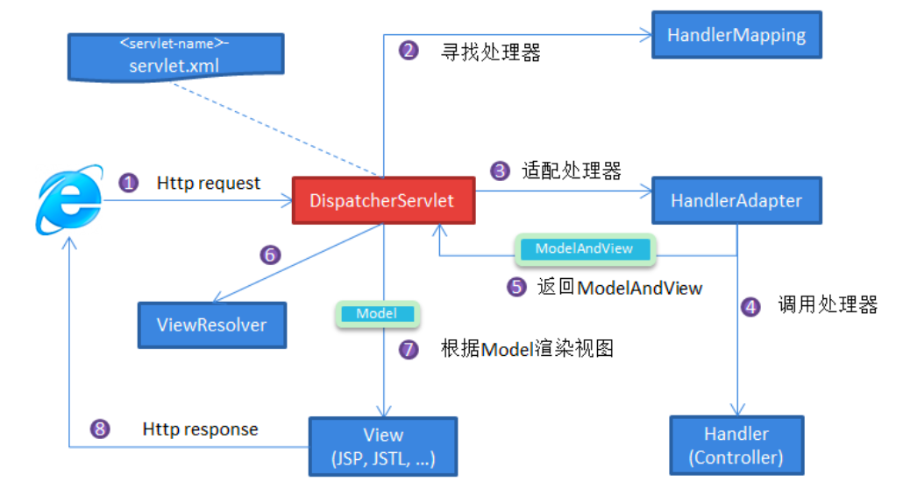


1. 客户端（浏览器）发送请求， `DispatcherServlet`拦截请求。
2. `DispatcherServlet` 根据请求信息调用 `HandlerMapping` 。`HandlerMapping` 根据 uri 去匹配查找能处理的 `Handler`（也就是我们平常说的 `Controller` 控制器） ，并会将请求涉及到的拦截器和 `Handler` 一起封装。
3. `DispatcherServlet` 调用 `HandlerAdapter`适配执行 `Handler` 。
4. `Handler` 完成对用户请求的处理后，会返回一个 `ModelAndView` 对象给`DispatcherServlet`，`ModelAndView` 顾名思义，包含了数据模型以及相应的视图的信息。`Model` 是返回的数据对象，`View` 是个逻辑上的 `View`。
5. `ViewResolver` 会根据逻辑 `View` 查找实际的 `View`。
6. `DispaterServlet` 把返回的 `Model` 传给 `View`（视图渲染）。
7. 把 `View` 返回给请求者（浏览器）


## Spring,Spring MVC,Spring Boot 之间什么关系?

Spring 包含了多个功能模块，其中最重要的是 Spring-Core（主要提供 IoC 依赖注入功能的支持） 模块， Spring 中的其他模块（比如 Spring MVC）的功能实现基本都需要依赖于该模块。


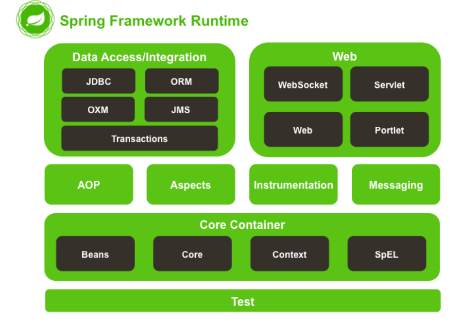


Spring MVC 是 Spring 中的一个很重要的模块，主要赋予 Spring 快速构建 MVC 架构的 Web 程序的能力。MVC 是模型(Model)、视图(View)、控制器(Controller)的简写，其核心思想是通过将业务逻辑、数据、显示分离来组织代码。


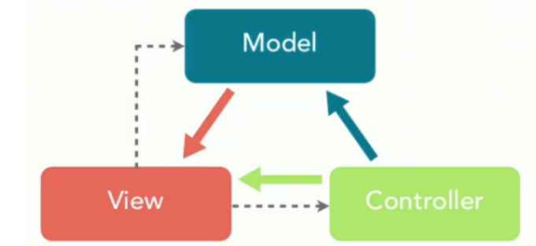


使用 Spring 进行开发各种配置过于麻烦比如开启某些 Spring 特性时，需要用 XML 或 Java 进行显式配置。于是，Spring Boot 诞生了！

Spring 旨在简化 J2EE 企业应用程序开发。Spring Boot 旨在简化 Spring 开发（减少配置文件，开箱即用！）。

Spring Boot 只是简化了配置，如果你需要构建 MVC 架构的 Web 程序，你还是需要使用 Spring MVC 作为 MVC 框架，只是说 Spring Boot 帮你简化了 Spring MVC 的很多配置，真正做到开箱即用！


## Spring IoC

### 谈谈自己对于 Spring IoC 的了解

**IoC（Inverse of Control:控制反转）** 是一种设计思想，而不是一个具体的技术实现。IoC 的思想就是将原本在程序中手动创建对象的控制权，交由 Spring 框架来管理。不过， IoC 并非 Spring 特有，在其他语言中也有应用。


**为什么叫控制反转？**

- **控制** ：指的是对象创建（实例化、管理）的权力
- **反转** ：控制权交给外部环境（Spring 框架、IoC 容器）


将对象之间的相互依赖关系交给 IoC 容器来管理，并由 IoC 容器完成对象的注入。这样可以很大程度上简化应用的开发，把应用从复杂的依赖关系中解放出来。 IoC 容器就像是一个工厂一样，当我们需要创建一个对象的时候，只需要配置好配置文件/注解即可，完全不用考虑对象是如何被创建出来的。

在实际项目中一个 Service 类可能依赖了很多其他的类，假如我们需要实例化这个 Service，你可能要每次都要搞清这个 Service 所有底层类的构造函数，这可能会把人逼疯。如果利用 IoC 的话，你只需要配置好，然后在需要的地方引用就行了，这大大增加了项目的可维护性且降低了开发难度。

在 Spring 中， IoC 容器是 Spring 用来实现 IoC 的载体， IoC 容器实际上就是个 Map（key，value），Map 中存放的是各种对象。

Spring 时代我们一般通过 XML 文件来配置 Bean，后来开发人员觉得 XML 文件来配置不太好，于是 SpringBoot 注解配置就慢慢开始流行起来。


### 什么是 Spring Bean？

简单来说，Bean 代指的就是那些被 IoC 容器所管理的对象。

我们需要告诉 IoC 容器帮助我们管理哪些对象，这个是通过配置元数据来定义的。配置元数据可以是 XML 文件、注解或者 Java 配置类。


### @Component 和 @Bean 的区别是什么？

- `@Component` 注解作用于类，而`@Bean`注解作用于方法。
- `@Component`通常是通过类路径扫描来自动侦测以及自动装配到 Spring 容器中（我们可以使用 `@ComponentScan` 注解定义要扫描的路径从中找出标识了需要装配的类自动装配到 Spring 的 bean 容器中）。`@Bean` 注解通常是我们在标有该注解的方法中定义产生这个 bean,`@Bean`告诉了 Spring 这是某个类的实例，当我需要用它的时候还给我。
- `@Bean` 注解比 `@Component` 注解的自定义性更强，而且很多地方我们只能通过 `@Bean` 注解来注册 bean。比如当我们引用第三方库中的类需要装配到 `Spring`容器时，则只能通过 `@Bean`来实现。


### 注入 Bean 的注解有哪些？

Spring 内置的 `@Autowired` 以及 JDK 内置的 `@Resource` 和 `@Inject` 都可以用于注入 Bean。


|  Annotaion   |              Package               |    Source    |
| :----------: | :--------------------------------: | :----------: |
| `@Autowired` | `org.springframework.bean.factory` | Spring 2.5+  |
| `@Resource`  |         `javax.annotation`         | Java JSR-250 |
|  `@Inject`   |           `javax.inject`           | Java JSR-330 |


### @Autowired 和 @Resource 的区别是什么？

`Autowired` 属于 Spring 内置的注解，默认的注入方式为`byType`（根据类型进行匹配），也就是说会优先根据接口类型去匹配并注入 Bean （接口的实现类）。

**这会有什么问题呢？** 当一个接口存在多个实现类的话，`byType`这种方式就无法正确注入对象了，因为这个时候 Spring 会同时找到多个满足条件的选择，默认情况下它自己不知道选择哪一个。

这种情况下，注入方式会变为 `byName`（根据名称进行匹配），这个名称通常就是类名（首字母小写）。


`@Resource`属于 JDK 提供的注解，默认注入方式为 `byName`。如果无法通过名称匹配到对应的 Bean 的话，注入方式会变为`byType`。

`@Resource` 有两个比较重要且日常开发常用的属性：`name`（名称）、`type`（类型）。


```java
public @interface Resource {
    String name() default "";
    Class<?> type() default Object.class;
}
```


如果仅指定 `name` 属性则注入方式为`byName`，如果仅指定`type`属性则注入方式为`byType`，如果同时指定`name` 和`type`属性（不建议这么做）则注入方式为`byType`+`byName`。


总结：

* **当一个接口存在多个实现类的情况下，`@Autowired` 和`@Resource`都需要通过名称才能正确匹配到对应的 Bean。`Autowired` 可以通过 `@Qualifier` 注解来显示指定名称，`@Resource`可以通过 `name` 属性来显示指定名称**
* **`@Autowired` 是 Spring 提供的注解，`@Resource` 是 JDK 提供的注解。**
* **`Autowired` 默认的注入方式为`byType`（根据类型进行匹配），`@Resource`默认注入方式为 `byName`（根据名称进行匹配）。**


### Bean 的作用域有哪些?

Spring 中 Bean 的作用域通常有下面几种：

- **singleton** : IoC 容器中只有唯一的 bean 实例。Spring 中的 bean 默认都是单例的，是对单例设计模式的应用。
- **prototype** : 每次获取都会创建一个新的 bean 实例。也就是说，连续 `getBean()` 两次，得到的是不同的 Bean 实例。
- **request** （仅 Web 应用可用）: 每一次 HTTP 请求都会产生一个新的 bean（请求 bean），该 bean 仅在当前 HTTP request 内有效。
- **session** （仅 Web 应用可用） : 每一次来自新 session 的 HTTP 请求都会产生一个新的 bean（会话 bean），该 bean 仅在当前 HTTP session 内有效。
- **application/global-session** （仅 Web 应用可用）： 每个 Web 应用在启动时创建一个 Bean（应用 Bean），，该 bean 仅在当前应用启动时间内有效。
- **websocket** （仅 Web 应用可用）：每一次 WebSocket 会话产生一个新的 bean。


### 单例 Bean 的线程安全问题了解吗？

大部分时候我们并没有在项目中使用多线程，所以很少有人会关注这个问题。单例 Bean 存在线程问题，主要是因为当多个线程操作同一个对象的时候是存在资源竞争的。

常见的有两种解决办法：

1. 在 Bean 中尽量避免定义可变的成员变量。
2. 在类中定义一个 `ThreadLocal` 成员变量，将需要的可变成员变量保存在 `ThreadLocal` 中（推荐的一种方式）。

不过，大部分 Bean 实际都是无状态（没有实例变量）的（比如 Dao、Service），这种情况下， Bean 是线程安全的。


## Spring AoP

### 谈谈自己对于 AOP 的了解

AOP(Aspect-Oriented Programming:面向切面编程)能够将那些与业务无关，却为业务模块所共同调用的逻辑或责任（例如事务处理、日志管理、权限控制等）封装起来，便于减少系统的重复代码，降低模块间的耦合度，并有利于未来的可拓展性和可维护性。

Spring AOP 就是基于动态代理的，如果要代理的对象，实现了某个接口，那么 Spring AOP 会使用 **JDK Proxy**，去创建代理对象，而对于没有实现接口的对象，就无法使用 JDK Proxy 去进行代理了，这时候 Spring AOP 会使用 **Cglib** 生成一个被代理对象的子类来作为代理


当然你也可以使用 **AspectJ** ！Spring AOP 已经集成了 AspectJ ，AspectJ 应该算的上是 Java 生态系统中最完整的 AOP 框架了。


AOP 切面编程设计到的一些专业术语：


|       术语        |                             含义                             |
| :---------------: | :----------------------------------------------------------: |
|   目标(Target)    |                         被通知的对象                         |
|    代理(Proxy)    |             向目标对象应用通知之后创建的代理对象             |
| 连接点(JoinPoint) |         目标对象的所属类中，定义的所有方法均为连接点         |
| 切入点(Pointcut)  | 被切面拦截 / 增强的连接点（切入点一定是连接点，连接点不一定是切入点） |
|   通知(Advice)    | 增强的逻辑 / 代码，也即拦截到目标对象的连接点之后要做的事情  |
|   切面(Aspect)    |                切入点(Pointcut)+通知(Advice)                 |
|   Weaving(织入)   |       将通知应用到目标对象，进而生成代理对象的过程动作       |


### Spring AOP 和 AspectJ AOP 有什么区别？

**Spring AOP 属于运行时增强，而 AspectJ 是编译时增强。** Spring AOP 基于代理(Proxying)，而 AspectJ 基于字节码操作(Bytecode Manipulation)。

Spring AOP 已经集成了 AspectJ ，AspectJ 应该算的上是 Java 生态系统中最完整的 AOP 框架了。AspectJ 相比于 Spring AOP 功能更加强大，但是 Spring AOP 相对来说更简单，

如果我们的切面比较少，那么两者性能差异不大。但是，当切面太多的话，最好选择 AspectJ ，它比 Spring AOP 快很多。


### AspectJ 定义的通知类型有哪些？

- **Before**（前置通知）：目标对象的方法调用之前触发
- **After** （后置通知）：目标对象的方法调用之后触发
- **AfterReturning**（返回通知）：目标对象的方法调用完成，在返回结果值之后触发
- **AfterThrowing**（异常通知） ：目标对象的方法运行中抛出 / 触发异常后触发。AfterReturning 和 AfterThrowing 两者互斥。如果方法调用成功无异常，则会有返回值；如果方法抛出了异常，则不会有返回值。
- **Around**： （环绕通知）编程式控制目标对象的方法调用。环绕通知是所有通知类型中可操作范围最大的一种，因为它可以直接拿到目标对象，以及要执行的方法，所以环绕通知可以任意的在目标对象的方法调用前后搞事，甚至不调用目标对象的方法


### 多个切面的执行顺序如何控制？

1. 通常使用`@Order` 注解直接定义切面顺序

加在类上，值越小优先级越高

```sh
@Order(3)
```


2. 实现`Ordered` 接口重写 `getOrder` 方法

```java
@Component
@Aspect
public class LoggingAspect implements Ordered 
{

    // ....

    @Override
    public int getOrder() 
    {
        // 返回值越小优先级越高
        return 1;
    }
}
```


## Spring 管理事务的方式有几种？

- **编程式事务** ： 在代码中硬编码(不推荐使用) : 通过 `TransactionTemplate`或者 `TransactionManager` 手动管理事务，实际应用中很少使用，但是对于你理解 Spring 事务管理原理有帮助。
- **声明式事务** ： 在 XML 配置文件中配置或者直接基于注解（推荐使用） : 实际是通过 AOP 实现（基于`@Transactional` 的全注解方式使用最多）


# Docker

## 什么是容器?

容器就是将软件打包成标准化单元，以用于开发、交付和部署。**

- **容器镜像是轻量的、可执行的独立软件包** ，包含软件运行所需的所有内容：代码、运行时环境、系统工具、系统库和设置。
- **容器化软件适用于基于 Linux 和 Windows 的应用，在任何环境中都能够始终如一地运行。**
- **容器赋予了软件独立性**，使其免受外在环境差异（例如，开发和预演环境的差异）的影响，从而有助于减少团队间在相同基础设施上运行不同软件时的冲突。


## Docker 容器的特点

- **轻量** :  在一台机器上运行的多个 Docker 容器可以共享这台机器的操作系统内核；它们能够迅速启动，只需占用很少的计算和内存资源。镜像是通过文件系统层进行构造的，并共享一些公共文件。这样就能尽量降低磁盘用量，并能更快地下载镜像。
- **标准** : Docker 容器基于开放式标准，能够在所有主流 Linux 版本、Microsoft Windows 以及包括 VM、裸机服务器和云在内的任何基础设施上运行。
- **安全** : Docker 赋予应用的隔离性不仅限于彼此隔离，还独立于底层的基础设施。Docker 默认提供最强的隔离，因此应用出现问题，也只是单个容器的问题，而不会波及到整台机器。


## 为什么要用 Docker ?

- **Docker 的镜像提供了除内核外完整的运行时环境，确保了应用运行环境一致性，从而不会再出现 “这段代码在我机器上没问题啊” 这类问题；——一致的运行环境**
- **可以做到秒级、甚至毫秒级的启动时间。大大的节约了开发、测试、部署的时间。——更快速的启动时间**
- **避免公用的服务器，资源会容易受到其他用户的影响。——隔离性**
- **善于处理集中爆发的服务器使用压力；——弹性伸缩，快速扩展**
- **可以很轻易的将在一个平台上运行的应用，迁移到另一个平台上，而不用担心运行环境的变化导致应用无法正常运行的情况。——迁移方便**
- **使用 Docker 可以通过定制应用镜像来实现持续集成、持续交付、部署。——持续交付和部署**


## 容器 VS 虚拟机

- **容器是一个应用层抽象，用于将代码和依赖资源打包在一起。** **多个容器可以在同一台机器上运行，共享操作系统内核，但各自作为独立的进程在用户空间中运行** 。与虚拟机相比， **容器占用的空间较少**（容器镜像大小通常只有几十兆），**瞬间就能完成启动** 。

- **虚拟机 (VM) 是一个物理硬件层抽象，用于将一台服务器变成多台服务器。** 管理程序允许多个 VM 在一台机器上运行。每个 VM 都包含一整套操作系统、一个或多个应用、必要的二进制文件和库资源，因此 **占用大量空间** 。而且 VM **启动也十分缓慢** 。


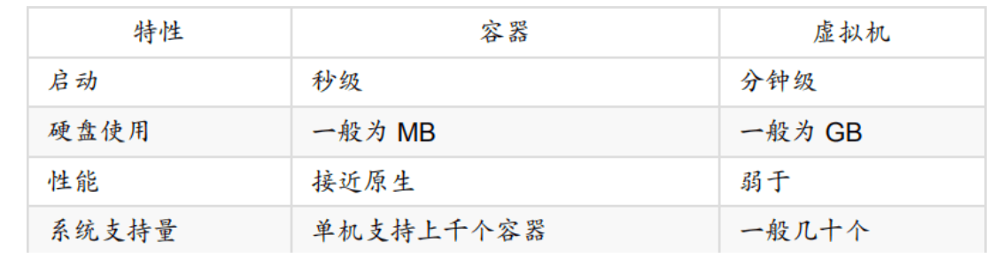


## Docker 底层原理

Docker 技术是基于 LXC（Linux container- Linux 容器）虚拟容器技术的。


LXC，其名称来自 Linux 软件容器（Linux Containers）的缩写，一种操作系统层虚拟化（Operating system–level virtualization）技术，为 Linux 内核容器功能的一个用户空间接口。它将应用软件系统打包成一个软件容器（Container），内含应用软件本身的代码，以及所需要的操作系统核心和库。通过统一的名字空间和共用 API 来分配不同软件容器的可用硬件资源，创造出应用程序的独立沙箱运行环境，使得 Linux 用户可以容易的创建和管理系统或应用容器。


LXC 技术主要是借助 Linux 内核中提供的 CGroup 功能和 namespace 来实现的，通过 LXC 可以为软件提供一个独立的操作系统运行环境。


**cgroup 和 namespace 介绍：**

- **namespace 是 Linux 内核用来隔离内核资源的方式。** 通过 namespace 可以让一些进程只能看到与自己相关的一部分资源，而另外一些进程也只能看到与它们自己相关的资源，这两拨进程根本就感觉不到对方的存在。具体的实现方式是把一个或多个进程的相关资源指定在同一个 namespace 中。Linux namespaces 是对全局系统资源的一种封装隔离，使得处于不同 namespace 的进程拥有独立的全局系统资源，改变一个 namespace 中的系统资源只会影响当前 namespace 里的进程，对其他 namespace 中的进程没有影响。
- **CGroup 是 Control Groups 的缩写，是 Linux 内核提供的一种可以限制、记录、隔离进程组 (process groups) 所使用的物力资源 (如 cpu memory i/o 等等) 的机制。**


两者都是将进程进行分组，但是两者的作用还是有本质区别。namespace 是为了隔离进程组之间的资源，而 cgroup 是为了对一组进程进行统一的资源监控和限制。


# MyBatis

## #{} 和 \${} 的区别是什么？

- `${}`是 Properties 文件中的变量占位符，它可以用于标签属性值和 sql 内部，属于静态文本替换，比如\${driver}会被静态替换为`com.mysql.jdbc. Driver`。
- `#{}`是 sql 的参数占位符，MyBatis 会将 sql 中的`#{}`替换为? 号，在 sql 执行前会使用 PreparedStatement 的参数设置方法，按序给 sql 的? 号占位符设置参数值，比如 ps.setInt(0, parameterValue)，`#{item.name}` 的取值方式为使用反射从参数对象中获取 item 对象的 name 属性值，相当于 `param.getItem().getName()`。


## Dao 接口的工作原理是什么？

最佳实践中，通常一个 xml 映射文件，都会写一个 Dao 接口与之对应。Dao 接口就是人们常说的 `Mapper` 接口，接口的全限名，就是映射文件中的 namespace 的值，接口的方法名，就是映射文件中 `MappedStatement` 的 id 值，接口方法内的参数，就是传递给 sql 的参数。 `Mapper` 接口是没有实现类的，当调用接口方法时，接口全限名+方法名拼接字符串作为 key 值，可唯一定位一个 `MappedStatement` ，举例： `com.mybatis3.mappers. StudentDao.findStudentById` ，可以唯一找到 namespace 为 `com.mybatis3.mappers. StudentDao` 下面 `id = findStudentById` 的 `MappedStatement` 。在 MyBatis 中，每一个 `<select>` 、 `<insert>` 、 `<update>` 、 `<delete>` 标签，都会被解析为一个 `MappedStatement` 对象。


Dao 接口的工作原理是 JDK 动态代理，MyBatis 运行时会使用 JDK 动态代理为 Dao 接口生成代理 proxy 对象，代理对象 proxy 会拦截接口方法，转而执行 `MappedStatement` 所代表的 sql，然后将 sql 执行结果返回。


## Dao 接口里的方法，参数不同时，方法能重载吗？

Dao 接口里的方法可以重载，但是 Mybatis 的 xml 里面的 ID 不允许重复。

Mybatis 的 Dao 接口可以有多个重载方法，但是多个接口对应的映射必须只有一个，否则启动会报错。


Dao 接口方法可以重载，但是需要满足以下条件：

* 仅有一个无参方法和一个有参方法
* 多个有参方法时，参数数量必须一致。且使用相同的 `@Param` ，或者使用 `param1` 这种


## MyBatis 是如何进行分页的？分页插件的原理是什么？

**(1)** MyBatis 使用 RowBounds 对象进行分页，它是针对 ResultSet 结果集执行的内存分页，而非物理分页；

**(2)** 可以在 sql 内直接书写带有物理分页的参数来完成物理分页功能，

**(3)** 也可以使用分页插件来完成物理分页。


分页插件的基本原理是使用 MyBatis 提供的插件接口，实现自定义插件，在插件的拦截方法内拦截待执行的 sql，然后重写 sql，根据 dialect 方言，添加对应的物理分页语句和物理分页参数。


## MyBatis 执行批量插入，能返回数据库主键列表吗？

能，JDBC 都能，MyBatis 当然也能


## MyBatis 动态 sql 是做什么的？

MyBatis 动态 sql 可以让我们在 xml 映射文件内，以标签的形式编写动态 sql，完成逻辑判断和动态拼接 sql 的功能。其执行原理为，使用 OGNL 从 sql 参数对象中计算表达式的值，根据表达式的值动态拼接 sql，以此来完成动态 sql 的功能。


## MyBatis 是如何将 sql 执行结果封装为目标对象并返回的？都有哪些映射形式？

第一种是使用 `<resultMap>` 标签，逐一定义列名和对象属性名之间的映射关系。第二种是使用 sql 列的别名功能，将列别名书写为对象属性名，比如 T_NAME AS NAME，对象属性名一般是 name，小写，但是列名不区分大小写，MyBatis 会忽略列名大小写，智能找到与之对应对象属性名，你甚至可以写成 T_NAME AS NaMe，MyBatis 一样可以正常工作。

有了列名与属性名的映射关系后，MyBatis 通过反射创建对象，同时使用反射给对象的属性逐一赋值并返回，那些找不到映射关系的属性，是无法完成赋值的。


## MyBatis 的 xml 映射文件中，不同的 xml 映射文件，id 是否可以重复？

不同的 xml 映射文件，如果配置了 namespace，那么 id 可以重复；如果没有配置 namespace，那么 id 不能重复；毕竟 namespace 不是必须的，只是最佳实践而已。

原因就是 namespace+id 是作为 `Map<String, MappedStatement>` 的 key 使用的，如果没有 namespace，就剩下 id，那么，id 重复会导致数据互相覆盖。有了 namespace，自然 id 就可以重复，namespace 不同，namespace+id 自然也就不同。


## MyBatis 中如何执行批处理？

使用 `BatchExecutor` 完成批处理。


## MyBatis 都有哪些 Executor 执行器？它们之间的区别是什么？

- **`SimpleExecutor`：** 每执行一次 update 或 select，就开启一个 Statement 对象，用完立刻关闭 Statement 对象。
- **`ReuseExecutor`：** 执行 update 或 select，以 sql 作为 key 查找 Statement 对象，存在就使用，不存在就创建，用完后，不关闭 Statement 对象，而是放置于 Map<String, Statement>内，供下一次使用。简言之，就是重复使用 Statement 对象。
  **`BatchExecutor`** 执行 update（没有 select，JDBC 批处理不支持 select），将所有 sql 都添加到批处理中（addBatch()），等待统一执行（executeBatch()），它缓存了多个 Statement 对象，每个 Statement 对象都是 addBatch()完毕后，等待逐一执行 executeBatch()批处理。与 JDBC 批处理相同。


`Executor` 的这些特点，都严格限制在 SqlSession 生命周期范围内。


## MyBatis 是否可以映射 Enum 枚举类？

MyBatis 可以映射枚举类，不单可以映射枚举类，MyBatis 可以映射任何对象到表的一列上。映射方式为自定义一个 `TypeHandler` ，实现 `TypeHandler` 的 `setParameter()` 和 `getResult()` 接口方法。 `TypeHandler` 有两个作用：

- 一是完成从 javaType 至 jdbcType 的转换；
- 二是完成 jdbcType 至 javaType 的转换，体现为 `setParameter()` 和 `getResult()` 两个方法，分别代表设置 sql 问号占位符参数和获取列查询结果。


## 为什么说 MyBatis 是半自动 ORM 映射工具？它与全自动的区别在哪里？

Hibernate 属于全自动 ORM 映射工具，使用 Hibernate 查询关联对象或者关联集合对象时，可以根据对象关系模型直接获取，所以它是全自动的。而 MyBatis 在查询关联对象或关联集合对象时，需要手动编写 sql 来完成，所以，称之为半自动 ORM 映射工具。


# CAP 理论

[CAP 理论/定理](https://zh.wikipedia.org/wiki/CAP%E5%AE%9A%E7%90%86)起源于 2000 年，由加州大学伯克利分校的 Eric Brewer 教授在分布式计算原理研讨会（PODC）上提出，因此 CAP 定理又被称作 **布鲁尔定理（Brewer’s theorem）**

2 年后，麻省理工学院的 Seth Gilbert 和 Nancy Lynch 发表了布鲁尔猜想的证明，CAP 理论正式成为分布式领域的定理。


## 简介

**CAP** 也就是 **Consistency（一致性）**、**Availability（可用性）**、**Partition Tolerance（分区容错性）** 这三个单词首字母组合。

CAP 理论的提出者布鲁尔在提出 CAP 猜想的时候，并没有详细定义 **Consistency**、**Availability**、**Partition Tolerance** 三个单词的明确定义。


在理论计算机科学中，CAP 定理（CAP theorem）指出对于一个分布式系统来说，当设计读写操作时，只能同时满足以下三点中的两个：

- **一致性（Consistency）** : 所有节点访问同一份最新的数据副本
- **可用性（Availability）**: 非故障的节点在合理的时间内返回合理的响应（不是错误或者超时的响应）。
- **分区容错性（Partition Tolerance）** : 分布式系统出现网络分区的时候，仍然能够对外提供服务。


**什么是网络分区？**

分布式系统中，多个节点之前的网络本来是连通的，但是因为某些故障（比如部分节点网络出了问题）某些节点之间不连通了，整个网络就分成了几块区域，这就叫 **网络分区**。


## 不是所谓的“3 选 2”

大部分人解释这一定律时，常常简单的表述为：“一致性、可用性、分区容忍性三者你只能同时达到其中两个，不可能同时达到”。实际上这是一个非常具有误导性质的说法，而且在 CAP 理论诞生 12 年之后，CAP 之父也在 2012 年重写了之前的论文。


**当发生网络分区的时候，如果我们要继续服务，那么强一致性和可用性只能 2 选 1。也就是说当网络分区之后 P 是前提，决定了 P 之后才有 C 和 A 的选择。也就是说分区容错性（Partition tolerance）我们是必须要实现的。**

简而言之就是：CAP 理论中分区容错性 P 是一定要满足的，在此基础上，只能满足可用性 A 或者一致性 C。


因此，**分布式系统理论上不可能选择 CA 架构，只能选择 CP 或者 AP 架构。** 比如 ZooKeeper、HBase 就是 CP 架构，Cassandra、Eureka 就是 AP 架构，Nacos 不仅支持 CP 架构也支持 AP 架构。


**为啥不可能选择 CA 架构呢？** 举个例子：若系统出现“分区”，系统中的某个节点在进行写操作。为了保证 C， 必须要禁止其他节点的读写操作，这就和 A 发生冲突了。如果为了保证 A，其他节点的读写操作正常的话，那就和 C 发生冲突了。


选择 CP 还是 AP 的关键在于当前的业务场景，没有定论，比如对于需要确保强一致性的场景如银行一般会选择保证 CP 。


如果网络分区正常的话（系统在绝大部分时候所处的状态），也就说不需要保证 P 的时候，C 和 A 能够同时保证。


## CAP 实际应用案例

注册中心 Registry 在其中扮演了什么角色呢？提供了什么服务呢？


注册中心负责服务地址的注册与查找，相当于目录服务，服务提供者和消费者只在启动时与注册中心交互，注册中心不转发请求，压力较小。


常见的可以作为注册中心的组件有：ZooKeeper、Eureka、Nacos...。

* **ZooKeeper 保证的是 CP。** 任何时刻对 ZooKeeper 的读请求都能得到一致性的结果，但是， ZooKeeper 不保证每次请求的可用性比如在 Leader 选举过程中或者半数以上的机器不可用的时候服务就是不可用的。
* **Eureka 保证的则是 AP。** Eureka 在设计的时候就是优先保证 A （可用性）。在 Eureka 中不存在什么 Leader 节点，每个节点都是一样的、平等的。因此 Eureka 不会像 ZooKeeper 那样出现选举过程中或者半数以上的机器不可用的时候服务就是不可用的情况。 Eureka 保证即使大部分节点挂掉也不会影响正常提供服务，只要有一个节点是可用的就行了。只不过这个节点上的数据可能并不是最新的。
* **Nacos 不仅支持 CP 也支持 AP。**


## 总结

**如果系统发生“分区”，我们要考虑选择 CP 还是 AP。如果系统没有发生“分区”的话，我们要思考如何保证 CA** 


# BASE 理论

[BASE 理论](https://dl.acm.org/doi/10.1145/1394127.1394128)起源于 2008 年， 由 eBay 的架构师 Dan Pritchett 在 ACM 上发表。


## 简介

**BASE** 是 **Basically Available（基本可用）** 、**Soft-state（软状态）** 和 **Eventually Consistent（最终一致性）** 三个短语的缩写。BASE 理论是对 CAP 中一致性 C 和可用性 A 权衡的结果，其来源于对大规模互联网系统分布式实践的总结，是基于 CAP 定理逐步演化而来的，它大大降低了我们对系统的要求。


## BASE 理论的核心思想

即使无法做到强一致性，但每个应用都可以根据自身业务特点，采用适当的方式来使系统达到最终一致性。

也就是牺牲数据的一致性来满足系统的高可用性，系统中一部分数据不可用或者不一致时，仍需要保持系统整体“主要可用”。


**BASE 理论本质上是对 CAP 的延伸和补充，更具体地说，是对 CAP 中 AP 方案的一个补充。**


AP 方案只是在系统发生分区的时候放弃一致性，而不是永远放弃一致性。在分区故障恢复后，系统应该达到最终一致性。这一点其实就是 BASE 理论延伸的地方。


## BASE 理论三要素

### 基本可用

基本可用是指分布式系统在出现不可预知故障的时候，允许损失部分可用性。但是，这绝不等价于系统不可用。


**什么叫允许损失部分可用性呢？**

- **响应时间上的损失**: 正常情况下，处理用户请求需要 0.5s 返回结果，但是由于系统出现故障，处理用户请求的时间变为 3 s。
- **系统功能上的损失**：正常情况下，用户可以使用系统的全部功能，但是由于系统访问量突然剧增，系统的部分非核心功能无法使用。


### 软状态

软状态指允许系统中的数据存在中间状态（**CAP 理论中的数据不一致**），并认为该中间状态的存在不会影响系统的整体可用性，即允许系统在不同节点的数据副本之间进行数据同步的过程存在延时。


### 最终一致性

最终一致性强调的是系统中所有的数据副本，在经过一段时间的同步后，最终能够达到一个一致的状态。因此，最终一致性的本质是需要系统保证最终数据能够达到一致，而不需要实时保证系统数据的强一致性。


## 分布式一致性的 3 种级别

* **强一致性** ：系统写入了什么，读出来的就是什么。

* **弱一致性** ：不一定可以读取到最新写入的值，也不保证多少时间之后读取到的数据是最新的，只是会尽量保证某个时刻达到数据一致的状态。

* **最终一致性** ：弱一致性的升级版，系统会保证在一定时间内达到数据一致的状态。


业界比较推崇是最终一致性级别，但是某些对数据一致要求十分严格的场景比如银行转账还是要保证强一致性。


## 实现最终一致性的具体方式是什么呢? 

- **读时修复** : 在读取数据时，检测数据的不一致，进行修复。比如 Cassandra 的 Read Repair 实现，具体来说，在向 Cassandra 系统查询数据的时候，如果检测到不同节点 的副本数据不一致，系统就自动修复数据。
- **写时修复** : 在写入数据，检测数据的不一致时，进行修复。比如 Cassandra 的 Hinted Handoff 实现。具体来说，Cassandra 集群的节点之间远程写数据的时候，如果写失败 就将数据缓存下来，然后定时重传，修复数据的不一致性。
- **异步修复** : 这个是最常用的方式，通过定时对账检测副本数据的一致性，并修复。


## 总结

**ACID 是数据库事务完整性的理论，CAP 是分布式系统设计理论，BASE 是 CAP 理论中 AP 方案的延伸。**


# Paxos 算法

## 算法介绍

Paxos 算法是 Leslie Lamport（[莱斯利·兰伯特](https://zh.wikipedia.org/wiki/莱斯利·兰伯特)）在 **1990** 年提出了一种分布式系统 **共识** 算法。这也是第一个被证明完备的共识算法（前提是不存在拜占庭将军问题，也就是没有恶意节点）。


兰伯特当时提出的 Paxos 算法主要包含 2 个部分:

- **Basic Paxos 算法** ： 描述的是多节点之间如何就某个值(提案 Value)达成共识。
- **Multi-Paxos 思想** ： 描述的是执行多个 Basic Paxos 实例，就一系列值达成共识。Multi-Paxos 说白了就是执行多次 Basic Paxos ，核心还是 Basic Paxos 。

由于 Paxos 算法在国际上被公认的非常难以理解和实现，因此不断有人尝试简化这一算法。到了2013 年才诞生了一个比 Paxos 算法更易理解和实现的共识算法—[Raft 算法](https://javaguide.cn/distributed-system/theorem&algorithm&protocol/raft-algorithm.html) 。更具体点来说，Raft 是Multi-Paxos的一个变种，其简化了 Multi-Paxos 的思想，变得更容易被理解以及工程实现。


针对没有恶意节点的情况，除了 Raft 算法之外，当前最常用的一些共识算法比如 ZAB 协议、 Fast Paxos 算法都是基于 Paxos 算法改进的。

针对存在恶意节点的情况，一般使用的是工作量证明（POW，Proof-of-Work）、权益证明（PoS，Proof-of-Stake ）等共识算法。这类共识算法最典型的应用就是区块链，就比如说前段时间以太坊官方宣布其共识机制正在从工作量证明(PoW)转变为权益证明(PoS)。

区块链系统使用的共识算法需要解决的核心问题是 **拜占庭将军问题** ，这和我们日常接触到的 ZooKeeper、Etcd、Consul 等分布式中间件不太一样。


总结：

- Paxos 算法是兰伯特在 **1990** 年提出了一种分布式系统共识算法。
- 兰伯特当时提出的 Paxos 算法主要包含 2 个部分:Basic Paxos 算法和Multi-Paxos 思想。
- Raft 算法、ZAB 协议、 Fast Paxos 算法都是基于 Paxos 算法改进而来。


**Paxos 不是一致性算法而是共识算法，一致性和共识并不是一个概念。**


## Basic Paxos 算法

Basic Paxos 中存在 3 个重要的角色：

1. **提议者（Proposer）**：也可以叫做协调者（coordinator），提议者负责接受客户端发起的提议，然后尝试让接受者接受该提议，同时保证即使多个提议者的提议之间产生了冲突，那么算法都能进行下去；
2. **接受者（Acceptor）**：也可以叫做投票员（voter），负责对提议者的提议投票，同时需要记住自己的投票历史；
3. **学习者（Learner）**：如果有超过半数接受者就某个提议达成了共识，那么学习者就需要接受这个提议，并就该提议作出运算，然后将运算结果返回给客户端。


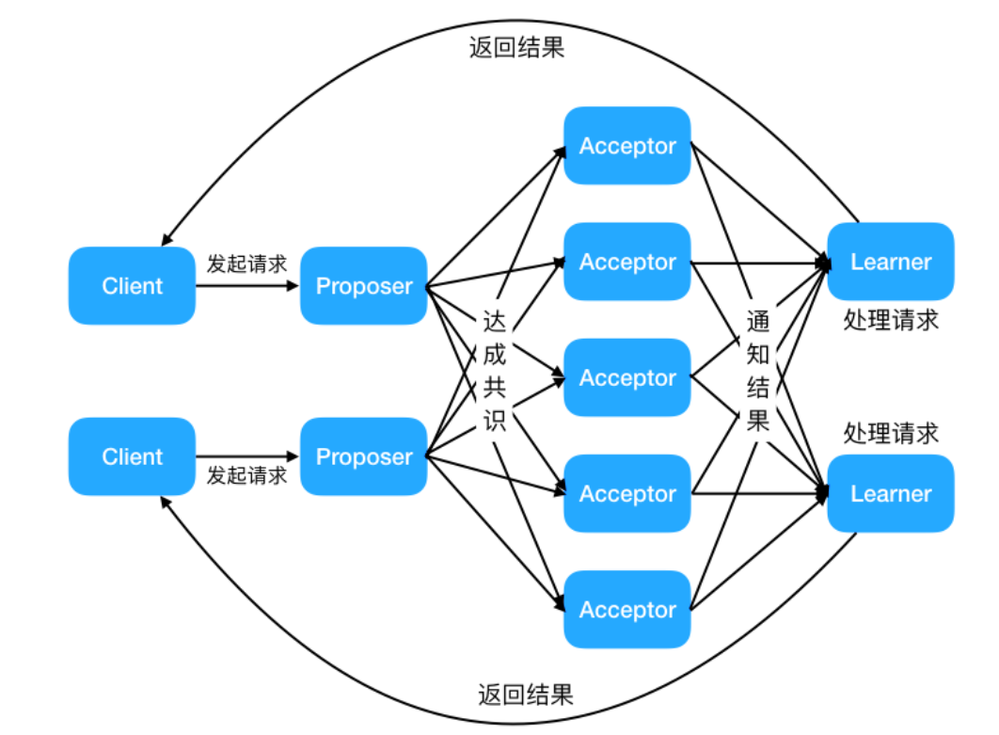


## Multi Paxos 思想

因为兰伯特提到的 Multi-Paxos 思想，缺少代码实现的必要细节(比如怎么选举领导者)，所以在理解上比较难。

Multi-Paxos 只是一种思想，这种思想的核心就是通过多个 Basic Paxos 实例就一系列值达成共识。


二阶段提交是达成共识常用的方式，Basic Paxos 就是通过二阶段提交的方式来达成共识。Basic Paxos 还支持容错，少于一般的节点出现故障时，集群也能正常工作。


# Raft 算法

## 背景

当今的数据中心和应用程序在高度动态的环境中运行，为了应对高度动态的环境，它们通过额外的服务器进行横向扩展，并且根据需求进行扩展和收缩。同时，服务器和网络故障也很常见。

因此，系统必须在正常操作期间处理服务器的上下线。它们必须对变故做出反应并在几秒钟内自动适应；对客户来说的话，明显的中断通常是不可接受的。

幸运的是，分布式共识可以帮助应对这些挑战。


## 拜占庭将军

假设多位拜占庭将军中没有叛军，信使的信息可靠但有可能被暗杀的情况下，将军们如何达成是否要进攻的一致性决定？


解决方案大致可以理解成：先在所有的将军中选出一个大将军，用来做出所有的决定。

举例如下：假如现在一共有 3 个将军 A，B 和 C，每个将军都有一个随机时间的倒计时器，倒计时一结束，这个将军就把自己当成大将军候选人，然后派信使传递选举投票的信息给将军 B 和 C，如果将军 B 和 C 还没有把自己当作候选人（自己的倒计时还没有结束），并且没有把选举票投给其他人，它们就会把票投给将军 A，信使回到将军 A 时，将军 A 知道自己收到了足够的票数，成为大将军。在有了大将军之后，是否需要进攻就由大将军 A 决定，然后再去派信使通知另外两个将军，自己已经成为了大将军。如果一段时间还没收到将军 B 和 C 的回复（信使可能会被暗杀），那就再重派一个信使，直到收到回复。


## 共识算法

共识是可容错系统中的一个基本问题：即使面对故障，服务器也可以在共享状态上达成一致。

共识算法允许一组节点像一个整体一样一起工作，即使其中的一些节点出现故障也能够继续工作下去，其正确性主要是源于复制状态机的性质：一组`Server`的状态机计算相同状态的副本，即使有一部分的`Server`宕机了它们仍然能够继续运行。


一般通过使用复制日志来实现复制状态机。每个`Server`存储着一份包括命令序列的日志文件，状态机会按顺序执行这些命令。因为每个日志包含相同的命令，并且顺序也相同，所以每个状态机处理相同的命令序列。由于状态机是确定性的，所以处理相同的状态，得到相同的输出。

因此共识算法的工作就是保持复制日志的一致性。服务器上的共识模块从客户端接收命令并将它们添加到日志中。它与其他服务器上的共识模块通信，以确保即使某些服务器发生故障。每个日志最终包含相同顺序的请求。一旦命令被正确地复制，它们就被称为已提交。每个服务器的状态机按照日志顺序处理已提交的命令，并将输出返回给客户端，因此，这些服务器形成了一个单一的、高度可靠的状态机。


适用于实际系统的共识算法通常具有以下特性：

- **安全**。确保在非拜占庭条件（也就是上文中提到的简易版拜占庭）下的安全性，包括网络延迟、分区、包丢失、复制和重新排序。
- **高可用**。只要大多数服务器都是可操作的，并且可以相互通信，也可以与客户端进行通信，那么这些服务器就可以看作完全功能可用的。因此，一个典型的由五台服务器组成的集群可以容忍任何两台服务器端故障。假设服务器因停止而发生故障；它们稍后可能会从稳定存储上的状态中恢复并重新加入集群。
- **一致性不依赖时序**。错误的时钟和极端的消息延迟，在最坏的情况下也只会造成可用性问题，而不会产生一致性问题。

- **在集群中大多数服务器响应**，命令就可以完成，不会被少数运行缓慢的服务器来影响整体系统性能。


## 基础

### 节点类型

一个 Raft 集群包括若干服务器，以典型的 5 服务器集群举例。在任意的时间，每个服务器一定会处于以下三个状态中的一个：

- `Leader`：负责发起心跳，响应客户端，创建日志，同步日志。
- `Candidate`：Leader 选举过程中的临时角色，由 Follower 转化而来，发起投票参与竞选。
- `Follower`：接受 Leader 的心跳和日志同步数据，投票给 Candidate。

在正常的情况下，只有一个服务器是 Leader，剩下的服务器是 Follower。Follower 是被动的，它们不会发送任何请求，只是响应来自 Leader 和 Candidate 的请求。


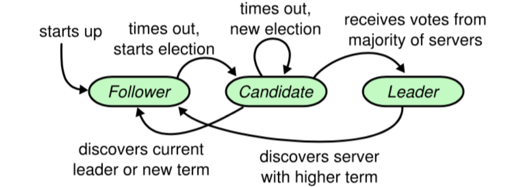


### 任期

raft 算法将时间划分为任意长度的任期（term），任期用连续的数字表示，看作当前 term 号。每一个任期的开始都是一次选举，在选举开始时，一个或多个 Candidate 会尝试成为 Leader。如果一个 Candidate 赢得了选举，它就会在该任期内担任 Leader。如果没有选出 Leader，将会开启另一个任期，并立刻开始下一次选举。raft 算法保证在给定的一个任期最少要有一个 Leader。

每个节点都会存储当前的 term 号，当服务器之间进行通信时会交换当前的 term 号；如果有服务器发现自己的 term 号比其他人小，那么他会更新到较大的 term 值。如果一个 Candidate 或者 Leader 发现自己的 term 过期了，他会立即退回成 Follower。如果一台服务器收到的请求的 term 号是过期的，那么它会拒绝此次请求。


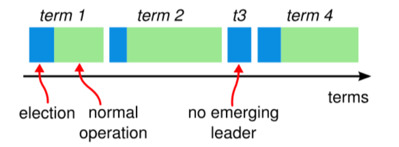


### 日志

- `entry`：每一个事件成为 entry，只有 Leader 可以创建 entry。entry 的内容为`<term,index,cmd>`其中 cmd 是可以应用到状态机的操作。
- `log`：由 entry 构成的数组，每一个 entry 都有一个表明自己在 log 中的 index。只有 Leader 才可以改变其他节点的 log。entry 总是先被 Leader 添加到自己的 log 数组中，然后再发起共识请求，获得同意后才会被 Leader 提交给状态机。Follower 只能从 Leader 获取新日志和当前的 commitIndex，然后把对应的 entry 应用到自己的状态机中。


## 领导人选举

raft 使用心跳机制来触发 Leader 的选举。

如果一台服务器能够收到来自 Leader 或者 Candidate 的有效信息，那么它会一直保持为 Follower 状态，并且刷新自己的 electionElapsed，重新计时。

Leader 会向所有的 Follower 周期性发送心跳来保证自己的 Leader 地位。如果一个 Follower 在一个周期内没有收到心跳信息，就叫做选举超时，然后它就会认为此时没有可用的 Leader，并且开始进行一次选举以选出一个新的 Leader。

为了开始新的选举，Follower 会自增自己的 term 号并且转换状态为 Candidate。然后他会向所有节点发起 RequestVoteRPC 请求， Candidate 的状态会持续到以下情况发生：

- 赢得选举
- 其他节点赢得选举
- 一轮选举结束，无人胜出

赢得选举的条件是：一个 Candidate 在一个任期内收到了来自集群内的多数选票`（N/2+1）`，就可以成为 Leader。

在 Candidate 等待选票的时候，它可能收到其他节点声明自己是 Leader 的心跳，此时有两种情况：

- 该 Leader 的 term 号大于等于自己的 term 号，说明对方已经成为 Leader，则自己回退为 Follower。
- 该 Leader 的 term 号小于自己的 term 号，那么会拒绝该请求并让该节点更新 term。

由于可能同一时刻出现多个 Candidate，导致没有 Candidate 获得大多数选票，如果没有其他手段来重新分配选票的话，那么可能会无限重复下去。

raft 使用了随机的选举超时时间来避免上述情况。每一个 Candidate 在发起选举后，都会随机化一个新的枚举超时时间，这种机制使得各个服务器能够分散开来，在大多数情况下只有一个服务器会率先超时；它会在其他服务器超时之前赢得选举。


## 日志复制

一旦选出了 Leader，它就开始接受客户端的请求。每一个客户端的请求都包含一条需要被复制状态机（`Replicated State Mechine`）执行的命令。

Leader 收到客户端请求后，会生成一个 entry，包含`<index,term,cmd>`，再将这个 entry 添加到自己的日志末尾后，向所有的节点广播该 entry，要求其他服务器复制这条 entry。

如果 Follower 接受该 entry，则会将 entry 添加到自己的日志后面，同时返回给 Leader 同意。

如果 Leader 收到了多数的成功响应，Leader 会将这个 entry 应用到自己的状态机中，之后可以成为这个 entry 是 committed 的，并且向客户端返回执行结果。

raft 保证以下两个性质：

- 在两个日志里，有两个 entry 拥有相同的 index 和 term，那么它们一定有相同的 cmd
- 在两个日志里，有两个 entry 拥有相同的 index 和 term，那么它们前面的 entry 也一定相同

通过“仅有 Leader 可以生存 entry”来保证第一个性质，第二个性质需要一致性检查来进行保证。

一般情况下，Leader 和 Follower 的日志保持一致，然后，Leader 的崩溃会导致日志不一样，这样一致性检查会产生失败。Leader 通过强制 Follower 复制自己的日志来处理日志的不一致。这就意味着，在 Follower 上的冲突日志会被领导者的日志覆盖。

为了使得 Follower 的日志和自己的日志一致，Leader 需要找到 Follower 与它日志一致的地方，然后删除 Follower 在该位置之后的日志，接着把这之后的日志发送给 Follower。

`Leader` 给每一个`Follower` 维护了一个 `nextIndex`，它表示 `Leader` 将要发送给该追随者的下一条日志条目的索引。当一个 `Leader` 开始掌权时，它会将 `nextIndex` 初始化为它的最新的日志条目索引数+1。如果一个 `Follower` 的日志和 `Leader` 的不一致，`AppendEntries` 一致性检查会在下一次 `AppendEntries RPC` 时返回失败。在失败之后，`Leader` 会将 `nextIndex` 递减然后重试 `AppendEntries RPC`。最终 `nextIndex` 会达到一个 `Leader` 和 `Follower` 日志一致的地方。这时，`AppendEntries` 会返回成功，`Follower` 中冲突的日志条目都被移除了，并且添加所缺少的上了 `Leader` 的日志条目。一旦 `AppendEntries` 返回成功，`Follower` 和 `Leader` 的日志就一致了，这样的状态会保持到该任期结束。


# 内容分发网络

## 介绍

**CDN** 全称是 Content Delivery Network/Content Distribution Network，翻译过的意思是 **内容分发网络** 。

我们可以将内容分发网络拆开来看：

- 内容 ：指的是静态资源比如图片、视频、文档、JS、CSS、HTML。
- 分发网络 ：指的是将这些静态资源分发到位于多个不同的地理位置机房中的服务器上，这样，就可以实现静态资源的就近访问比如北京的用户直接访问北京机房的数据。

所以，简单来说，**CDN 就是将静态资源分发到多个不同的地方以实现就近访问，进而加快静态资源的访问速度，减轻服务器以及带宽的负担。**


你可以将 CDN 看作是服务上一层的特殊缓存服务，分布在全国各地，主要用来处理静态资源的请求。


我们经常拿全站加速和内容分发网络做对比，不要把两者搞混了！全站加速（不同云服务商叫法不同，腾讯云叫 ECDN、阿里云叫 DCDN）既可以加速静态资源又可以加速动态资源，内容分发网络（CDN）主要针对的是 **静态资源** 。


## CDN 工作原理是什么？

### 静态资源是如何被缓存到 CDN 节点中的？

你可以通过预热的方式将源站的资源同步到 CDN 的节点中。这样的话，用户首次请求资源可以直接从 CDN 节点中取，无需回源。这样可以降低源站压力，提升用户体验。

如果不预热的话，你访问的资源可能不再 CDN 节点中，这个时候 CDN 节点将请求源站获取资源，这个过程是大家经常说的 **回源**。

**命中率** 和 **回源率** 是衡量 CDN 服务质量两个重要指标。命中率越高越好，回源率越低越好。

如果资源有更新的话，你也可以对其 **刷新** ，删除 CDN 节点上缓存的资源，当用户访问对应的资源时直接回源获取最新的资源，并重新缓存。


### 如何找到最合适的 CDN 节点？

GSLB （Global Server Load Balance，全局负载均衡）是 CDN 的大脑，负责多个CDN节点之间相互协作，最常用的是基于 DNS 的 GSLB。

CDN 会通过 GSLB 找到最合适的 CDN 节点，更具体点来说是下面这样的：

1. 浏览器向 DNS 服务器发送域名请求；
2. DNS 服务器向根据 CNAME( Canonical Name ) 别名记录向 GSLB 发送请求；
3. GSLB 返回性能最好（通常距离请求地址最近）的 CDN 节点（边缘服务器，真正缓存内容的地方）的地址给浏览器；
4. 浏览器直接访问指定的 CDN 节点。


为了方便理解，上图其实做了一点简化。GSLB 内部可以看作是 CDN 专用 DNS 服务器和负载均衡系统组合。CDN 专用 DNS 服务器会返回负载均衡系统 IP 地址给浏览器，浏览器使用 IP 地址请求负载均衡系统进而找到对应的 CDN 节点。

**GSLB 是如何选择出最合适的 CDN 节点呢？** GSLB 会根据请求的 IP 地址、CDN 节点状态（比如负载情况、性能、响应时间、带宽）等指标来综合判断具体返回哪一个 CDN 节点的地址。


### 如何防止资源被盗刷？

解决这个问题最常用最简单的办法设置 **Referer 防盗链**，具体来说就是根据 HTTP 请求的头信息里面的 Referer 字段对请求进行限制。我们可以通过 Referer 字段获取到当前请求页面的来源页面的网站地址，这样我们就能确定请求是否来自合法的网站。

不过，如果站点的防盗链配置允许 Referer 为空的话，通过隐藏 Referer，可以直接绕开防盗链。

通常情况下，我们会配合其他机制来确保静态资源被盗用，一种常用的机制是 **时间戳防盗链** 。相比之下，**时间戳防盗链** 的安全性更强一些。时间戳防盗链加密的 URL 具有时效性，过期之后就无法再被允许访问。


